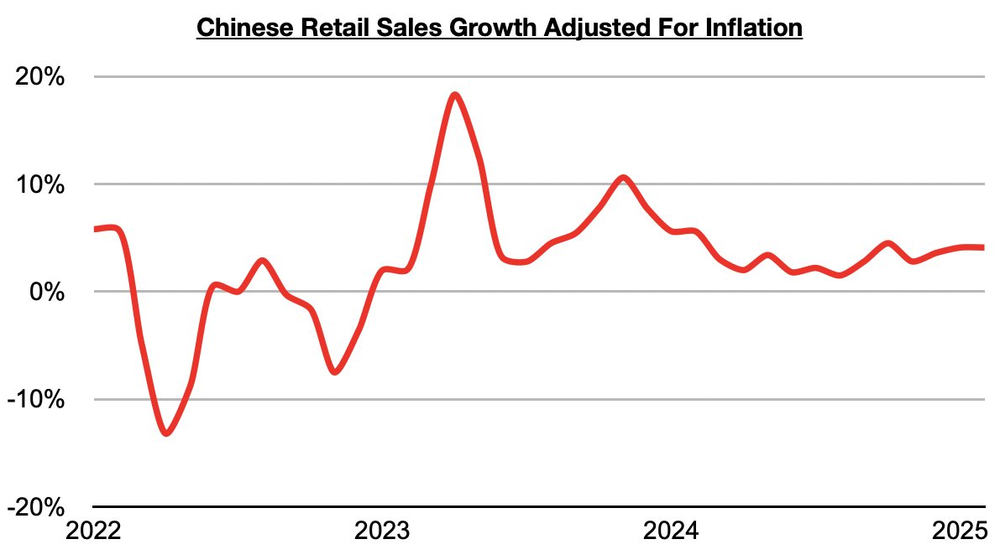
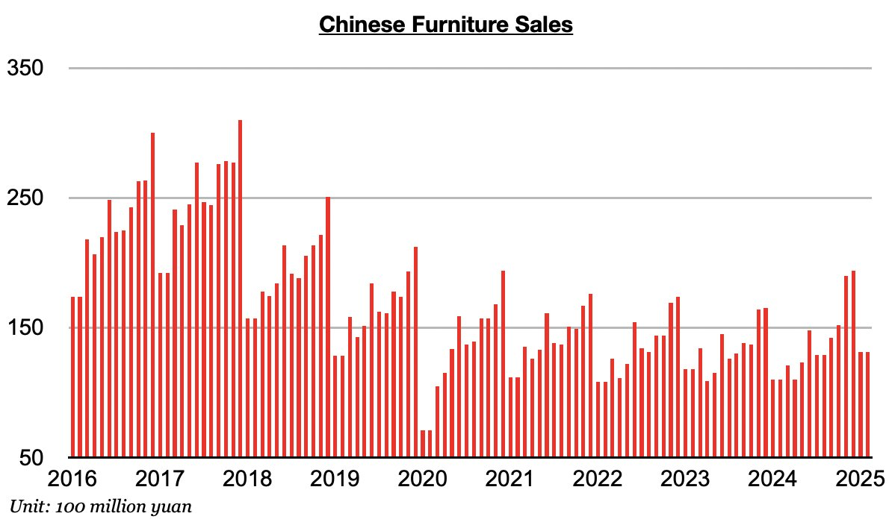

# Ongoing Strong Growth in Furniture Sales in China

**Date:** March 31, 2025  
**Publisher:** Breakwave Advisors | **Category:** Market Insights  
**Original URL:** [https://www.breakwaveadvisors.com/insights/2025/3/31/ongoing-strong-growth-in-furniture-sales-in-china](https://www.breakwaveadvisors.com/insights/2025/3/31/ongoing-strong-growth-in-furniture-sales-in-china)  

---

*By*[*Jeffrey Landsberg*](https://www.linkedin.com/in/jeffrey-landsberg-70ab957/)

As we discussed in Commodore Research's most recent Weekly China Report, China’s retail sales in January/February grew year-on-year by 4%, which marks an increase from the 3.7% growth seen in December. Taking January/February’s 0.1% deflation into account, retail sales adjusted for inflation/deflation increased year-on-year by 4.1%. This marks the highest growth seen since October.

> **Figure 1: Chart 1**  
> [Local Asset](file:///C:/Users/Dell/Github/Shipping/corpus/03-breakwave/insights/2025/assets/2025-03-31_ongoing-strong-growth-in-furniture-sales-in-china_img_chart1_f1449334d803.jpg)

During each of the last twenty-six months, retail sales growth in China has come in higher than any inflation. Prior to the last twenty-six months, retail sales came in lower than inflation for four straight months. Of note on the consumer side is that furniture sales, clothing sales, and appliance sales (which includes consumer electronics) again all experienced year-on-year growth. Furniture sales have seen the best year-on-year growth.

> **Figure 2: Chart 2**  
> [Local Asset](file:///C:/Users/Dell/Github/Shipping/corpus/03-breakwave/insights/2025/assets/2025-03-31_ongoing-strong-growth-in-furniture-sales-in-china_img_chart2_178f6024187c.jpg)

---

**Tags:** China, Economy  
