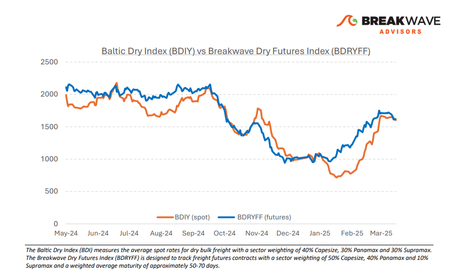
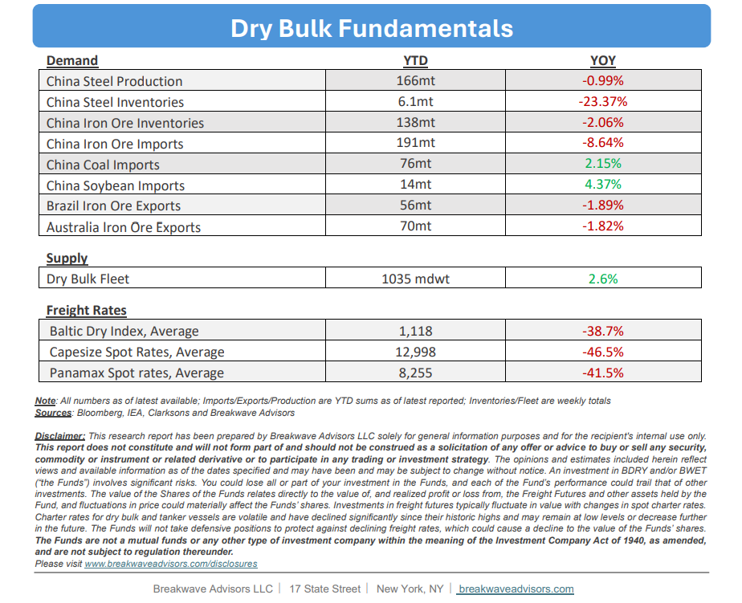

# Breakwave Bi-Weekly Dry Bulk Report - April 1, 2025

**Date:** April 01, 2025  
**Publisher:** Breakwave Advisors | **Category:** Market Insights  
**Original URL:** [https://www.breakwaveadvisors.com/insights/2025183-dry547-hhu5-l2rgm](https://www.breakwaveadvisors.com/insights/2025183-dry547-hhu5-l2rgm)  

---

•**Capesize Spot Rates Stabilize as Traders Digest Recent Move**– Capesize spot rates have stabilized at around the $20,000 mark after reaching their highest level for this time of year in many years. Significant congestion in West Africa has tightened the Atlantic market, contributing to the recent bullish sentiment among traders regarding the near-term rate outlook in that region. Meanwhile, Panamax spot rates have also experienced a strong rally, now comfortably exceeding $12,000—an impressive achievement given the headwinds posed by anemic grain and coal volumes in the last few months. Looking ahead, we anticipate that tariffs and US port fees will play a significant role in shaping the near- and medium-term outlook for shipping rates. On the tariff front, potential trade route reshuffling, combined with the broader economic impact of tariffs, is expected to influence both trade volumes and tonne-miles in the dry bulk sector. Regarding the discussed US port fees, any potential implementation may take time, and if enacted, could considerably impact market balance starting in the third and fourth quarters. Overall, while iron ore and coal volumes may weaken compared to last year, ongoing trade uncertainty will likely be the primary driver of shipping markets for the remainder of the year. Fundamentally, there are few positive catalysts for dry bulk beyond these uncertain but impactful factors, however, the last few years have proven that such sudden outcomes could lead to measurable increases in spot rates.

> **Figure 1: Στιγμιότυπο Οθόνης 2025 03 31 214812**  
> [Local Asset](file:///C:/Users/Dell/Github/Shipping/corpus/03-breakwave/insights/2025/assets/2025-04-01_2025183-dry547-hhu5-l2rgm_img_cea3cf84ceb9ceb3cebcceb9cf8ccf84cf85_c9116eda0a29.png)

•**Iron Ore Prices Remain Rangebound as Fundamentals Stabilize**– Despite its reputation as a volatile commodity, iron ore has experienced a period of unusual stability in recent months. Elevated Chinese port inventory levels, subdued domestic demand, and ample supply (barring some weather-related disruptions in the first quarter) suggest that a tightening supply environment is unlikely in the near future. While the current price level of approximately $100/ton appears to be a comfortable equilibrium for both producers and consumers of this key steelmaking material, sustaining such levels may prove challenging if market conditions for the coming year hold. With anticipated pressures on steel production in China and combined with the production guidance already issued by major iron ore suppliers, we foresee an oversupplied market for both this year and next, particularly as new production from West Africa is set to come online starting early next year. For the shipping industry, volume is the key determinant. As long as there is limited willingness to curtail exports, the risk of a significant correction in dry bulk freight rates remains low. Although iron ore prices have historically shown little direct correlation with freight rates, they can influence supply dynamics and, over time, have a significant impact on freight rates that are naturally directly tied to shipment volumes.

•**Our Long-term View**– The last few years have been characterized by increased geopolitical uncertainty. Going forward, we expect such events to continue to affect global trade and have a meaningful impact on effective vessel supply. Combined with the potential for a multi-year cyclical rebound in China’s economic activity following the recent economic turmoil, dry bulk shipping should experience higher volatility on top of a secular tightness driven by stable bulk commodity demand and a slower fleet growth owing to a relatively low orderbook.

> **Figure 2: Στιγμιότυπο Οθόνης 2025 03 31 214829**  
> [Local Asset](file:///C:/Users/Dell/Github/Shipping/corpus/03-breakwave/insights/2025/assets/2025-04-01_2025183-dry547-hhu5-l2rgm_img_cea3cf84ceb9ceb3cebcceb9cf8ccf84cf85_3b706a55181a.png)

> **Figure 3: Στιγμιότυπο Οθόνης 2025 03 31 214842**  
> [Local Asset](file:///C:/Users/Dell/Github/Shipping/corpus/03-breakwave/insights/2025/assets/2025-04-01_2025183-dry547-hhu5-l2rgm_img_cea3cf84ceb9ceb3cebcceb9cf8ccf84cf85_a3e9c64c95ae.png)

### Subscribe:
