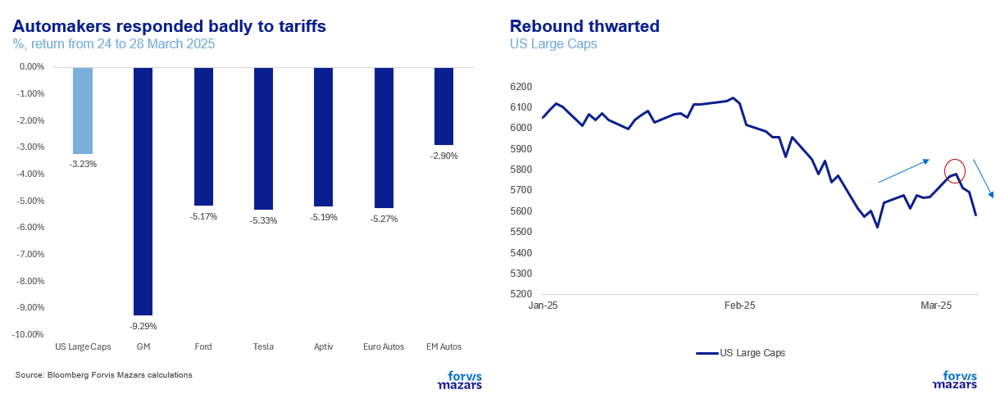
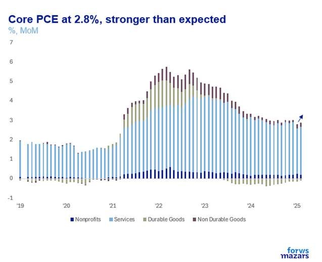
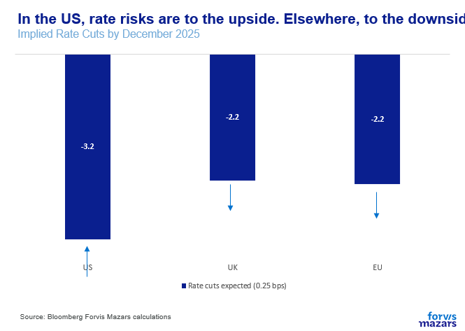
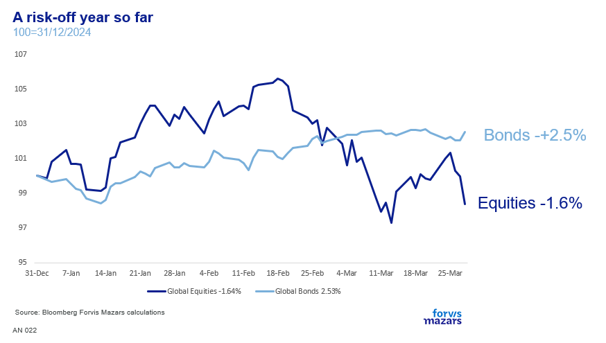

# “Liberation” day: Inflation now, but gone tomorrow?

**Date:** April 01, 2025  
**Publisher:** Breakwave Advisors | **Category:** Market Insights  
**Original URL:** [https://www.breakwaveadvisors.com/insights/2025/4/1/liberation-day-inflation-now-but-gone-tomorrow](https://www.breakwaveadvisors.com/insights/2025/4/1/liberation-day-inflation-now-but-gone-tomorrow)  

---

The three things investors should know about this week

1. After a brief rebound, risk markets retrenched again, as April 2 -tariff day- nears, and the US stepped up tariffs on autos.
2. Rate risks for the US move to the upside (less cuts) and for the rest of the world to the downside (more cuts)
3. Over the short and medium term, markets may perform better than the economy, as sluggish growth could lower the cost of capital and improve returns. However, over the longer term, growth could very likely weigh on earnings enough to cause more frequent corrections.

*By*[*George Lagarias*](https://www.linkedin.com/in/george-lagarias-mba-3baa769/)

### Summary:

This week, April 2 marks the first official day of reciprocal tariffs. US automaker stocks fell significantly after the President’s decision to impose 25% tariffs on car and part imports and the market in general retrenched after a quick rebound. In the next few months, it will be the ratio of winners vs losers + inflation that might very well dictate policy. But it still begs the question: will US inflation really be transitory? We think that there’s a large enough percentage of outcomes to otherwise that should at least give investors pause. Presently the market is pricing in nearly 3x cuts in the US (against the Fed’s 2x average expected cuts). We feel that risks are to the upside (higher rates/fewer cuts) than to the downside. Conversely, in the EU, US tariffs will likely cause a more immediate growth slowdown.

**Over the short and medium term, markets may perform better than the economy, as sluggish growth could lower the cost of capital and improve returns. However, over the longer term, growth (or recessions) could very likely weigh on earnings enough to cause more frequent corrections. Meanwhile, in the real economy, slower growth and economic pain could spread.**Professionals across the board should make sure that their investment and business plans and decisions capture that uncertainty.

### Week Ahead

April 2, the official unveiling of reciprocal tariffs is the day investors will be looking at. If the US government, which has cultivated expectations for extensive tariffs produces something more measured, we would expect risk markets to rebound sharply. Conversely, if negative expectations are met (or even exceeded) then the sell-off may continue. March's final manufacturing and services PMI numbers should give investors a clue as to where the economy is moving in the first few tumultuous months of the new US administration.

----------------------------

This week, April 2 marks what the US President calls “Liberation Day”, the first official day of reciprocal tariffs.

Big ideas, big outcomes. So let’s bring them down to one humble item. Say a car engine piston. How is an American piston assembled? First, raw aluminium to manufacture it is shipped from Michigan to Ontario. Second, the piston is cast and pre-machined, before being sent back to Michigan. Then is sent to Mexico to be finished. The piston is sent back to Wisconsin, where it is assembled with rods before being sent to an engine plant in Michigan. It is then placed into an engine in Michigan which is then sent to a vehicle assembly plant in Ontario, before the final vehicle is shipped to the US as Canadian export.

A person with simple common sense might say “This is madness, the piston crosses the border six times. Just imagine the waste and the environmental footprint”. But a Chief Operating Officer (COO) a key role in most modern corporations would point to a big graph with significant savings and say “This actually saves money and improves quality. It’s more efficient. Behold the marvel that is the modern supply chain”.

A car is comprised of thousands of parts. Six border crossings mean at least 3 tariffs (assuming Canada and Mexico don’t escalate) and a whole lot of paperwork, just for one component. Every time the border is crossed prices are jacked up. Sure, eventually domestic production can expand to produce the piston mostly in the US and reduce the length of the supply chain. So to import tariffs we can add costs to buy land, design the factory, build, hire workers under Union contracts, reroute supply chains etc. More importantly, it will take time. At best, theory stipulates that it takes a year for a built factory to get production up to speed. Another year to plan and build.

Given time, economic theory suggests that efficiencies will improve, though not necessarily at the same level as those of unconstrained trade. And still, it will take years. Meanwhile, tariff costs occur today.

No wonder that US automaker stocks fell significantly after the President’s decision to impose 25% tariffs on car and part imports and that the market in general retrenched after a quick rebound.

> **Figure 1: Market Chart 1**  
> [Local Asset](file:///C:/Users/Dell/Github/Shipping/corpus/03-breakwave/insights/2025/assets/2025-04-01_liberation-day-inflation-now-but-gone-tomorrow_img_image001_bc0455b39f05.png)

But, as US Treasury Secretary Scott Bessent told us “cheap goods is not the American dream”, laying the ground for an inflation surge in the next few months. The President also warned about “short-term pain”. Both have said that equity returns are not a priority.

Now tariffs can be a divisive subject, as John Quincy Adams, the 6th US President, found out. His 38% tariffs in 1828 were meant to protect Northern industry textiles and iron. Southerners, however, felt betrayed as Britain was now boycotting their cotton in response and they couldn’t import machinery for their plantations. Jackson’s VP, southerner John C. Calhoun quit in protest, saying that states had the right to “nullify” executive decisions they deemed unconstitutional (Nullification Theory). It was the beginning of a North-South economic division which eventually escalated into the Civil War.

Tariffs also seem to divide the Fed. Two weeks ago, Jerome Powell said that he considers tariff inflation as “transitory”. However, follow-up interviews with other Fed members (Goolsbee, Kugler, Bostic, Barkin and others) suggested that this is highly dependent on them being a one-off without retaliations and with no second-order effects. In other words, an improbable outcome.

We should not expect the Fed to keep lowering interest rates even if inflation picks up. Friday’s core PCE announcement (which still reflects the realities of a pre-tariff regime) further challenged the reassuring rhetoric suggesting that core inflation was already trending higher.

> **Figure 2: Market Chart 2**  
> [Local Asset](file:///C:/Users/Dell/Github/Shipping/corpus/03-breakwave/insights/2025/assets/2025-04-01_liberation-day-inflation-now-but-gone-tomorrow_img_image006_1adfeeae96c9.jpg)

Expect, thus, big losers and big winners from tariffs, as well as inflation. In the next few months, it will be the ratio of winners vs losers + inflation that might very well dictate policy. That much is very likely.

But it still begs the question: will US inflation really be transitory? There are three eventualities.

Yes it will because tariffs are a one-off and the economy will adjustYes it will because tariffs will cause a material growth slowdown, eventually alleviating wage pressuresNo, it won’t because tariffs will likely be ongoing, changing and retaliated, and immigration curbs will increase wages.

We think that the second and third scenarios more completely capture reality than the first. The second scenario, where inflation is indeed transitory as growth drags down demand, essentially would move the US from “inflationary boom” to “deflationary bust”. The third scenario may see the US in “inflationary boom” or “inflationary bust” territory, as inflation persists, even in a growth slowdown. This scenario will likely not cause quick rate cuts from the Fed.

Presently the market is pricing in nearly 3x cuts in the US (against the Fed’s 2x average expected cuts). We feel that risks are to the upside (higher rates/less cuts) than to the downside. Conversely, in the EU, US tariffs will likely cause a more immediate growth slowdown. So risks for the BoE and the ECB are likely to the downside (lower rates/more cuts). The OBR already halved the UK’s growth projections for 2025 last week ahead of the budget.

> **Figure 3: Market Chart 3**  
> [Local Asset](file:///C:/Users/Dell/Github/Shipping/corpus/03-breakwave/insights/2025/assets/2025-04-01_liberation-day-inflation-now-but-gone-tomorrow_img_image004_26933c27dc7f.png)

What is the bigger picture? One of short-term US inflation, with a question mark as to whether it will become a longer-term affair, slower growth, especially in Europe, uncertain economic outcomes and macroeconomic volatility. It is no wonder that bond markets remain edgy, even after gains in the first part of the year.

> **Figure 4: Market Chart 4**  
> [Local Asset](file:///C:/Users/Dell/Github/Shipping/corpus/03-breakwave/insights/2025/assets/2025-04-01_liberation-day-inflation-now-but-gone-tomorrow_img_image005_24d40924d87d.png)

**Over the short and medium term, markets may perform better than the economy, as sluggish growth could lower the cost of capital and improve returns. However, over the longer term, growth (or recessions) could very likely weigh on earnings enough to cause more frequent corrections. Meanwhile, in the real economy, slower growth and economic pain could spread.**

There are some scenarios where things turn out well. However “hope is not a strategy”. The base case scenario is that things will become increasingly volatile as tariffs begin to weigh on the global economy. Professionals across the board should make sure that their investment and business plans and decisions capture that uncertainty.

---

**Tags:** Macro, Economy, Markets  
