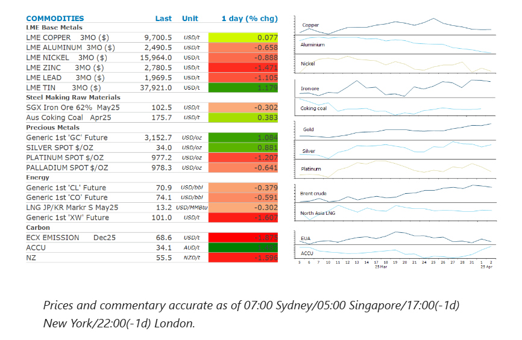
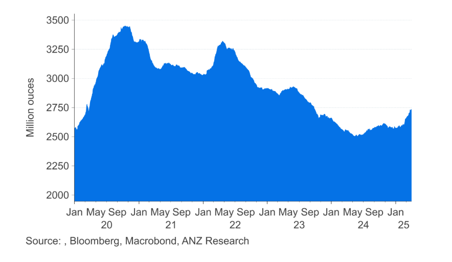

# Gold edges higher ahead of tariff announcement

**Date:** April 03, 2025  
**Publisher:** Breakwave Advisors | **Category:** Market Insights  
**Original URL:** [https://www.breakwaveadvisors.com/insights/2025/4/3/gold-edges-higher-ahead-of-tariff-announcement](https://www.breakwaveadvisors.com/insights/2025/4/3/gold-edges-higher-ahead-of-tariff-announcement)  

---

Commodity markets remained on edge ahead of the announcement of US tariffs. A weaker USD provided some support, as did ongoing supply side issues.

*By*[*Daniel Hynes*](https://www.linkedin.com/in/dahynes/)

> **Figure 1: Στιγμιότυπο Οθόνης 2025 04 03 111656**  
> **Interactive Data & Source:** [Linkedin](https://www.linkedin.com/newsletters/commodities-wrap-6692196755876012032/?fbclid=IwAR3kiXJqZdxmp9ZcRwBNI7FsBySI-XSC0pfPur1qzjt7OZp7PTE59Tsl1QI) | [Local Asset](file:///C:/Users/Dell/Github/Shipping/corpus/03-breakwave/insights/2025/assets/2025-04-03_gold-edges-higher-ahead-of-tariff-announcement_img_cea3cf84ceb9ceb3cebcceb9cf8ccf84cf85_a666873683e3.png)

### Market Commentary

**Gold**edged higher as traders awaited the release of US President Trump’s reciprocal tariffs. The pending announcement has driven safe haven buying in the precious metal. The recent rally has also been supported by strong inflows into gold-backed exchange traded funds. Total holdings have risen 5.5% since the start of February to 2,738t, according to Bloomberg data.

**Base metals**were mixed ahead of the tariff announcement. Aluminium, lead and zinc all ended lower. However, copper managed to end the session higher as a weaker USD helped boost investor appetite. Copper has benefited from major dislocations in the market. Traders have been desperately sourcing metal in the US ahead of any levy. This has sucked inventories out of the international market at a time when demand has been picking up.**Tin**recorded further gains amid the ongoing supply side disruptions. The market is grappling with disruptions in Myanmar following the devastating earthquake that hit the country last week.

**Iron ore**prices gained amid signs of stronger demand. Spot buying at ports in China is said to be brisk as construction activity picks up. This comes following data showing an increase in molten iron production in China as manufacturers become more confident over downstream demand for steel. Sentiment was further pressured by reports that the Chinese government intends to tighten restrictions on non-VAT steel exports.

**Crude oil**crept higher as trader focus remained firmly on the impending US tariffs. However, reports that OPEC was looking to tighten adherence on supply quotas also provided some support. OPEC+ ministers are said to be planning a call on Thursday to discuss the need for all members to abide by the supply agreement. The group has just started the long-delayed process of phasing out 2.2mb/d of voluntary production cuts it implemented last year. That will result in output rising by approximately 138kb/d every month from April. However, some members have been overproducing against their quotas and have been asked by de facto leader Saudi Arabia to make extra curbs as compensation. Kazakhstan has been a particular source of friction after it significantly exceeded its output ceiling during the startup of the expansion of its giant Tengiz oil field. The Energy Minister promised to bring the country’s production back in line. The OPEC+ alliance is also scheduled to hold an online session of their Joint Ministerial Monitoring Committee on Saturday, which oversees the production cuts.

Sentiment in the**oil**market wasn’t helped by a rise in US inventories. Overall commercial stockpiles of crude rose by 6.17mbbl last week. More importantly, US refinery runs declined by 192kb/d, while exports were also lower.

**European gas**fell as prospects for storage refilling over summer improved. North Asian LNG prices were also lower amid weak demand from Asian buyers.

### Chart of the Day

Inflows into gold-backed ETFs have picked up sharply in recent weeks amid uncertainty around global growth as the Trump administration implements its trade policy. However, total holdings remain well below levels seen during the early stages of the pandemic. This raises the prospect of further strong inflows into these funds.

> **Figure 2: Στιγμιότυπο Οθόνης 2025 04 03 111704**  
> **Interactive Data & Source:** [Linkedin](https://www.linkedin.com/newsletters/commodities-wrap-6692196755876012032/?fbclid=IwAR3kiXJqZdxmp9ZcRwBNI7FsBySI-XSC0pfPur1qzjt7OZp7PTE59Tsl1QI) | [Local Asset](file:///C:/Users/Dell/Github/Shipping/corpus/03-breakwave/insights/2025/assets/2025-04-03_gold-edges-higher-ahead-of-tariff-announcement_img_cea3cf84ceb9ceb3cebcceb9cf8ccf84cf85_eb3c777f99d3.png)

Data source:[Commodities Wrap](https://www.linkedin.com/newsletters/commodities-wrap-6692196755876012032/?fbclid=IwAR3kiXJqZdxmp9ZcRwBNI7FsBySI-XSC0pfPur1qzjt7OZp7PTE59Tsl1QI)

---

**Tags:** Commodities, Markets, Shipping  
