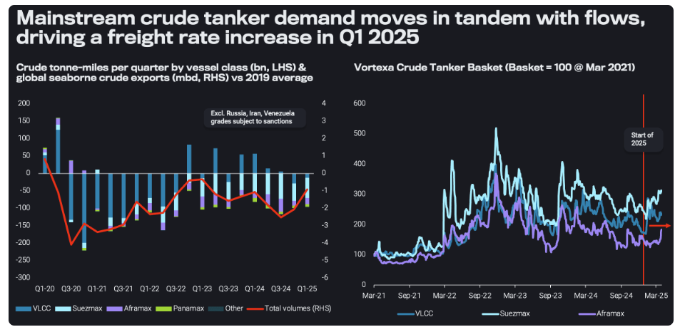
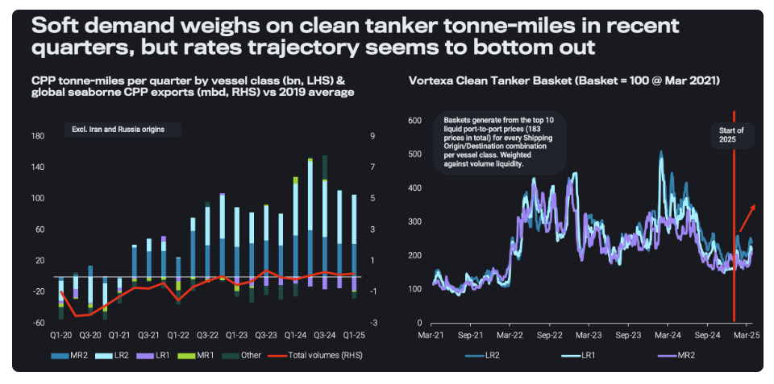

# Geopolitical backdrop drives freight rate resilience

**Date:** April 04, 2025  
**Publisher:** Breakwave Advisors | **Category:** Market Insights  
**Original URL:** [https://www.breakwaveadvisors.com/insights/2025/4/4/geopolitical-backdrop-drives-freight-rate-resilience](https://www.breakwaveadvisors.com/insights/2025/4/4/geopolitical-backdrop-drives-freight-rate-resilience)  

---

Inefficient supply chains driven by tightening supply and lengthening voyages could support crude and clean tanker freight rates

*By*[*Ioannis Papadimitriou*](https://www.linkedin.com/in/ipapadimitriou/)

## Mainstream Crude Demand Has Supported Supertankers in Q1 But Could Subside Going Forward

Crude oil volumes have declined in recent years compared to the 2019 average, significantly reducing mainstream crude tanker tonne-mile demand (excluding Russian, Iranian and Venezuelan grades). However, in the first quarter of 2025, an improvement in mainstream crude tanker demand has been observed. This trend has largely been driven by concerns in India and China regarding crude oil supply stability following the imposition of OFAC sanctions on January 10, as well as uncertainties surrounding the sustainability of Russian exports.

These concerns triggered replacement buying, sourced from both the Middle East Gulf (MEG) and the Atlantic Basin for delivery to the Pacific.This tradeflow shift has led to an increase in tonne-mile demand and freight rates, particularly for VLCCs and Suezmax tankers. Nevertheless, this trend is expected to moderate due to two key factors:

1. Seasonal demand fluctuations in the Pacific leading to the traditional summer lull, compounded by refineries coming online in the region, which is likely to exert further pressure on already suppressed refining margins.
2. The resilience of discounted crude supplies, such as Iranian and Russian oil, which, after an initial decline following the January 10 OFAC sanctions as well as the ban on OFAC-sanctioned tankers calling in ports operated by the Shandong Port Group, have overcome logistical challenges and continued to reach end buyers. This suggests that key importers of discounted crude, such as China and India, are unlikely to significantly increase their reliance on crude sourced from the Middle East or the Atlantic Basin.

> **Figure 1: Στιγμιότυπο Οθόνης 2025 04 04 134257**  
> **Interactive Data & Source:** [Vortexa](https://www.vortexa.com//oil-gas-data-traders-analysts-data-scientists?gclid=Cj0KCQjw8_qRBhCXARIsAE2AtRZKOvMnbilZ_6_91d7huSFFy71pWLrnPwGwOHVzXsmsG-1a1mZnQw8aAt89EALw_wcB&hsa_acc=1782073842&hsa_ad=548425387665&hsa_cam=14746637662&hsa_grp=125038601902&hsa_kw=&hsa_mt=&hsa_net=adwords&hsa_src=g&hsa_tgt=dsa-1431852288425&hsa_ver=3&utm_campaign=%5BCD%5D%20-%20DSA%20-%20EMEA&utm_medium=cpc&utm_medium=ppc&utm_source=google&utm_source=adwords&utm_term=) | [Local Asset](file:///C:/Users/Dell/Github/Shipping/corpus/03-breakwave/insights/2025/assets/2025-04-04_geopolitical-backdrop-drives-freight-rate-resilience_img_cea3cf84ceb9ceb3cebcceb9cf8ccf84cf85_433c5b7edd1b.png)

On a positive note, non-sanctioned tankers with the ability to call in Chinese ports and deliver these discounted barrels are increasing in demand. The lucrative rates are shifting vessels from mainstream to opaque trade operations via S&P deals, ultimately tightening mainstream tanker supply.

## Lrs to Benefit From Higher Flows and Longer Distances

For CPP, our data tells a different story. As illustrated in the chart below, while overall volumes remain at or below 2019 averages, tonne-mile demand has surpassed 2019 levels particularly for MR2 and LR2 tankers. However, in the past two quarters, a decline in CPP flows—attributed to weaker demand, refinery maintenance, and outages—has resulted in reduced volumes of products at sea.

> **Figure 2: Στιγμιότυπο Οθόνης 2025 04 04 134343**  
> **Interactive Data & Source:** [Vortexa](https://www.vortexa.com//oil-gas-data-traders-analysts-data-scientists?gclid=Cj0KCQjw8_qRBhCXARIsAE2AtRZKOvMnbilZ_6_91d7huSFFy71pWLrnPwGwOHVzXsmsG-1a1mZnQw8aAt89EALw_wcB&hsa_acc=1782073842&hsa_ad=548425387665&hsa_cam=14746637662&hsa_grp=125038601902&hsa_kw=&hsa_mt=&hsa_net=adwords&hsa_src=g&hsa_tgt=dsa-1431852288425&hsa_ver=3&utm_campaign=%5BCD%5D%20-%20DSA%20-%20EMEA&utm_medium=cpc&utm_medium=ppc&utm_source=google&utm_source=adwords&utm_term=) | [Local Asset](file:///C:/Users/Dell/Github/Shipping/corpus/03-breakwave/insights/2025/assets/2025-04-04_geopolitical-backdrop-drives-freight-rate-resilience_img_cea3cf84ceb9ceb3cebcceb9cf8ccf84cf85_43331344a7c2.png)

Freight rates, however, appear to have reached a floor. Rising geopolitical tensions could contribute to increased voyage distances, which would provide support for freight rates. Further support may also emerge from an uptick in seaborne product volumes as refineries resume operations post-maintenance. This effect is likely to be particularly pronounced for LR tankers, given heightened geopolitical risks re-emerging in the Red Sea and the resurgence of longer-haul East-to-West middle distillate flows.

In summary, despite indicators of poor trade demand and ongoing uncertainties surrounding economic growth, the current geopolitical landscape is exacerbating fleet inefficiencies. This suggests potential upside for freight rates, particularly in the event of additional disruptions, such as the implementation of tariffs or US Trade Representative (USTR) proposals. On one hand, the tightening supply of mainstream tankers and the continued evolution of a multi-tiered fleet structure are shaping vessel supply-side dynamics. On the other hand, escalating geopolitical tensions and uncertainties, are altering trade flows and extending voyage distances, which could provide additional demand for freight.

Data Source:[Vortexa](https://www.vortexa.com//oil-gas-data-traders-analysts-data-scientists?gclid=Cj0KCQjw8_qRBhCXARIsAE2AtRZKOvMnbilZ_6_91d7huSFFy71pWLrnPwGwOHVzXsmsG-1a1mZnQw8aAt89EALw_wcB&hsa_acc=1782073842&hsa_ad=548425387665&hsa_cam=14746637662&hsa_grp=125038601902&hsa_kw=&hsa_mt=&hsa_net=adwords&hsa_src=g&hsa_tgt=dsa-1431852288425&hsa_ver=3&utm_campaign=%5BCD%5D%20-%20DSA%20-%20EMEA&utm_medium=cpc&utm_medium=ppc&utm_source=google&utm_source=adwords&utm_term=)

---

**Tags:** Crude, Tankers, Shipping  
