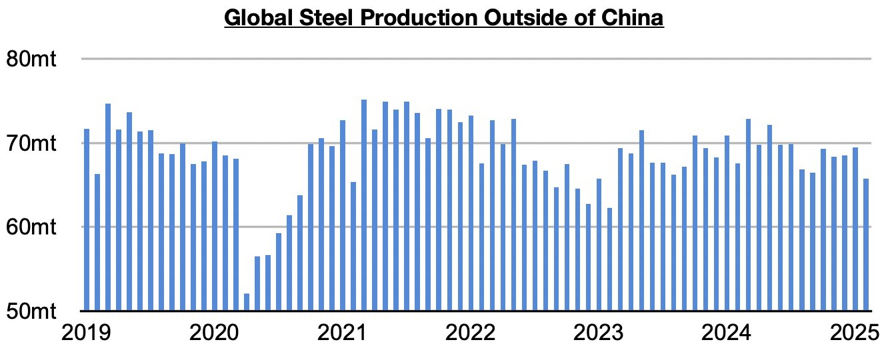
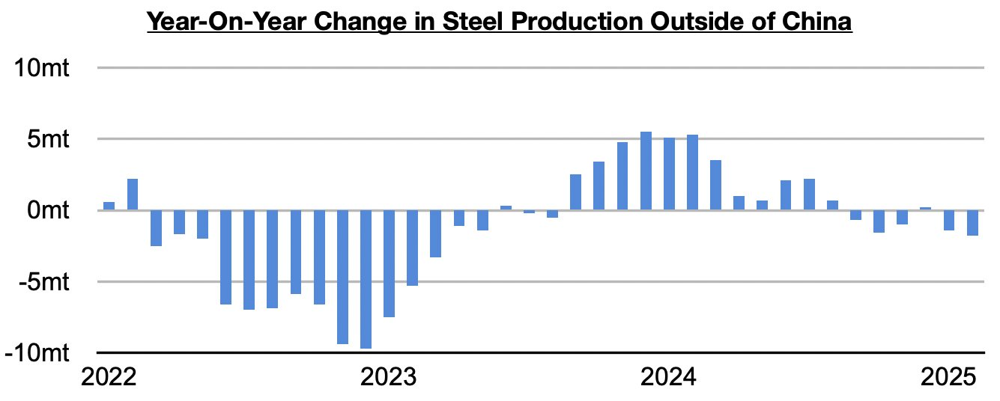

# Ongoing Contraction in Steel Production Outside of China

**Date:** April 04, 2025  
**Publisher:** Breakwave Advisors | **Category:** Market Insights  
**Original URL:** [https://www.breakwaveadvisors.com/insights/2025/4/4/ongoing-contraction-in-steel-production-outside-of-china](https://www.breakwaveadvisors.com/insights/2025/4/4/ongoing-contraction-in-steel-production-outside-of-china)  

---

*By*[*Jeffrey Landsberg*](https://www.linkedin.com/in/jeffrey-landsberg-70ab957/)

As we discussed in Commodore Research's most recent Weekly Executive Report, steel production outside of China totaled approximately 65.8 million tons in February. This is down month-on-month by 3.7 million tons (-5%) and is down year-on-year by 1.8 million tons (-3%).

> **Figure 1: Chart 1**  
> [Local Asset](file:///C:/Users/Dell/Github/Shipping/corpus/03-breakwave/insights/2025/assets/2025-04-04_ongoing-contraction-in-steel-production-outside-of-china_img_chart1_a75c3180b8cf.jpg)

Overall, the global economy outside of China remains a concern of ours. Steel production outside of China has now contracted on a year-on-year basis in five of the last six months (and the contraction most recently seen in February has been the largest). Prior to this six-month period, it had grown on a year-on-year basis for twelve straight months. As we continue to stress in Commodore Research's Weekly Executive Reports and Weekly China Reports, China continues to fare better than many other economies (particularly on the industrial side).

> **Figure 2: Chart 2**  
> [Local Asset](file:///C:/Users/Dell/Github/Shipping/corpus/03-breakwave/insights/2025/assets/2025-04-04_ongoing-contraction-in-steel-production-outside-of-china_img_chart2_5f6002c4ed8c.jpg)

---

**Tags:** China, Economy, Markets  
