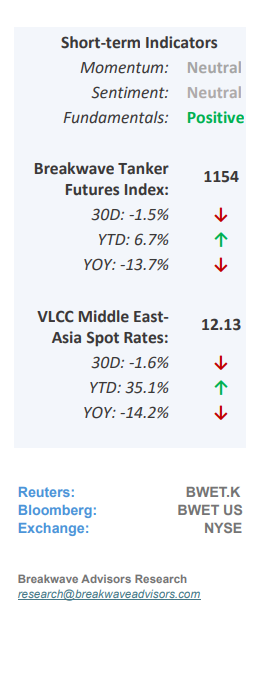
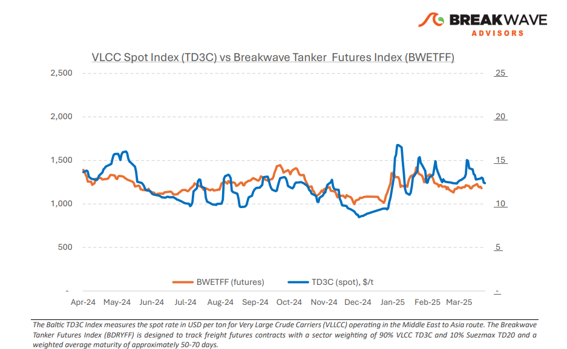
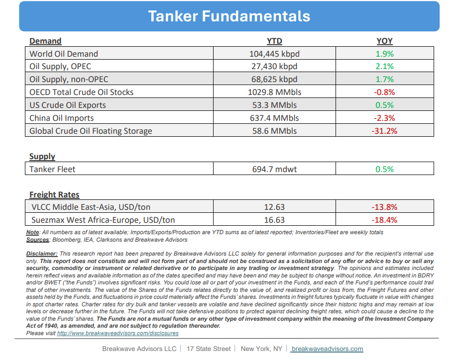

# Breakwave Bi-Weekly Tanker Report - April 8, 2025

**Date:** April 08, 2025  
**Publisher:** Breakwave Advisors | **Category:** Market Insights  
**Original URL:** [https://www.breakwaveadvisors.com/insights/202584wet8547-88](https://www.breakwaveadvisors.com/insights/202584wet8547-88)  

---

•**Trade Tensions Affect VLCC Sentiment**– The**VLCC market**entered April on a**mixed note**, with regional dynamics reflecting a combination of transient strength and underlying caution. In the Middle East, the month commenced with a moderate increase in chartering activity for second-decade April stems, briefly buoying market sentiment.**Owners**were initially**optimistic**that the positive momentum observed in March would translate into firmer rates. However, charterers adopted a more measured approach, likely influenced by uncertainty surrounding oil market fundamentals and the pending outcomes of OPEC+ policy decisions. Consequently,**freight rates**on the benchmark AG/China route**softened**, although they remain ~30% higher than levels recorded in the previous quarter. Despite this relative resilience, market sentiment remains subdued. The global VLCC sector is contending with escalating**geopolitical tensions**and the potential for trade disruptions in the wake of recently**announced tariffs.**China’s imposition of a 10% tariff in February led to a significant decline in U.S. crude imports by Chinese refiners. Should crude oil become a direct target of additional tariffs and in anticipation of such developments, Chinese buyers have already begun diversifying their sourcing strategies, increasing reliance on Middle Eastern, Russian, Brazilian, and West African grades to offset reduced U.S. volumes.

> **Figure 1: Στιγμιότυπο Οθόνης 2025 04 08 123421**  
> [Local Asset](file:///C:/Users/Dell/Github/Shipping/corpus/03-breakwave/insights/2025/assets/2025-04-08_202584wet8547-88_img_cea3cf84ceb9ceb3cebcceb9cf8ccf84cf85_132e380e7713.png)

•**Oil Price Collapse Pushes Curve Closer to Contango**– Oil prices**declined sharply**last week as global markets responded to the unexpected announcement of**global tariffs**by the United States. This development, coupled with a**surprising****increase**in projected**production**from OPEC+, created a**"perfect storm"**that put significant downward pressure on prices. More recently, the Dec25-to-Dec26 spread on Brent crude briefly**shifted into contango**—a market structure that has historically supported stronger tanker rates. We continue to believe that OPEC+, and Saudi Arabia in particular, has now adopted a**new strategy:**With the apparent support of the current U.S. administration, which favors lower oil prices, we anticipate a more aggressive effort to**defend market share**, a deviation from recent years that aimed at price control. This strategic shift will likely result in significantly lower oil prices in the short term, creating**challenges for many producers.**However, it may also**curb investment**in the Western oil sector, which remains a key driver of future production growth. From a tanker market perspective, we believe the shape of the oil curve is the critical factor. With limited underlying growth in crude demand expected in the coming years, a**contango structure**could drive**higher**spot**tanker rates**. Overall, a weak price environment and a market in contango would be beneficial for tankers, echoing trends during the 2015–2017 period.

•**Our Long-term View**– The tanker market is recovering from a long period of staggered rates as the growth in new vessel supply shrinks while oil demand remains elevated in line with the global economy. A historically low orderbook combined with favorable shifting trade patterns should continue to support increased spot rate volatility, which combined with the ongoing geopolitical turmoil, should sustain freight rates in the medium to long term.

> **Figure 2: Στιγμιότυπο Οθόνης 2025 04 08 100945**  
> [Local Asset](file:///C:/Users/Dell/Github/Shipping/corpus/03-breakwave/insights/2025/assets/2025-04-08_202584wet8547-88_img_cea3cf84ceb9ceb3cebcceb9cf8ccf84cf85_d4cd0f9a8ee2.png)

> **Figure 3: Στιγμιότυπο Οθόνης 2025 04 08 123434**  
> [Local Asset](file:///C:/Users/Dell/Github/Shipping/corpus/03-breakwave/insights/2025/assets/2025-04-08_202584wet8547-88_img_cea3cf84ceb9ceb3cebcceb9cf8ccf84cf85_53c965651ca1.png)

### Subscribe:
