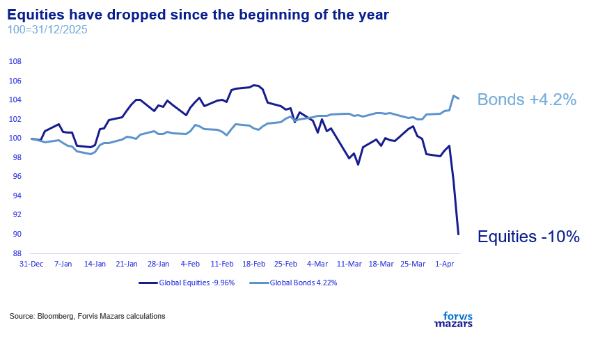
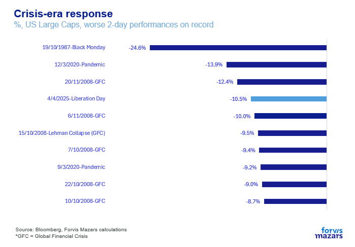
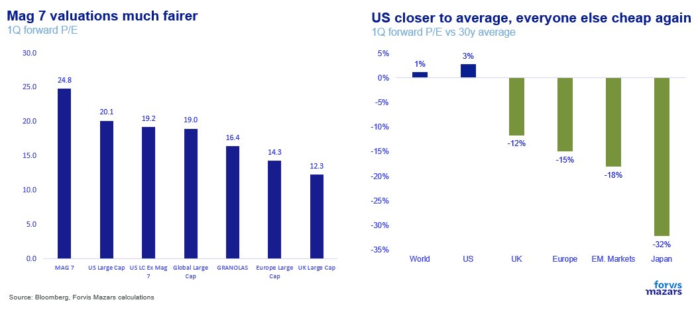
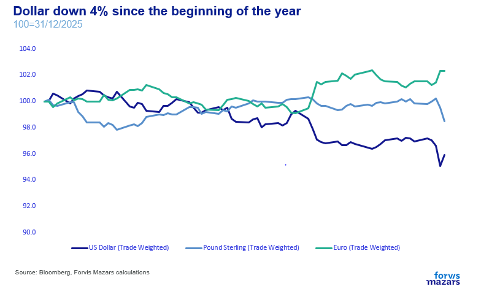
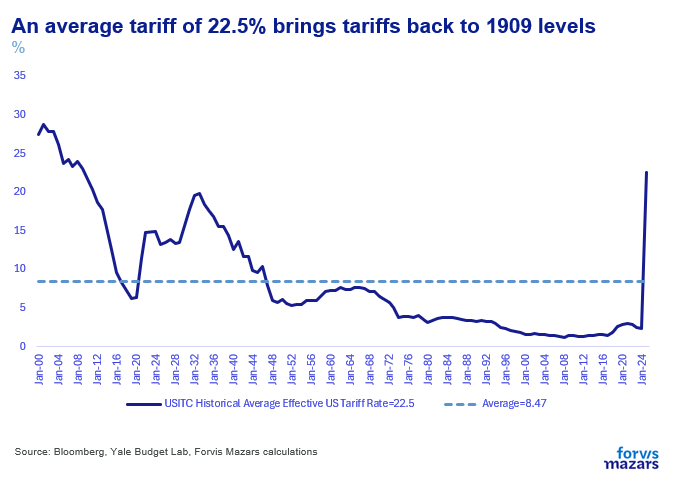

# The greatest economic gambit of our time

**Date:** April 08, 2025  
**Publisher:** Breakwave Advisors | **Category:** Market Insights  
**Original URL:** [https://www.breakwaveadvisors.com/insights/2025/4/8/the-greatest-economic-gambit-of-our-time](https://www.breakwaveadvisors.com/insights/2025/4/8/the-greatest-economic-gambit-of-our-time)  

---

The three things investors need to focus on, in this very crucial week:

1. The risk-off is mostly focused on equities. Bonds are still a safe haven and businesses, though worried, have prepared inventories ahead of the Trade War.
2. Our House View, for the time being, is that tariffs are likely still intended to be a negotiating tool, a way to apply pressure. Why? Because the tariff hike is so sharp that makes little economic sense*except*as a negotiating tool.
3. What can halt the equity market meltdown – long enough for talks to begin? A) An affirmation of the central bank put and/or B) Mr Trump pausing tariff implementation.

*By*[*George Lagarias*](https://www.linkedin.com/in/george-lagarias-mba-3baa769/)

### ------------------------------------

### Summary

*Global equity markets have been in risk-off mode since Mr Trump’s announcement of worldwide tariffs on 185 countries. US large caps had one of their worst 2-day performance in recent history. Despite the equity meltdown, the good news is that in this risk-off year (so far) markets, and diversified portfolios, behave the way they are supposed to, with bonds being a safe asset. What should investors do? Think long-term. Investors who invest in weakness are not always rewarded (for no one can capture the exact bottom), but they don’t necessarily suffer either.*

*However, we understand it’s difficult not to be afraid. One can argue that “this time is different”. This is the point where we need to be very cautious. There is damage done, and there is damage that**may**happen. There is also economic risk and there is investment risk. These notions need to be distinguished. What’s the actual damage? For one, the market retrenchment, however, can very well revert. The only true actual damage comes from uncertainty: is the market still central to Washington? What’s the possible damage? Markets suggest that pursuing trade wars could cause an initial bump in core US inflation to 4.5%-5% which could lead to even a 7% in headline inflation. Estimates also suggest that US growth could slow by about 1%, to just north of 1%-1.5% per annum. Meanwhile, Europe (and the UK) could lose about 1% of its own growth, effectively stagnating or going into recession, and China could lose half its stated growth, before accounting for any retaliation.*

*Our House View, for the time being, is that tariffs are likely still a negotiating tool.**Why? Because the tariff hike is so sharp that makes little economic sense**except**as a negotiating tool. But the true $2tn question lies not in the intention, or the plan, but the execution: Can the US achieve strategic gains before the equity sell-off metastasises to the real economy? What can buy Mr Trump some extra time and act as a backstop to the market pullback? A) A postponement or b) A possible affirmation of the Fed Put*

**What to look out for this week.**

Investors and businesses need to look out for two things: signs of capitulation, either by the US government or its large trading partners and also possible indications from the central banks that they would be willing to affirm their Put and absorb some of the damage.

---------------------------------------

Since Mr Trump’s announcement of worldwide tariffs on 185 countries, financial markets reacted adversely. In the initial two days after tariffs were announced, global stocks lost 8.7% of their value while bonds, the traditional refuge in uncertain times gained 1.2%. At the time of writing Asian stocks were closing at around 7.6%, US equity futures were down 3.5% and Europe stocks were down 5.6%.

> **Figure 1: Market Chart 1**  
> [Local Asset](file:///C:/Users/Dell/Github/Shipping/corpus/03-breakwave/insights/2025/assets/2025-04-08_the-greatest-economic-gambit-of-our-time_img_image001_62f3631205e7.png)

US large caps had one of their worst 2-day performance in recent history. Only three times since 1950 was a two-day event worse: 1987 Black Monday, the first days of the Pandemic and November 2008, the depths of the Global Financial Crisis.

> **Figure 2: Market Chart 2**  
> [Local Asset](file:///C:/Users/Dell/Github/Shipping/corpus/03-breakwave/insights/2025/assets/2025-04-08_the-greatest-economic-gambit-of-our-time_img_image002_758b4fb81863.png)

**Despite being in equity-crisis mode, the good news is that in this risk-off year (so far) markets, and diversified portfolios, behave the way they are supposed to.**Previously inflated US tech valuations have come a lot closer to planet Earth. Meanwhile, bonds behave like the safe assets they are supposed to be.

> **Figure 3: Market Chart 3**  
> [Local Asset](file:///C:/Users/Dell/Github/Shipping/corpus/03-breakwave/insights/2025/assets/2025-04-08_the-greatest-economic-gambit-of-our-time_img_image003_a9839964b63d.png)

So, before reading on, it’s good to remember that**diversification exists precisely for events like that.**

What should investors do? Think long-term. Ignoring any timing, if an investor bought US large caps a few days after Lehman’s collapse, they would have still made 10.94% per annum since that point – including the last two-day retrenchment. The average return since 1950? 11.2%. Investors who invest in weakness are not always rewarded (for no one can capture the exact bottom), but they don’t necessarily suffer either.

Over the shorter term, of course, all outcomes are open, especially in such a volatile environment. Over the long-term, however, there are**three types of investors who more often than not lose money or lag performance:**

- **Those who run for the hills**, crystallising losses and never really getting back until all the good news are priced in again.
- **Those who fall in love and forget to diversify.**They would bet everything on one theme, becoming so immersed that they often forget to sell before said theme inevitably turns around.
- **Those that buy mostly on extreme strength or only after good news have been published**: investors who bought at the apex of the .com bubble made only 7% per annum since then.

**However, we understand it’s difficult not to be afraid.**One can argue that “this time is different”. The global trading system, the driving force behind Western economic disinflation, >10% equity returns per annum in the past couple of decades, as well as a massive upgrade in our way of life, is undergoing a secular (non-cyclical) shift which could cause long-term damage.

This is the point where we, as investors, need to be very cautious. There is**damage done**, and there is**damage that****may****happen**. There is also**economic risk**and there is**investment risk**. These notions need to be distinguished.

Mr Trump’s agenda is on the table for everyone to see: the reindustrialisation of the American North and a shift from growth overwhelmingly dependent on services to a recipe which would see more manufacturing in the mix. Why? Because in growth times, companies with operational leverage (manufacturing, shipping, anything which depends on large fixed investments) can really outperform. For Republicans, capturing the hearts and minds of northern states and traditionally Democratic strongholds could be the holy grail to ensure political dominance.

Will he succeed?

To answer that, we must first answer three questions:

1. What is the damage that’s already done?
2. What is the potential damage?
3. Are tariffs still a negotiating tool?

1. **What’s the actual damage?**So far the actual damage is two-fold:**one is a market retrenchment,**as well as a shock to US and global economic consumer confidence. All these effects, however, can be easily reversed if the market bounces – say on a Fed intervention. The more important damage, however, is the**loss of investor confidence**. The reason why investors prefer the US stock markets and the Dollar to any other economy is not just market depth. It is the long-time assurance that the US is the ultimate capitalist state: wealth generation through the stock market is engraved in policy decisions. A perceived shift from this pledge could have economic repercussions, as well as long-term effects on the Dollar and the premiums applied to US-listed equities (and even positive effects on European and Asian risk assets).**The only true actual damage comes from uncertainty: is the market still central to Washington?**

> **Figure 4: Market Chart 4**  
> [Local Asset](file:///C:/Users/Dell/Github/Shipping/corpus/03-breakwave/insights/2025/assets/2025-04-08_the-greatest-economic-gambit-of-our-time_img_image004_7cb604bf6f68.png)

2.**What’s the possible damage?**The potential damage from insistence on exorbitant tariffs is higher for the real economy than it is for markets, at least over the short and medium term. If history is any guide, the Fed tends to make some sort of intervention (money printing, lower rates, credit lines, verbal assurances of their “Put”) around the -20% to -25% mark. Currently, US large caps are down 17.5%.**So the markets have an immediate policy safety net.**

**The economy on the other hand does not.**JP Morgan and Bloomberg analysts suggest that pursuing trade wars could cause an initial bump in core US inflation to 4.5%-5% which could lead to even a 7% in headline inflation. Market estimates also suggest that growth, on the other hand, could slow by about 1%, to just north of 1%-1.5% per annum. Meanwhile, the EU could lose about 1% of its own growth, effectively stagnating or going into recession, and China could lose half its stated growth, before accounting for any retaliation. JP Morgan’s Bruce Kasman suggested a 60% chance of a global recession. Interest rates may well come down across the board, but it would take time for them to work and they may not still be enough to counter the economic damage.

Which brings us to the ostensible $2tn question:

**Are Tariffs a negotiating tool?**In other words, can he take it back? We have always avoided trying to peek through Mr Trump’s mind, save for an understanding that policy changes happen, and the people around the President change more often than in other administrations.**Our House View, for the time being, is that tariffs are likely still a negotiating tool.**Why?**Because the tariff hike is so sharp that makes little economic sense****except****as a negotiating tool.**competition with China is real, and applying pressure at a rate that supply chains can re-orientate, even at the cost of short-term pain, might be a legitimate goal.

> **Figure 5: To Be Sure, Strategic**  
> [Local Asset](file:///C:/Users/Dell/Github/Shipping/corpus/03-breakwave/insights/2025/assets/2025-04-08_the-greatest-economic-gambit-of-our-time_img_image005_95db653ee28b.png)

Some countries are getting some sort of a deal. Mexico and Canada who sat down with the US are getting a less hostile treatment (Mexico especially). So did Panama who agreed to remove control of the canal from China and Britain, which got hit with just the base 10%.

So the intention to negotiate, taking some growth away from competitors and bringing to the US, is there.

**But the true $2tn question lies not in the intention, or the plan, but the execution: Can the US achieve strategic gains before the equity sell-off metastasises to the real economy?**

On the one hand, we need to remember that there are backstops. So far, we are dealing with an equity market problem. The bond market is acting as a safe haven. Businesses have built up some resilience, in the form of higher inventories, so they can withstand a few weeks or months of trade pressures. Central banks have likely been drawing battle plans. The pullback doesn’t find investors severely leveraged, which is also good for systemic reasons.

Still, equity markets have been tumbling very quickly. Investors are trying to add risk premia to the Trade War but can’t calculate the magnitude of risk at this point. Already, the personal wealth of consumers is suffering, and business planning (hiring, investment) is being severely disrupted.

**Can the President sit down with enough economic blocs to reach some sort of a deal before the market pressures become too pronounced, threatening to destabilise the economy and the global financial system?**

### What Can Buy MR Trump Some Extra Time and Act As a Backstop to the Market Pullback?

- **A postponement**(same as he did with Canada and Mexico) for countries that agree to sit on the table.
- **A possible affirmation of the Fed Put**(verbal most likely, or buying government bonds, extending credit lines, even emergency rate cuts).

All these could unfold in the next few days. This is an environment that unfolds very quickly, and making decisions with a long-term impact might not necessarily lead to positive outcomes.

**Welcome, to the greatest economic gambit of our times.**

---

**Tags:** Macro, Economy, Markets  
