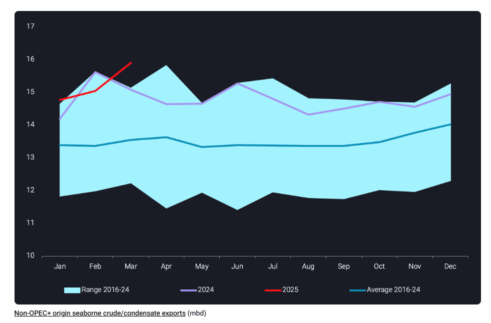
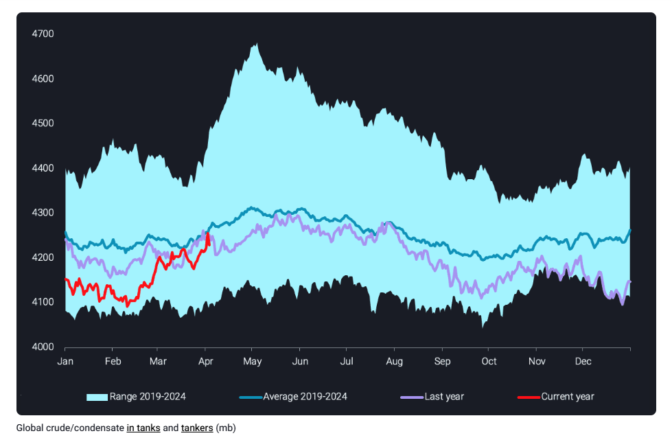
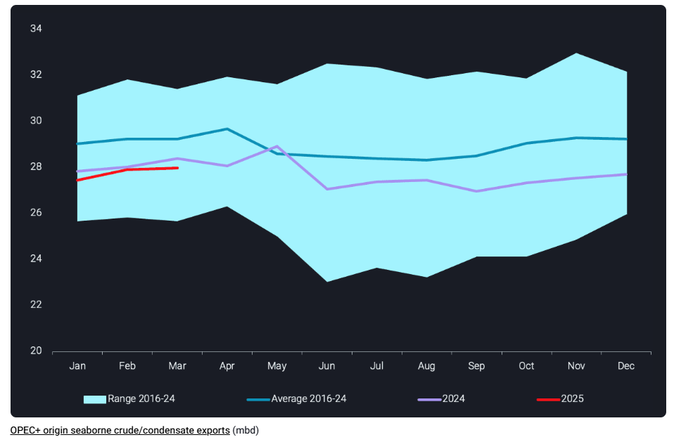

# Oversupply in crude oil markets set to pressure prices

**Date:** April 09, 2025  
**Publisher:** Breakwave Advisors | **Category:** Market Insights  
**Original URL:** [https://www.breakwaveadvisors.com/insights/2025/4/9/oversupply-in-crude-oil-markets-set-to-pressure-prices](https://www.breakwaveadvisors.com/insights/2025/4/9/oversupply-in-crude-oil-markets-set-to-pressure-prices)  

---

As building oversupply is putting crude oil prices under pressure, we explore what OPEC will do and whether China capitalizes on this opportunity

*By*[*Rohit Rathod*](https://www.linkedin.com/in/rathodrohit/)

A breakout pattern has been emerging in terms of global crude supplies, led by non-OPEC+ suppliers whose exports in March 2025 have reached an all time high of close to 16mbd. This – combined with slower demand in the Atlantic basin – could contribute to oversupply in the coming months, and therefore sustain the pressure on crude oil prices that recently emerged from the US trade war. The announced/potential unwinding of voluntary production cuts by OPEC+ is only adding fuel to the flames.

## Non-Opec+ Supplies Post Highs in March

> **Figure 1: Στιγμιότυπο Οθόνης 2025 04 09 113223**  
> **Interactive Data & Source:** [Vortexa](https://www.vortexa.com//oil-gas-data-traders-analysts-data-scientists?gclid=Cj0KCQjw8_qRBhCXARIsAE2AtRZKOvMnbilZ_6_91d7huSFFy71pWLrnPwGwOHVzXsmsG-1a1mZnQw8aAt89EALw_wcB&hsa_acc=1782073842&hsa_ad=548425387665&hsa_cam=14746637662&hsa_grp=125038601902&hsa_kw=&hsa_mt=&hsa_net=adwords&hsa_src=g&hsa_tgt=dsa-1431852288425&hsa_ver=3&utm_campaign=%5BCD%5D%20-%20DSA%20-%20EMEA&utm_medium=cpc&utm_medium=ppc&utm_source=google&utm_source=adwords&utm_term=) | [Local Asset](file:///C:/Users/Dell/Github/Shipping/corpus/03-breakwave/insights/2025/assets/2025-04-09_oversupply-in-crude-oil-markets-set-to-pressure-prices_img_cea3cf84ceb9ceb3cebcceb9cf8ccf84cf85_e3841bfc2498.png)

March seaborne exports from non-OPEC+ sources increased 6% m-o-m, reaching an all time high. This is a positive divergence from the stagnation in these exports seen for most of 2024. The key drivers behind this growth are growing exports from Brazil, Colombia, and the UK in the Atlantic Basin, as well as West Coast Canada (TMX barrels) in the Pacific Basin. The US, which was the driving factor behind non-OPEC+ supply growth in 2023, has since stagnated and even been declining since early 2024. US exports remained a tad shy of 4mbd over February and March 2025.

For now, the supply growth has been largely digested by an import pull from the East. Triggered by massive vessel-specific sanctions from OFAC in early January, concerns about the persistent availability of sanctioned barrels from Russia, Iran and Venezuela triggered a buying stampede by India, China, and other Asian players. These barrels have only started to arrive in Asia, while so far Russian and Iranian discharges continue largely unfazed by the sanction-related logistical challenges.

## Oil in Tanks and Tankers Rises

> **Figure 2: Στιγμιότυπο Οθόνης 2025 04 09 113317**  
> **Interactive Data & Source:** [Vortexa](https://www.vortexa.com//oil-gas-data-traders-analysts-data-scientists?gclid=Cj0KCQjw8_qRBhCXARIsAE2AtRZKOvMnbilZ_6_91d7huSFFy71pWLrnPwGwOHVzXsmsG-1a1mZnQw8aAt89EALw_wcB&hsa_acc=1782073842&hsa_ad=548425387665&hsa_cam=14746637662&hsa_grp=125038601902&hsa_kw=&hsa_mt=&hsa_net=adwords&hsa_src=g&hsa_tgt=dsa-1431852288425&hsa_ver=3&utm_campaign=%5BCD%5D%20-%20DSA%20-%20EMEA&utm_medium=cpc&utm_medium=ppc&utm_source=google&utm_source=adwords&utm_term=) | [Local Asset](file:///C:/Users/Dell/Github/Shipping/corpus/03-breakwave/insights/2025/assets/2025-04-09_oversupply-in-crude-oil-markets-set-to-pressure-prices_img_cea3cf84ceb9ceb3cebcceb9cf8ccf84cf85_30b85353c38e.png)

While global crude oil exports have surged, we have been observing a build in onshore crude inventories, driven by spring maintenance and slowing crude demand due to tighter refining margins in the Atlantic Basin. Along with stockbuilds, we also have increasing oil on water driven by long-haul flows from Atlantic Basin to Pacific Basin on the back of the strong East of Suez buying.

Together, this is leading to a lengthening of crude markets by 120mb since mid February, adding pressure on crude oil prices which have just recently been jolted by market sentiment amidst President Trump’s reciprocal tariff announcement on April 2nd. While crude in tanks and tankers already touches the seasonal average, this trend is likely to continue as more long-haul barrels arrive and current prices may well incentivise Chinese buyers to stockpile more crude. It appears quite likely currently that the global onshore and offshore stockbuild will surpass average seasonal highs during Q2.

## Unwinding of OPEC+ Production Cuts on the Horizon

> **Figure 3: Στιγμιότυπο Οθόνης 2025 04 09 113427**  
> **Interactive Data & Source:** [Vortexa](https://www.vortexa.com//oil-gas-data-traders-analysts-data-scientists?gclid=Cj0KCQjw8_qRBhCXARIsAE2AtRZKOvMnbilZ_6_91d7huSFFy71pWLrnPwGwOHVzXsmsG-1a1mZnQw8aAt89EALw_wcB&hsa_acc=1782073842&hsa_ad=548425387665&hsa_cam=14746637662&hsa_grp=125038601902&hsa_kw=&hsa_mt=&hsa_net=adwords&hsa_src=g&hsa_tgt=dsa-1431852288425&hsa_ver=3&utm_campaign=%5BCD%5D%20-%20DSA%20-%20EMEA&utm_medium=cpc&utm_medium=ppc&utm_source=google&utm_source=adwords&utm_term=) | [Local Asset](file:///C:/Users/Dell/Github/Shipping/corpus/03-breakwave/insights/2025/assets/2025-04-09_oversupply-in-crude-oil-markets-set-to-pressure-prices_img_cea3cf84ceb9ceb3cebcceb9cf8ccf84cf85_b74e99376da1.png)

A double whammy for crude oil prices came on April 3rd from the OPEC+ grouping, announcing an unwinding of their voluntary production cuts. The plans so far seem to point towards an accelerated phase-out of these cuts by increasing crude production by 411kbd starting in May. This unexpected boost has since contributed to sharp decline in oil prices, with Brent tumbling to below $65 per barrel recently.

It is important to note that OPEC+ has indicated that any increase in production may be paused or reversed given market conditions. But, for now the higher than expected reduction in Saudi OSPs could indicate a commitment towards unwinding production cuts and gaining market share in Asia, increasing the pressure on non-compliant OPEC+ producers.

Data Source:[Vortexa](https://www.vortexa.com//oil-gas-data-traders-analysts-data-scientists?gclid=Cj0KCQjw8_qRBhCXARIsAE2AtRZKOvMnbilZ_6_91d7huSFFy71pWLrnPwGwOHVzXsmsG-1a1mZnQw8aAt89EALw_wcB&hsa_acc=1782073842&hsa_ad=548425387665&hsa_cam=14746637662&hsa_grp=125038601902&hsa_kw=&hsa_mt=&hsa_net=adwords&hsa_src=g&hsa_tgt=dsa-1431852288425&hsa_ver=3&utm_campaign=%5BCD%5D%20-%20DSA%20-%20EMEA&utm_medium=cpc&utm_medium=ppc&utm_source=google&utm_source=adwords&utm_term=)

---

**Tags:** Crude, Tankers, Shipping  
