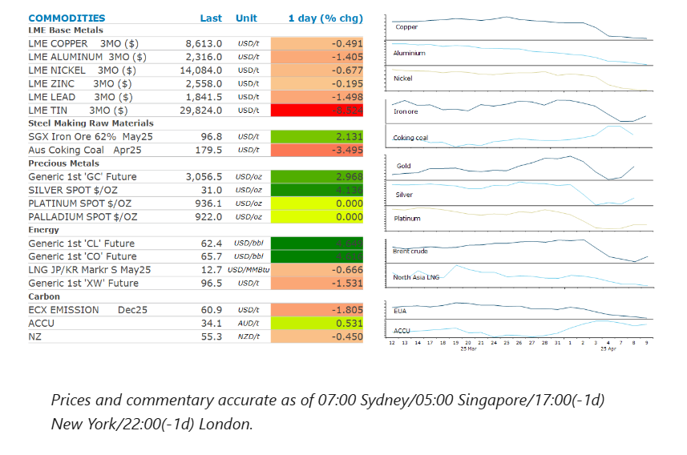
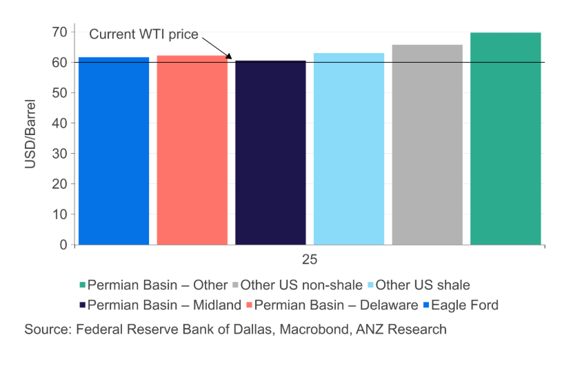

# Tariff pause sparks relief rally

**Date:** April 10, 2025  
**Publisher:** Breakwave Advisors | **Category:** Market Insights  
**Original URL:** [https://www.breakwaveadvisors.com/insights/2025/4/10/tariff-pause-sparks-relief-rally](https://www.breakwaveadvisors.com/insights/2025/4/10/tariff-pause-sparks-relief-rally)  

---

A relief rally sparked by a pause in US tariffs helped push energy and metal markets higher. Gold also benefited from the extreme volatility across global markets.

*By*[*Daniel Hynes*](https://www.linkedin.com/in/dahynes/)

> **Figure 1: Crude Oilsurged After President Trump Announced a 90-Day Pause**  
> *Crude oilsurged after President Trump announced a 90-day pause on some of the higher reciprocal tariffs on major trading partners. The latest move sparked a risk-on tone across markets, pushing Brent crude oil futures more than 4% higher. The move was exacerbated by traders being forced to cover some bearish option bets and short positions that had been built over the past few days. Prices also found some support after the Keystone Pipeline declaredforce majeureon scheduled oil shipments after a leak spilled an estimated 3,500 barrels of crude in a North Dakota field. Earlier in the day prices were under pressure on further signs of surging supply. Saudi Arabia’s decision to increase output by nearly 500kb/d in May, almost four times the scheduled amount, was supposed to force some of the over-producing members to reign in their output. However, Kazakhstan continues to pump at high levels. The OPEC member has been struggling to reach an agreement with some of its international partners that are operating the oil field. The Tengizchevroil joint venture that includes Chevron and Exxon Mobil Corp has said it will stick with plans to boost production this year and has no intention of cutting back. This sets the scene for further pressure from Saudi Arabia.*  
> **Interactive Data & Source:** [Linkedin](https://www.linkedin.com/newsletters/commodities-wrap-6692196755876012032/?fbclid=IwAR3kiXJqZdxmp9ZcRwBNI7FsBySI-XSC0pfPur1qzjt7OZp7PTE59Tsl1QI) | [Local Asset](file:///C:/Users/Dell/Github/Shipping/corpus/03-breakwave/insights/2025/assets/2025-04-10_tariff-pause-sparks-relief-rally_img_cea3cf84ceb9ceb3cebcceb9cf8ccf84cf85_502e14f90671.png)

### Market Commentary

The tariff situation developed at breakneck pace overnight. As 104% tariffs against China came into effect, China retaliated saying that it would levy 84% tariffs against US goods (ie 50% more than their prior retaliatory stance), which then prompted Trump to counter with 125% tariffs on China, effective immediately. But while Trump singled out China with an escalatory response, he then pivoted and announced a 90 day pause on reciprocal tariffs greater than 10% against all other countries, also effective immediately. So the 10% baseline tariff will stay, and larger tariffs are on hold, having been in effect for just over 12 hours.

**Global gas**markets failed to benefit from the relief rally on US equity markets, with the announcement of the pause in reciprocal tariffs coming after the official close in many regions. European gas benchmark futures ended the session down more than 7% amid concerns of weaker economic growth triggered by the trade war. The tit-for-tat tariffs are leading to a high level of uncertainty in the market, with May futures softening in part because there’s an increasing likelihood of US LNG rerouting from China to Europe in coming months. The losses in the**North Asian LNG**market were limited as the failing prices raised the spectre of price sensitive buyers such as India returning to the market. India Oil Corp bought an LNG cargoes for delivery in May, a sign of increased interest.

**Gold**rallied to record its biggest intraday gain in five years as global markets gyrated in response to trade announcements. Gold’s price rose 3.8% to USD3,095/oz during the session. The rise in UST yields appears to have stoked demand for gold as investors shield themselves from the market turmoil. Gold is likely to remain well supported as China and the US escalate tariffs on each other. Investors continue to pile in to gold-backed exchange traded funds, but most of the inflows are coming from China. A record CNY7.6bn was funnelled into such funds last week, according to Bloomberg calculations.

The**base metals**sector remained under pressure, with the session recording further losses before Trump announced the pause in reciprocal tariffs. However, copper futures in New York rallied as much as 7%. Metal markets are likely to remain nervous with China becoming the increasing focus of the Trump administration.

### Chart of the Day

The likelihood of reaching President Trump’s goal of a 3mb/d rise in US oil supply looks increasingly unlikely. The recent selloff across oil markets has pushed prices below the average profitability level for the US shale oil industry.

> **Figure 2: Στιγμιότυπο Οθόνης 2025 04 10 153920**  
> **Interactive Data & Source:** [Linkedin](https://www.linkedin.com/newsletters/commodities-wrap-6692196755876012032/?fbclid=IwAR3kiXJqZdxmp9ZcRwBNI7FsBySI-XSC0pfPur1qzjt7OZp7PTE59Tsl1QI) | [Local Asset](file:///C:/Users/Dell/Github/Shipping/corpus/03-breakwave/insights/2025/assets/2025-04-10_tariff-pause-sparks-relief-rally_img_cea3cf84ceb9ceb3cebcceb9cf8ccf84cf85_9cbec43362b5.png)

Data source:[Commodities Wrap](https://www.linkedin.com/newsletters/commodities-wrap-6692196755876012032/?fbclid=IwAR3kiXJqZdxmp9ZcRwBNI7FsBySI-XSC0pfPur1qzjt7OZp7PTE59Tsl1QI)

---

**Tags:** Commodities, Markets, Shipping  
