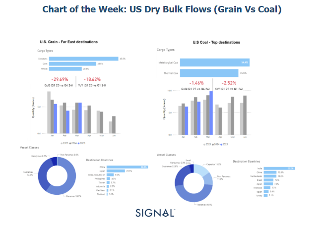
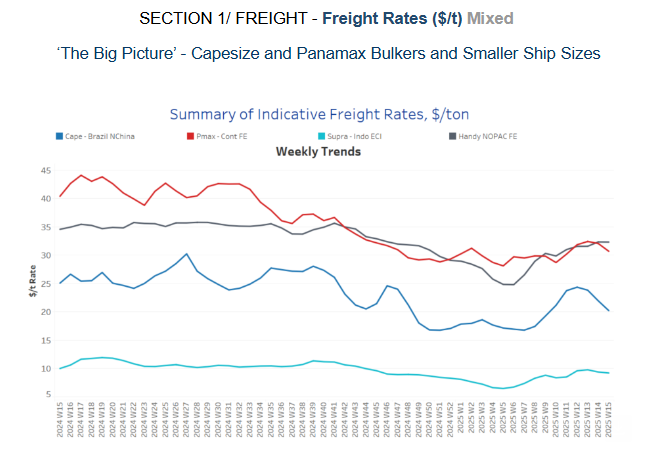
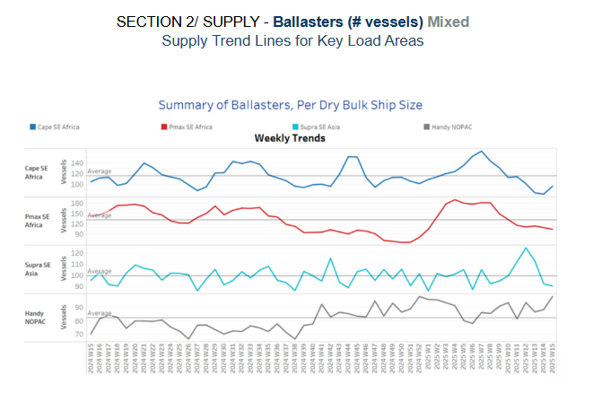
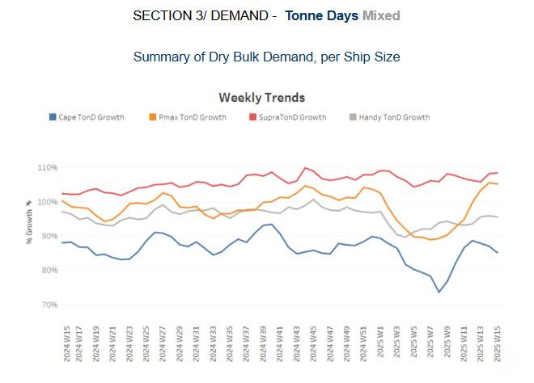
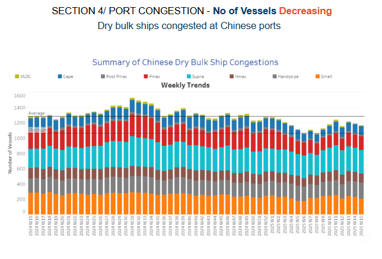

# US Dry Bulk Flows

**Date:** April 10, 2025  
**Publisher:** Breakwave Advisors | **Category:** Market Insights  
**Original URL:** [https://www.breakwaveadvisors.com/insights/2025/4/9/us-dry-bulk-flows](https://www.breakwaveadvisors.com/insights/2025/4/9/us-dry-bulk-flows)  

---

**Dry Weekly Market Monitor - Week 15, 2025**
Snapshot of Spot Freight Rates, Supply-Demand Trends, Port Congestions
April 09, 2025

> **Figure 1: Στιγμιότυπο Οθόνης 2025 04 09 171300**  
> **Interactive Data & Source:** [Signal Ocean Platform](https://www.thesignalgroup.com/signal-ocean-platform) | [Local Asset](file:///C:/Users/Dell/Github/Shipping/corpus/03-breakwave/insights/2025/assets/2025-04-10_us-dry-bulk-flows_img_cea3cf84ceb9ceb3cebcceb9cf8ccf84cf85_96c3b37ca480.png)

### Escalation of U.s.-China Trade Tensions: Implications for Dry Bulk Freight

On April 4th, China announced a 34% tariff on all U.S. imports, a retaliatory response to recent U.S. protectionist trade measures, effective April 10th. This escalation in the trade dispute is set to have a direct impact on key U.S. dry bulk exports—particularly soybeans and corn—based on recent cargo flow and vessel deployment data from the Signal Ocean Platform and supporting trade intelligence.

### Grain Trade at Risk: China As the Top Buyer

According to Q1 2025 data, China accounts for 52.8% of U.S. grain exports to Far East destinations, with Japan and South Korea following at 23.3% and 9.0%, respectively. These flows are heavily reliant on Panamax vessels (59.2%), followed by Supramax (34.2%). The primary cargo types—soybeans (43.5%), corn (29.5%), and wheat (20.5%)—are all sensitive to Chinese demand.

Comparing quarterly performance, U.S. grain shipments to Far East destinations declined:

- ### -29.69% Quarter-on-Quarter (Q1 2025 vs Q4 2024)
- ### -18.62% Year-on-Year (Q1 2025 vs Q1 2024)

This downward trend is likely to accelerate as the newly imposed tariffs deter Chinese buyers, potentially redirecting volumes to alternative markets such as Southeast Asia. However, these substitute markets may offer lower margins and may not be able to fully absorb the volume previously destined for China.

### U.s. Coal May Also See Dampened Demand

While China is not the top importer of U.S. coal, it does source 10.3% of U.S. coal exports, making it the second-largest Asian destination after India (25.2%). The coal trade—split between metallurgical (54.4%) and thermal coal (45.6%)—has so far shown relative stability, with only modest contractions:

- ### -1.46% Qoq
- ### -2.52% Yoy

Coal exports primarily rely on**Panamax (46.1%), Supramax (22.8%), and Capesize (15.2%)**vessels, making the trade more diverse in both cargo type and ship class. However, the imposition of tariffs could make U.S. coal less competitive in Asia, especially as China already has strong import ties with Australia, Russia, and Indonesia.

Following China's announcement of retaliatory tariffs—34% on U.S. imports including key agricultural goods—grain markets reacted sharply. U.S. soybean futures dropped by 4% as traders anticipated a significant reduction in Chinese demand. The tariffs, combined with China's move to curb foreign grain purchases like barley and sorghum, added downward pressure on prices. Meanwhile, exporters such as Brazil have seen increased demand, boosting their market share and insulating Chinese buyers from U.S. supply disruptions.

In the coal market, the immediate price reaction was more muted. Despite a 15% tariff on U.S. coal, prices for seaborne coal and coking coal remained relatively stable. This resilience is partly due to the small share of U.S. coal in China’s overall imports and the quick redirection of U.S. cargoes toward alternative markets like India. However, the broader market remains cautious, with uncertainty around long-term demand and trade flows likely to maintain price volatility.

> **Figure 2: Στιγμιότυπο Οθόνης 2025 04 09 171357**  
> **Interactive Data & Source:** [Signal Ocean Platform](https://www.thesignalgroup.com/signal-ocean-platform) | [Local Asset](file:///C:/Users/Dell/Github/Shipping/corpus/03-breakwave/insights/2025/assets/2025-04-10_us-dry-bulk-flows_img_cea3cf84ceb9ceb3cebcceb9cf8ccf84cf85_a623d8e22b4e.png)

​​​​The freight market sentiment for the Capesize vessel segment is being revised downward as the number of ballasters increases, while we observe soft signs of a slight downward revision in the Panamax market, along with firmness in the smaller vessel sizes segments.

- **Capesize**vessel freight rates from Brazil to North China closed at $20 per tonne, showing a 10% decrease compared to last month.
- **Panamax**from the Continent remained above $30 per tonne, showing a 6% weekly decrease, and an 8% increase compared to last month.
- **Supramax**vessel freight rates on the Indo-ECI route rose by 13% compared to last month, reaching almost $9 per tonne.
- **Handysize**freight rates for the NOPAC Far East route have remained above $30 per tonne since late February, rising by 8% over the past month.

> **Figure 3: Στιγμιότυπο Οθόνης 2025 04 09 171538**  
> **Interactive Data & Source:** [Signal Ocean Platform](https://www.thesignalgroup.com/signal-ocean-platform) | [Local Asset](file:///C:/Users/Dell/Github/Shipping/corpus/03-breakwave/insights/2025/assets/2025-04-10_us-dry-bulk-flows_img_cea3cf84ceb9ceb3cebcceb9cf8ccf84cf85_8d2ba665bf7b.png)

The latest ballaster indicators point to continued downward revisions in the Panamax and Supramax sectors in Southeast Africa, while the Capesize segment has shown signs of upward pressure since the beginning of April.

- **Capesize, SE Africa**: The number of vessels increased to 96—up from around 80 two weeks —still below the annual average of 110. However, there appears to have been a gradual buildup of tonnage since the end of March.
- **Panamax SE Africa**: The vessel count continued to decline, falling to nearly 100 — approximately 30 below the annual average.

- **Supramax SE Asia**: Current trends indicate a sustained downward trajectory from the peak observed in Week 13, with recent levels now falling below the annual average of 100.
- **Handysize NOPAC**: The Handy NOPAC segment's levels have increased to 98, continuing an upward trend that began at the end of week 11.

> **Figure 4: Στιγμιότυπο Οθόνης 2025 04 09 171636**  
> **Interactive Data & Source:** [Signal Ocean Platform](https://www.thesignalgroup.com/signal-ocean-platform) | [Local Asset](file:///C:/Users/Dell/Github/Shipping/corpus/03-breakwave/insights/2025/assets/2025-04-10_us-dry-bulk-flows_img_cea3cf84ceb9ceb3cebcceb9cf8ccf84cf85_b83fad723d5f.png)

The first days of April are marked by a downward trajectory in the Capesize growth of tonne days and a significant preserved growth in the Panamax.

- **Capesize**: The growth trajectory has trended downward since the latest peak at the end of Week 11, though it remains well above the low point recorded in Week 9.
- **Panamax**: Tonne-day growth has maintained its upward trajectory from previous weeks, while April so far appears to mirror the late-March pattern, showing no further spikes.
- **Supramax**: The growth rate remained elevated, marking a firmer pace than the levels observed in Week 11.
- **Handysize**: Its growth rate remained consistent with the previous three weeks, showing a gradual increase starting at the end of week 2.

> **Figure 5: Στιγμιότυπο Οθόνης 2025 04 09 171751**  
> **Interactive Data & Source:** [Signal Ocean Platform](https://www.thesignalgroup.com/signal-ocean-platform) | [Local Asset](file:///C:/Users/Dell/Github/Shipping/corpus/03-breakwave/insights/2025/assets/2025-04-10_us-dry-bulk-flows_img_cea3cf84ceb9ceb3cebcceb9cf8ccf84cf85_5876ff18551a.png)

Congestion at Chinese dry bulk ports exhibited a slight upward trend in early April for the Capesize, Panamax, and Handysize vessel segments, while the overall trend appears to maintain a downward trajectory from the end of March.

- **Capesize**: Capesize vessel congestion rose 112, up by 5 compared to the previous week's end.
- **Panamax**: Panamax vessel congestion rose nearly 180, around 8 more than the end of the previous week.
- **Supramax**: Congestion levels hovered nearly the 300 mark, 6 lower than at the end of the previous week.
- **Handysize**: Congestion levels rose above 200, marking an increase of 12 compared to the end of the previous week.

Data Source:[Signal Ocean Platform](https://www.thesignalgroup.com/signal-ocean-platform)

---

**Tags:** Drybulk, Shipping, Markets  
