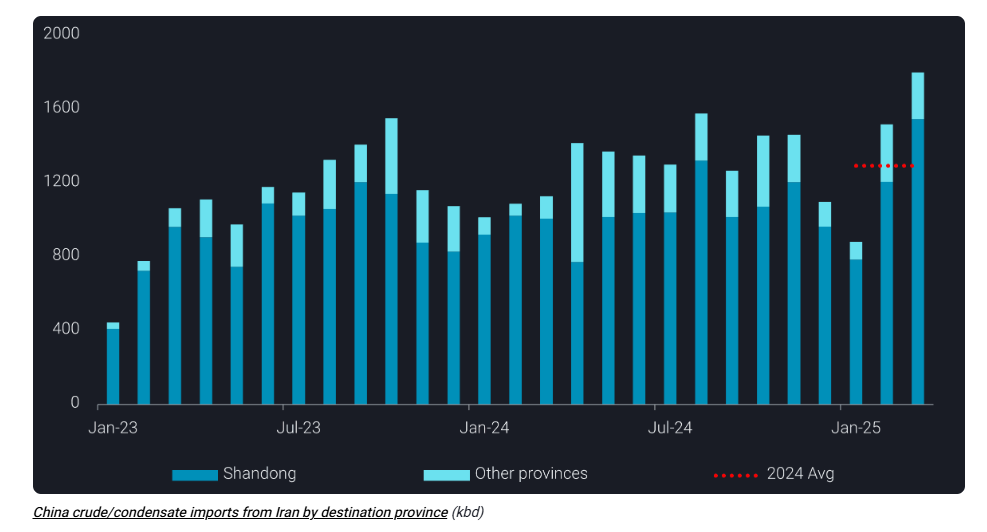
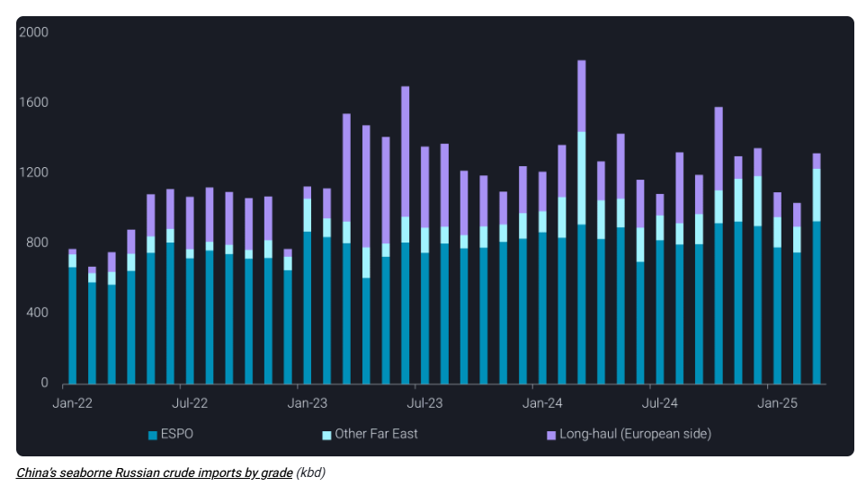
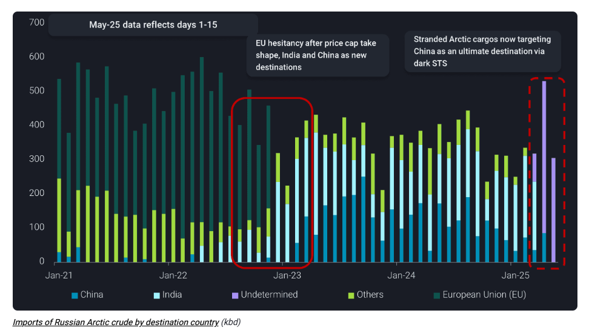

# Record stockpile of sanctioned crude builds in Shandong amid supply disruption fears

**Date:** April 11, 2025  
**Publisher:** Breakwave Advisors | **Category:** Market Insights  
**Original URL:** [https://www.breakwaveadvisors.com/insights/2025/4/11/record-stockpile-of-sanctioned-crude-builds-in-shandong-amid-supply-disruption-fears](https://www.breakwaveadvisors.com/insights/2025/4/11/record-stockpile-of-sanctioned-crude-builds-in-shandong-amid-supply-disruption-fears)  

---

Chinese teapot refiners ramped up sanctioned crude imports in March, pushing Shandong’s crude stockpiles to record highs amid intensifying US sanctions

*By*[*Emma Li*](https://www.linkedin.com/in/emma-li-73003443/)

[China’s seaborne crude imports](https://analytics.vortexa.com/Flows?dateRange=2023-01-01T00%3A00%3A00.000Z__2025-04-30T23%3A59%3A59.999Z&filtersEnabled=%5B%22p%22%2C%22o%22%2C%22d%22%2C%22d_r%22%2C%22intra_d%22%2C%22sts_o%22%2C%22c_o%22%2C%22v%22%2C%22w%22%5D&metric=bpd&movementEvent=unloading_start&page=Flows&products=%5B%2254af755a090118dcf9b0724c9a4e9f14745c26165385ffa7f1445bc768f06f11%22%5D&tabId=79e451b4-c797-47b5-940c-9821caee6759&timeSeriesProperty=destination_country&to=%5B%22b5fafce6e20de2dc307fb7e0b89978ee91a49a7b6ec6f5461daf2633f3c56674%22%5D&v=3)rebounded to 10.6mbd in March—the highest since October 2023—driven largely by record Iranian crude arrivals into the Shandong region.

The latest OFAC sanctions targeting additional Iran-linked tankers have deepened concerns about potential disruptions to Iranian crude flows, prompting refiners to accelerate stockpiling of this critical feedstock.

Iranian crude imports into China surged to a record 1.8mbd in March, with Shandong alone absorbing over 1.5mbd and marking a nearly 50% jump from the 2024 average.

> **Figure 1: Στιγμιότυπο Οθόνης 2025 04 11 125857**  
> **Interactive Data & Source:** [Analytics Vortexa](https://analytics.vortexa.com/Flows?dateRange=2018-01-01T00%3A00%3A00.000Z__2025-04-09T23%3A59%3A59.999Z&filtersEnabled=%5B%22p%22%2C%22o%22%2C%22d%22%2C%22d_r%22%2C%22v%22%2C%22intra_d%22%2C%22sts_o%22%2C%22c_o%22%2C%22v_o%22%5D&from=%5B%22d308ddc557e774187ad6c7da81b39db990def9a39e6c88e79cb163b6bdd6e8e5%22%5D&geoBreakdownDestinationGlobal=region&metric=bpd&page=Flows&products=%5B%2254af755a090118dcf9b0724c9a4e9f14745c26165385ffa7f1445bc768f06f11%22%5D&tabId=a973444c-c834-4af9-b649-efe99b8a6877&v=3) | [Local Asset](file:///C:/Users/Dell/Github/Shipping/corpus/03-breakwave/insights/2025/assets/2025-04-11_record-stockpile-of-sanctioned-crude-builds-in-shandong-amid-supply-disruption-f_img_cea3cf84ceb9ceb3cebcceb9cf8ccf84cf85_77661723e2a5.png)

Shandong’s onshore crude inventories rose by over 20mb during March—an increase that closely mirrors the surge in Iranian oil arrivals and represents the fastest monthly stock build on record.

The current high inventory levels have strengthened Shandong teapots’ bargaining power, allowing them to slow down on stockpiling and demand steeper discounts for upcoming deliveries. Despite likely slower inbound flows in April, demand for discounted feedstock remains firm, buoyed by improved domestic refining margins in April as oil benchmark prices collapsed.

Meanwhile, Iranian crude floating storage in the South China Sea held steady at around 30mb at the end of March, down slightly from 33mb at the start of the month. The[near 7-year-record export pace](https://analytics.vortexa.com/Flows?dateRange=2018-01-01T00%3A00%3A00.000Z__2025-04-09T23%3A59%3A59.999Z&filtersEnabled=%5B%22p%22%2C%22o%22%2C%22d%22%2C%22d_r%22%2C%22v%22%2C%22intra_d%22%2C%22sts_o%22%2C%22c_o%22%2C%22v_o%22%5D&from=%5B%22d308ddc557e774187ad6c7da81b39db990def9a39e6c88e79cb163b6bdd6e8e5%22%5D&geoBreakdownDestinationGlobal=region&metric=bpd&page=Flows&products=%5B%2254af755a090118dcf9b0724c9a4e9f14745c26165385ffa7f1445bc768f06f11%22%5D&tabId=a973444c-c834-4af9-b649-efe99b8a6877&v=3)in March—just shy of 1.8mbd—suggests Iran moved aggressively to send barrels eastward ahead of any further supply hiccups.

## Russian Arctic Crude on Sanctioned Tankers As Well Eyes Shandong

China’s seaborne imports of Russian crude also rebounded to 1.3mbd in March, in line with the 2024 average. This recovery was led by Far East grades, which surged to a 12-month high, as stranded Sokol and Sakhalin Blend cargoes from January and February found buyers at discounted rates. These gains helped offset declining imports of long-haul Urals and Arctic crude, constrained by a tight pool of non-sanctioned tankers after the Jan-10 sanctions.

> **Figure 2: Στιγμιότυπο Οθόνης 2025 04 11 125912**  
> **Interactive Data & Source:** [Vortexa](https://www.vortexa.com//oil-gas-data-traders-analysts-data-scientists?gclid=Cj0KCQjw8_qRBhCXARIsAE2AtRZKOvMnbilZ_6_91d7huSFFy71pWLrnPwGwOHVzXsmsG-1a1mZnQw8aAt89EALw_wcB&hsa_acc=1782073842&hsa_ad=548425387665&hsa_cam=14746637662&hsa_grp=125038601902&hsa_kw=&hsa_mt=&hsa_net=adwords&hsa_src=g&hsa_tgt=dsa-1431852288425&hsa_ver=3&utm_campaign=%5BCD%5D%20-%20DSA%20-%20EMEA&utm_medium=cpc&utm_medium=ppc&utm_source=google&utm_source=adwords&utm_term=) | [Local Asset](file:///C:/Users/Dell/Github/Shipping/corpus/03-breakwave/insights/2025/assets/2025-04-11_record-stockpile-of-sanctioned-crude-builds-in-shandong-amid-supply-disruption-f_img_cea3cf84ceb9ceb3cebcceb9cf8ccf84cf85_643cc7319c4a.png)

Now, Russian Arctic crude loaded on sanctioned tankers post-January 10 is beginning to arrive in the South China Sea, targeting orders from teapot refiners who had largely reduced long-haul Russian barrel purchases since 2024.

Notably, a non-sanctioned VLCC, previously active in Iranian STS deliveries, is now carrying Russian Arctic crude—loaded via two STS transfers—and is currently signalling Shandong. This suggests Russian barrels were offered at even deeper discounts than Iranian crude, appealing to price-sensitive teapots.

> **Figure 3: Στιγμιότυπο Οθόνης 2025 04 11 125929**  
> **Interactive Data & Source:** [Vortexa](https://www.vortexa.com//oil-gas-data-traders-analysts-data-scientists?gclid=Cj0KCQjw8_qRBhCXARIsAE2AtRZKOvMnbilZ_6_91d7huSFFy71pWLrnPwGwOHVzXsmsG-1a1mZnQw8aAt89EALw_wcB&hsa_acc=1782073842&hsa_ad=548425387665&hsa_cam=14746637662&hsa_grp=125038601902&hsa_kw=&hsa_mt=&hsa_net=adwords&hsa_src=g&hsa_tgt=dsa-1431852288425&hsa_ver=3&utm_campaign=%5BCD%5D%20-%20DSA%20-%20EMEA&utm_medium=cpc&utm_medium=ppc&utm_source=google&utm_source=adwords&utm_term=) | [Local Asset](file:///C:/Users/Dell/Github/Shipping/corpus/03-breakwave/insights/2025/assets/2025-04-11_record-stockpile-of-sanctioned-crude-builds-in-shandong-amid-supply-disruption-f_img_cea3cf84ceb9ceb3cebcceb9cf8ccf84cf85_46fa9d5065a7.png)

Data Source:[Vortexa](https://www.vortexa.com//oil-gas-data-traders-analysts-data-scientists?gclid=Cj0KCQjw8_qRBhCXARIsAE2AtRZKOvMnbilZ_6_91d7huSFFy71pWLrnPwGwOHVzXsmsG-1a1mZnQw8aAt89EALw_wcB&hsa_acc=1782073842&hsa_ad=548425387665&hsa_cam=14746637662&hsa_grp=125038601902&hsa_kw=&hsa_mt=&hsa_net=adwords&hsa_src=g&hsa_tgt=dsa-1431852288425&hsa_ver=3&utm_campaign=%5BCD%5D%20-%20DSA%20-%20EMEA&utm_medium=cpc&utm_medium=ppc&utm_source=google&utm_source=adwords&utm_term=)

---

**Tags:** Crude, Tankers, Shipping  
