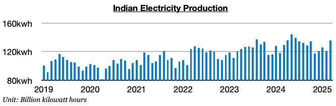
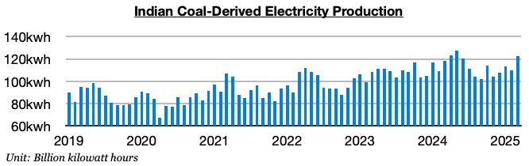

# Significant Improvement in India

**Date:** April 14, 2025  
**Publisher:** Breakwave Advisors | **Category:** Market Insights  
**Original URL:** [https://www.breakwaveadvisors.com/insights/2025/4/13/significant-improvement-in-india](https://www.breakwaveadvisors.com/insights/2025/4/13/significant-improvement-in-india)  

---

*By*[*Jeffrey Landsberg*](https://www.linkedin.com/in/jeffrey-landsberg-70ab957/)

As we discussed in Commodore Research's most recent Weekly Executive Report, India produced approximately 136.1 billion kilowatt hours of electricity in March. This is up month-on-month by 15 billion kilowatt hours (12%) and is up year-on-year by 6.6 billion kilowatt hours (5%). While month-on-month changes are very seasonal, significant is that year-on-year growth has now been seen for two straight months. Also very significant is that last month’s 5% year-on-year growth has marked the strongest growth seen since July.

> **Figure 1: Chart 1**  
> [Local Asset](file:///C:/Users/Dell/Github/Shipping/corpus/03-breakwave/insights/2025/assets/2025-04-14_significant-improvement-in-india_img_chart1_31d5a314ad75.jpg)

Coal-derived electricity generation totaled approximately 122.6 billion kilowatt hours, which is up month-on-month by 12.7 billion kilowatt hours (12%) and up year-on- year by 4 billion kilowatt hours (3%). India’s coal-derived generation has now grown on a year-on-year basis for two straight months. Previously, it had fallen on a year-on-year basis during four of the prior six months (which was very rare). Last month’s 3% year-on-year growth has marked the strongest growth since July.

> **Figure 2: Chart 2**  
> [Local Asset](file:///C:/Users/Dell/Github/Shipping/corpus/03-breakwave/insights/2025/assets/2025-04-14_significant-improvement-in-india_img_chart2_ba6fcc6fbb2b.jpg)

---

**Tags:** Coal, Economy, Markets  
