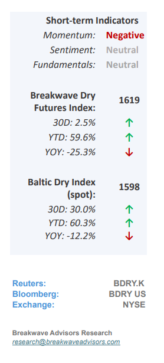
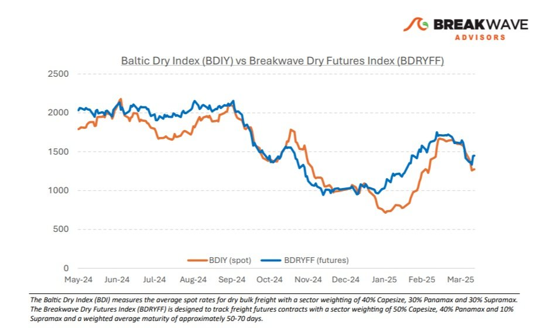
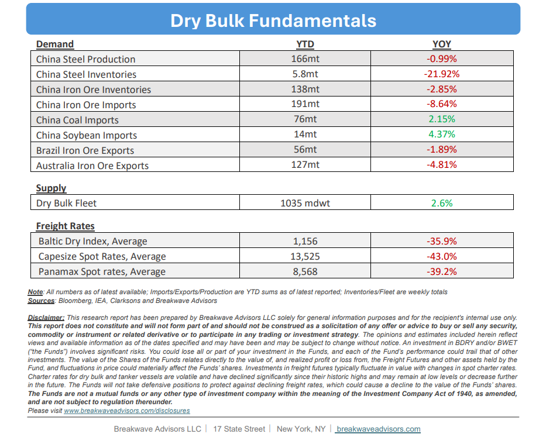

# Breakwave Bi-Weekly Dry Bulk Report - April 15, 2025

**Date:** April 15, 2025  
**Publisher:** Breakwave Advisors | **Category:** Market Insights  
**Original URL:** [https://www.breakwaveadvisors.com/insights/2025154-dry544lo](https://www.breakwaveadvisors.com/insights/2025154-dry544lo)  

---

•**Global Market Turmoil Sours Dry Bulk Sentiment –**Following the**recent tariff**announcements by the U.S. administration and the resulting volatility in global markets,**sentiment**in the dry bulk sector has also**been affected**, leading to a softening in spot rates—most notably in the key Capesize segment. While dry bulk imports into the US accounts for**less than 1%**of the global market, the broader economic slowdown that may result from the new tariffs presents some downside risk for the sector. However, it is the**secondary effects**that warrant closer attention. As investors around the world assess the implications of an evolving and uncertain trade landscape, it remains crucial to recognize that China continues to be the primary driver of demand in the dry bulk market. A prolonged trade conflict may prompt**additional stimulus measures**from the Chinese government— particularly those aimed at supporting domestic infrastructure and industrial activity—which could, in turn, boost demand for dry bulk. This dynamic has not gone unnoticed by the freight futures market, where the recent pullback was short-lived and relatively muted. While global attention remains fixed on the ongoing tariff talks, the dry bulk sector has demonstrated**resilience**and maintained a relatively solid footing. Looking ahead, further upside will likely depend on a**recovery**in Chinese**restocking**activity, especially given the year-to-date declines in import volumes.

> **Figure 1: Στιγμιότυπο Οθόνης 2025 03 31 214812**  
> [Local Asset](file:///C:/Users/Dell/Github/Shipping/corpus/03-breakwave/insights/2025/assets/2025-04-15_2025154-dry544lo_img_cea3cf84ceb9ceb3cebcceb9cf8ccf84cf85_c9116eda0a29.png)

•**As Trade Frictions Grow, China’s Economy Might Refocus on Domestic Demand**– Over the past two decades,**China**has been a**key****engine**of global economic expansion and unquestionably the primary**driver of global trade**growth. However, Chinese policymakers have long acknowledged the limitations of sustaining this growth model and have increasingly emphasized the need to pivot toward domestic consumption as a more sustainable foundation for long-term prosperity. The current**trade tensions**with the United States present an**opportunity for China to accelerate**this transition by recalibrating resource allocation. Future stimulus efforts are therefore expected to prioritize the revitalization of domestic consumption and the strengthening of social safety nets— critical measures to**encourage**Chinese**households**to reduce their precautionary savings and**increase spending**. While we do not foresee a significant decline in industrial production during such transition, the outlook for any growth in steel production over the coming years will be challenging. As this economic transformation unfolds and**demand for raw materials begins to plateau**, it becomes increasingly important to consider other key elements of the shipping market balance—namely voyage distances and vessel supply. On both fronts, we believe the**dynamics remain supportive**over the medium term. Barring a sharp global economic downturn, dry bulk is well positioned to remain resilient and potentially benefit from these evolving market conditions.

•**Our Long-term View**– The last few years have been characterized by increased geopolitical uncertainty. Going forward, we expect such events to continue to affect global trade and have a meaningful impact on effective vessel supply. Combined with the potential for a multi-year cyclical rebound in China’s economic activity following the recent economic turmoil, dry bulk shipping should experience higher volatility on top of a secular tightness driven by stable bulk commodity demand and a slower fleet growth owing to a relatively low orderbook.

> **Figure 2: %Ce%a3%cf%84%ce%b9%ce%b3%ce%bc%ce%b9%cf%8c%cf%84%cf%85%cf%80%ce%bf+%ce%bf%ce%b8%cf%8c%ce%bd%ce%b7%cf%82+2025 04 15+085719**  
> [Local Asset](file:///C:/Users/Dell/Github/Shipping/corpus/03-breakwave/insights/2025/assets/2025-04-15_2025154-dry544lo_img_25ce25a325cf258425ce25b925ce25b325ce_2df59aae2507.jpg)

> **Figure 3: Στιγμιότυπο Οθόνης 2025 04 15 085734**  
> [Local Asset](file:///C:/Users/Dell/Github/Shipping/corpus/03-breakwave/insights/2025/assets/2025-04-15_2025154-dry544lo_img_cea3cf84ceb9ceb3cebcceb9cf8ccf84cf85_3b0491cd664e.png)

### Subscribe:
