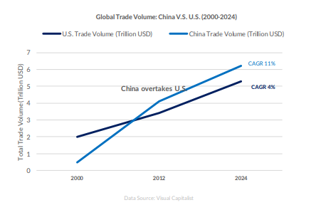
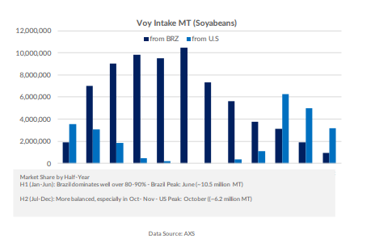
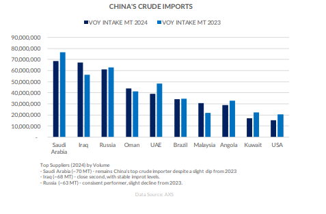

# China's Geoeconomic Ascent and Global Trade Realignment

**Date:** April 16, 2025  
**Publisher:** Breakwave Advisors | **Category:** Market Insights  
**Original URL:** [https://www.breakwaveadvisors.com/insights/2025/4/16/chinas-geoeconomic-ascent-and-global-trade-realignment](https://www.breakwaveadvisors.com/insights/2025/4/16/chinas-geoeconomic-ascent-and-global-trade-realignment)  

---

Between 2000 and 2024, China transformed from a relatively marginal player in global trade into the world’s leading trading hub, surpassing the United States as the top trade partner for more than 130 countries. One of the key catalysts for the U.S.-China trade war was the ballooning American trade deficit with China, which surged from under $50 billion in 1990 to nearly $540 billion by the mid-2020s, triggering strategic responses from Washington. The ripple effects of the trade war have been felt across multiple shipping sectors, though unevenly. The U.S.-China trade war has hit container shipping hardest, with 11% of global volumes affected by tariffs, while dry bulk and oil shipping face smaller direct impacts but broader indirect consequences.

> **Figure 1: Στιγμιότυπο Οθόνης 2025 04 16 112509**  
> **Interactive Data & Source:** [Allied-shipbroking](https://www.allied-shipbroking.gr/) | [Local Asset](file:///C:/Users/Dell/Github/Shipping/corpus/03-breakwave/insights/2025/assets/2025-04-16_chinas-geoeconomic-ascent-and-global-trade-realignment_img_cea3cf84ceb9ceb3cebcceb9cf8ccf84cf85_be14163e6da7.png)

### Seaborne Trade Deficit: Structural Imbalances and Strategic Shifts

The U.S. seaborne trade imbalance with China is driven by asymmetries across three key categories: agricultural exports, highvalue industrial imports, and energy flows. Agriculture—particularly soybeans—once formed the backbone of U.S. exports to China, moving in bulk via Panamax vessels across the Pacific. Before trade tensions escalated, China purchased over 60% of U.S. soybean exports. However, retaliatory tariffs disrupted this flow, triggering a sustained shift in sourcing toward Brazil. As a result, American exporters were compelled to seek alternative markets, while established transpacific grain corridors declined in strategic importance.

On the import side, high-tech and industrial goods—such as electronics, machinery, and electrical components—are primarily transported via containerized liner services across the Asia–Pacific. These imports, often routed through transshipment hubs and feeder networks, constitute the largest share of the trade deficit. Their dominance in U.S.-China shipping has not only shaped maritime logistics but also fueled domestic concerns over industrial hollowing and competitiveness, intensifying calls for protectionist and reshoring policies.

> **Figure 2: Στιγμιότυπο Οθόνης 2025 04 16 112518**  
> **Interactive Data & Source:** [Allied-shipbroking](https://www.allied-shipbroking.gr/) | [Local Asset](file:///C:/Users/Dell/Github/Shipping/corpus/03-breakwave/insights/2025/assets/2025-04-16_chinas-geoeconomic-ascent-and-global-trade-realignment_img_cea3cf84ceb9ceb3cebcceb9cf8ccf84cf85_fbb1f32271d8.png)

Energy trade has similarly evolved under the weight of geopolitical friction. During the U.S. shale boom, crude oil and LNG exports to China surged, facilitated by VLCCs and LNG carriers. Yet the imposition of tariffs led to a steep decline in flows, prompting China to diversify its energy supply. Beijing has since increased reliance on long-haul imports from the Middle East and Russia, redrawing global tanker routes and reducing U.S. Gulf shipments in the process.

> **Figure 3: Στιγμιότυπο Οθόνης 2025 04 16 113014**  
> **Interactive Data & Source:** [Allied-shipbroking](https://www.allied-shipbroking.gr/) | [Local Asset](file:///C:/Users/Dell/Github/Shipping/corpus/03-breakwave/insights/2025/assets/2025-04-16_chinas-geoeconomic-ascent-and-global-trade-realignment_img_cea3cf84ceb9ceb3cebcceb9cf8ccf84cf85_33f70d6ad0e1.png)

Conclusion: Seaborne Trade as a Geopolitical Barometer China’s rise is not just a market story—it’s a deliberate reengineering of global trade. The U.S.-China trade war marks a structural rift, not a policy dispute. Its consequences are being written into shipping lanes, port calls, and fleet strategies—turning maritime trade into the frontline of geoeconomic competition.

Data Source:[Allied](https://www.allied-shipbroking.gr/)

---

**Tags:** China, Shipping, Markets  
