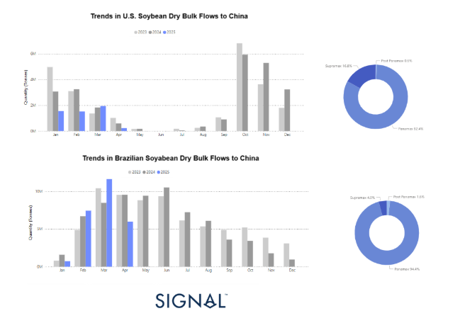
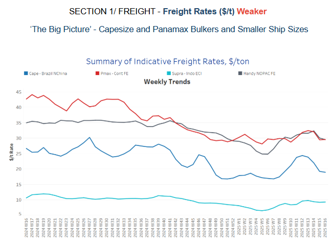
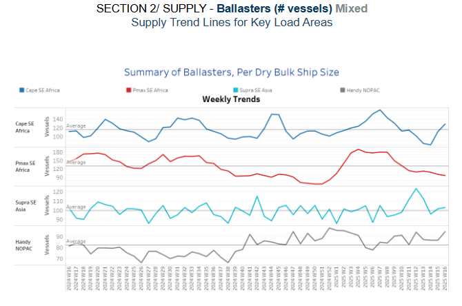
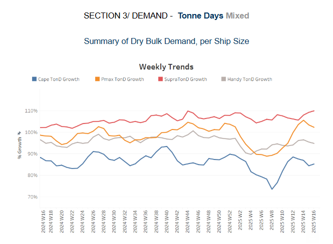
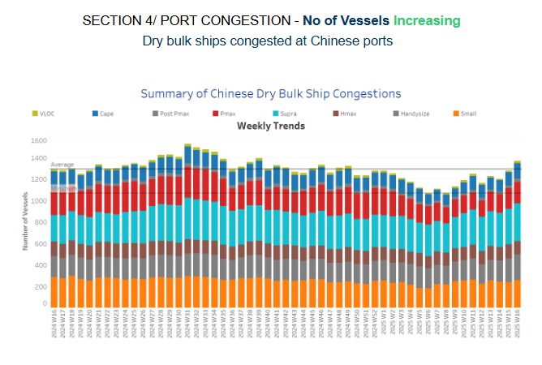

# Grain Dry Bulk Flows (Brazil Vs U.S.A)

**Date:** April 17, 2025  
**Publisher:** Breakwave Advisors | **Category:** Market Insights  
**Original URL:** [https://www.breakwaveadvisors.com/insights/2025/4/16/grain-dry-bulk-flows-brazil-vs-usa](https://www.breakwaveadvisors.com/insights/2025/4/16/grain-dry-bulk-flows-brazil-vs-usa)  

---

**Dry Weekly Market Monitor - Week 16, 2025**
Snapshot of Spot Freight Rates, Supply-Demand Trends, Port Congestions
April 16, 2025

> **Figure 1: Στιγμιότυπο Οθόνης 2025 04 16 160007**  
> **Interactive Data & Source:** [Signal Ocean Platform](https://www.thesignalgroup.com/signal-ocean-platform) | [Local Asset](file:///C:/Users/Dell/Github/Shipping/corpus/03-breakwave/insights/2025/assets/2025-04-17_grain-dry-bulk-flows-brazil-vs-usa_img_cea3cf84ceb9ceb3cebcceb9cf8ccf84cf85_23f415f58c08.png)

## Shift in Global Soybean Trade Flows

Voyage data from the Signal Ocean Platform reveals a clear structural shift in the global soybean trade, underscoring China’s increasing reliance on Brazilian imports. In recent years, Brazil has steadily emerged as China’s primary soybean supplier—a trend closely tied to broader macroeconomic dynamics, notably the ongoing trade tensions between the United States and China. Brazil’s competitive edge stems from record harvests, favorable pricing, and a lack of trade barriers, positioning it as a more dependable and cost-effective source for meeting China's growing soybean demand.

## U.s. Soybean Exports: Declining Share and Strategic Setback

U.S. soybean exports to China have traditionally adhered to a clear seasonal pattern, with peak shipments occurring in the first and last quarters of each year. However, this trend is showing signs of disruption. In March 2025, export volumes plummeted to approximately 2 million tonnes—significantly lower than during the same periods in 2023 and 2024. This decline highlights the enduring consequences of the U.S.-China trade war. As tariffs and geopolitical tensions continued, Chinese importers increasingly turned to alternative suppliers, especially Brazil. The outcome has been a persistent decrease in U.S. market share, leaving American farmers and agribusinesses struggling with diminished demand, decreasing prices, and increasing financial pressure.

## Brazil’s Export Surge: A Geoeconomic Windfall

In sharp contrast, Brazilian soybean exports to China have surged in 2025, with volumes in March and April exceeding 10 million tonnes—well above levels recorded in previous years. This growth reflects Brazil’s alignment with China’s seasonal demand and highlights its capacity to step in as U.S. exports falter. Sustained high export volumes into mid-year further reinforce Brazil’s emergence as a reliable and dominant supplier. More than just a trade shift, this trend signals deeper economic integration between China and Brazil, solidifying Brazil’s strategic role in global agricultural supply chains and reshaping the dynamics of the soybean market.

> **Figure 2: Στιγμιότυπο Οθόνης 2025 04 16 160103**  
> **Interactive Data & Source:** [Signal Ocean Platform](https://www.thesignalgroup.com/signal-ocean-platform) | [Local Asset](file:///C:/Users/Dell/Github/Shipping/corpus/03-breakwave/insights/2025/assets/2025-04-17_grain-dry-bulk-flows-brazil-vs-usa_img_cea3cf84ceb9ceb3cebcceb9cf8ccf84cf85_dd606fb5ff99.png)

​​​​Sentiment in the Capesize freight market is softening as the number of ballasters rises, while early signs also point to a weakening outlook in the Panamax segment.

- **Capesize**vessel freight rates from Brazil to North China closed at $19 per tonne, showing a 20% decrease compared to last month.
- **Panamax**from the Continent remained at nearly $30 per tonne, showing a 6% monthly decrease, and a 30% decrease compared to last month.
- **Supramax**vessel freight rates on the Indonesia–East Coast India (ECI) route held firm at approximately $9 per tonne, marking a 5% increase month-on-month.
- **Handysize**freight rates for the NOPAC Far East route slipped slightly below $30 per tonne, registering a 6% decline month-on-month.

> **Figure 3: Στιγμιότυπο Οθόνης 2025 04 16 160448**  
> **Interactive Data & Source:** [Signal Ocean Platform](https://www.thesignalgroup.com/signal-ocean-platform) | [Local Asset](file:///C:/Users/Dell/Github/Shipping/corpus/03-breakwave/insights/2025/assets/2025-04-17_grain-dry-bulk-flows-brazil-vs-usa_img_cea3cf84ceb9ceb3cebcceb9cf8ccf84cf85_eaedd84e85ed.png)

The latest ballaster indicators suggest continued upward momentum for Capesize activity in Southeast Africa, while Panamax levels face downward pressure.

- **Capesize, SE Africa**: The number of vessels has risen to 12. This is an increase from approximately 80 vessels three weeks ago, and it is also higher than the yearly average of 110 vessels.
- **Panamax SE Africa**: The vessel count continued to decline, falling to nearly 96 — approximately 34 below the annual average.
- **Supramax SE Asia**: Current trends indicate a sustained upward trajectory from the peak observed in Week 13, with recent levels now hovering slightly above the annual average of 100.
- **Handysize NOPAC**: The Handy NOPAC segment's levels have increased to 95, continuing an upward trend that began at the end of week 11.

> **Figure 4: Στιγμιότυπο Οθόνης 2025 04 16 160457**  
> **Interactive Data & Source:** [Signal Ocean Platform](https://www.thesignalgroup.com/signal-ocean-platform) | [Local Asset](file:///C:/Users/Dell/Github/Shipping/corpus/03-breakwave/insights/2025/assets/2025-04-17_grain-dry-bulk-flows-brazil-vs-usa_img_cea3cf84ceb9ceb3cebcceb9cf8ccf84cf85_87d0179dfbf2.png)

The third week of April is marked by a downward trajectory in the Panamax growth of tonne days, while a remarkable spike is recorded in the Supramax.

- **Capesize**: The growth trend has been declining since its recent peak at the end of Week 11, though there are early signs of a recovery. Despite the dip, levels remain well above the low point seen in Week 9.
- **Panamax**: A downward trend has emerged since the peak recorded two weeks ago, though levels remain elevated compared to the softer momentum observed in Week 8.
- **Supramax**: The growth rate remained elevated, marking a firmer pace than the levels observed in Week 11.
- **Handysize**: Its growth rate remained steady compared to the previous two weeks, though it showed a gradual decline in the latter half of the month.

> **Figure 5: Στιγμιότυπο Οθόνης 2025 04 16 160506**  
> **Interactive Data & Source:** [Signal Ocean Platform](https://www.thesignalgroup.com/signal-ocean-platform) | [Local Asset](file:///C:/Users/Dell/Github/Shipping/corpus/03-breakwave/insights/2025/assets/2025-04-17_grain-dry-bulk-flows-brazil-vs-usa_img_cea3cf84ceb9ceb3cebcceb9cf8ccf84cf85_ca931192de7a.png)

Dry bulk port congestion in China saw a significant rise across all vessel size categories.

- **Capesize**: Capesize vessel congestion rose 142, up 10 compared to the previous week's end.
- **Panamax**: Panamax vessel congestion rose by nearly 198, around 20 more than at the end of the previous two weeks.
- **Supramax**: The highest congestion levels since the end of week 9 were observed, with levels around 350.
- **Handysize**: Congestion levels rose 238, marking an increase of 18 compared to the end of the previous week.

Data Source:[Signal Ocean Platform](https://www.thesignalgroup.com/signal-ocean-platform)

---

**Tags:** Drybulk, Shipping, Markets  
