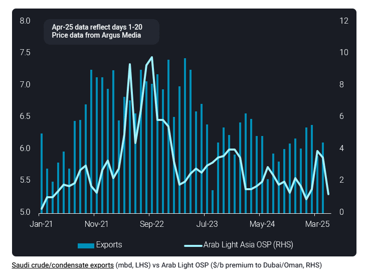
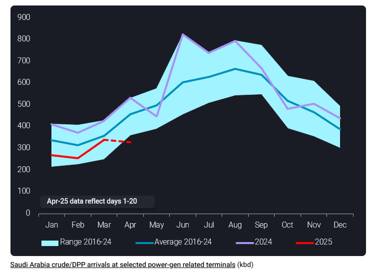

# Saudi crude exports primed for uptick in May

**Date:** April 23, 2025  
**Publisher:** Breakwave Advisors | **Category:** Market Insights  
**Original URL:** [https://www.breakwaveadvisors.com/insights/2025/4/23/saudi-crude-exports-primed-for-uptick-in-may](https://www.breakwaveadvisors.com/insights/2025/4/23/saudi-crude-exports-primed-for-uptick-in-may)  

---

Saudi crude exports are primed for growth in May as the Kingdom’s production quotas increase, coinciding with more aggressively discounted prices, while initial indications also point to weaker-than-usual uptick in seasonal domestic demand.

*By*[*Jay Maroo*](https://www.linkedin.com/in/jay-m-336a3633/)

Saudi Arabia’s crude/condensate exports have maintained a relatively tight range (see chart below) since July 2024, underlining a firm adherence to production quotas agreed with OPEC+. However, given the most recently announced 411kbd production unwind in May, Saudi Arabia’s production quota will be effectively 160kbd higher than April levels. This is likely to pave the way for higher exports in May.

Saudi crude/condensate exports have been fairly stable at around 6mbd according to Vortexa data from March to April (first 20 days). Although exports were higher than the historical norm in January-February (by around 350kbd), this was during planned refinery maintenance at Saudi Aramco’s 400kbd Jizan plant. Looking to May, the 6mbd is likely to be surpassed, especially in the context of the latest pricing developments and early indications for domestic demand trends.

> **Figure 1: Στιγμιότυπο Οθόνης 2025 04 23 111008**  
> **Interactive Data & Source:** [Vortexa](https://www.vortexa.com//oil-gas-data-traders-analysts-data-scientists?gclid=Cj0KCQjw8_qRBhCXARIsAE2AtRZKOvMnbilZ_6_91d7huSFFy71pWLrnPwGwOHVzXsmsG-1a1mZnQw8aAt89EALw_wcB&hsa_acc=1782073842&hsa_ad=548425387665&hsa_cam=14746637662&hsa_grp=125038601902&hsa_kw=&hsa_mt=&hsa_net=adwords&hsa_src=g&hsa_tgt=dsa-1431852288425&hsa_ver=3&utm_campaign=%5BCD%5D%20-%20DSA%20-%20EMEA&utm_medium=cpc&utm_medium=ppc&utm_source=google&utm_source=adwords&utm_term=) | [Local Asset](file:///C:/Users/Dell/Github/Shipping/corpus/03-breakwave/insights/2025/assets/2025-04-23_saudi-crude-exports-primed-for-uptick-in-may_img_cea3cf84ceb9ceb3cebcceb9cf8ccf84cf85_6ba2fb816e75.png)

Regarding pricing, the signs point to an uptick in exports. Saudi OSPs for May loading cargoes announced in early April and were significantly lower than market expectations. As seen in the chart above, the May OSP for Arab Light crude for the Asia Pacific market is at only $1.20/bl premium to the average of Oman and Dubai prices – the sharpest m-o-m decline in multiple years. The sharp discount to Saudi crude for May loading, in particular for the Asian market, is likely to facilitate exports to key markets in the region, including China, where Saudi has recently been losing market share.

On domestic demand, Saudi Arabia relies upon its own crude and domestic/imported residual fuel oils to help meet increased power generation demand in the summer months. Data for crude/DPP arrivals at selected key Saudi power-gen related sites shows that while the seasonal uptrend is yet to get into full swing, the start to the ramp-up in arrivals is a slow one. Arrivals for the first 20 days of April are at the bottom of the historical range and previous months this year were also below historical averages.

> **Figure 2: Στιγμιότυπο Οθόνης 2025 04 23 111117**  
> **Interactive Data & Source:** [Vortexa](https://www.vortexa.com//oil-gas-data-traders-analysts-data-scientists?gclid=Cj0KCQjw8_qRBhCXARIsAE2AtRZKOvMnbilZ_6_91d7huSFFy71pWLrnPwGwOHVzXsmsG-1a1mZnQw8aAt89EALw_wcB&hsa_acc=1782073842&hsa_ad=548425387665&hsa_cam=14746637662&hsa_grp=125038601902&hsa_kw=&hsa_mt=&hsa_net=adwords&hsa_src=g&hsa_tgt=dsa-1431852288425&hsa_ver=3&utm_campaign=%5BCD%5D%20-%20DSA%20-%20EMEA&utm_medium=cpc&utm_medium=ppc&utm_source=google&utm_source=adwords&utm_term=) | [Local Asset](file:///C:/Users/Dell/Github/Shipping/corpus/03-breakwave/insights/2025/assets/2025-04-23_saudi-crude-exports-primed-for-uptick-in-may_img_cea3cf84ceb9ceb3cebcceb9cf8ccf84cf85_c80c2716c8d6.png)

With that in mind, a very rough calculation from a potential 100-150kbd shortfall in domestic demand, plus an extra 160kbd in production allowance, results to an additional 300kbd in potential exports for May. This volume could also be boosted by crude supplies freed up fromthe domestic refining as a result of a 60-day turnaround underway this month at the 400kbd Petro Rabigh refinery.

Looking ahead, the question is how much longer Saudi Arabia, and OPEC+ more generally, will increase production quotas and exports for the global market. The group’s members meet again on May 5 to determine June production levels. On one hand, the group could continue to add supply into the market, with Saudi Arabia claiming a rising share at the expense of other producers as they comply with their respective compensation plans. Alternatively, if macroeconomic concerns continue growing, there will be more pressure among the group members to show restraint on total group output and mitigate the impact of lower prices and downward revisions to global oil demand.

Data Source:[Vortexa](https://www.vortexa.com//oil-gas-data-traders-analysts-data-scientists?gclid=Cj0KCQjw8_qRBhCXARIsAE2AtRZKOvMnbilZ_6_91d7huSFFy71pWLrnPwGwOHVzXsmsG-1a1mZnQw8aAt89EALw_wcB&hsa_acc=1782073842&hsa_ad=548425387665&hsa_cam=14746637662&hsa_grp=125038601902&hsa_kw=&hsa_mt=&hsa_net=adwords&hsa_src=g&hsa_tgt=dsa-1431852288425&hsa_ver=3&utm_campaign=%5BCD%5D%20-%20DSA%20-%20EMEA&utm_medium=cpc&utm_medium=ppc&utm_source=google&utm_source=adwords&utm_term=)

---

**Tags:** Crude, Tankers, Shipping  
