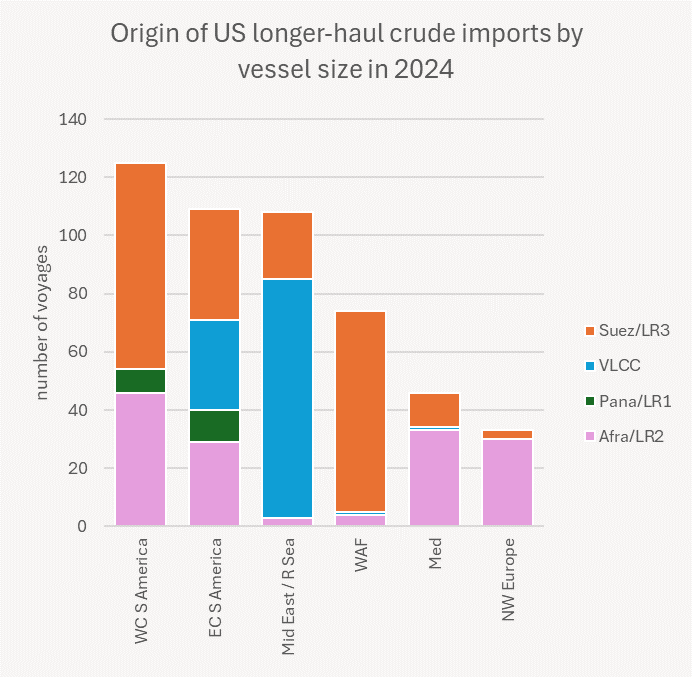
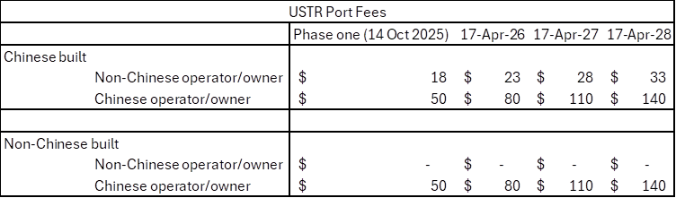
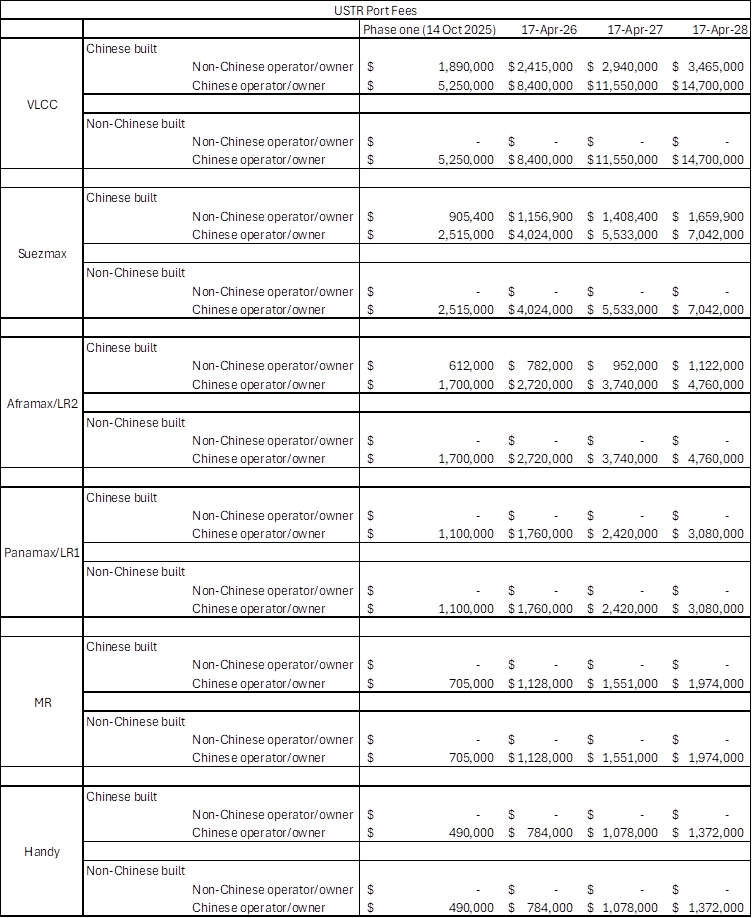

# The Big Picture: USTR port fees Watered down

**Date:** April 23, 2025  
**Publisher:** Breakwave Advisors | **Category:** Market Insights  
**Original URL:** [https://www.breakwaveadvisors.com/insights/2025/4/23/the-big-picture-ustr-port-fees-watered-down](https://www.breakwaveadvisors.com/insights/2025/4/23/the-big-picture-ustr-port-fees-watered-down)  

---

Last Thursday’s much-diluted USTR ‘section 301’ port fee plan takes aim at China’s maritime sector while seemingly doing as little as possible to disrupt US oil flows.

At first glance the new USTR port fees should be easy to avoid. Oil exports are effectively exempt from USTR fees for all but Chinese-owned tankers. Tankers under 55k dwt (or possibly under 80k dwt depending on your interpretation of the wording) are exempt unless Chinese-owned; non Chinese-owned specialised tankers are exempt; US-owned tankers, and tankers in US government programs are exempt. Short-sea oil shipments up to 2,000 nm from US ports are exempt. Only long-haul US crude oil imports, and oil trade on Chinese-owned tonnage would seem to be caught up by the new USTR port fee structure.

Only around 3% of voyages would have met the criteria for USTR port fees last year. Roughly half of these voyages were imports or exports on Chinese-owned tankers and the other half were imports on Chinese-built tankers not covered by any of the exemptions. It should be easy to replace that 3% beyond October 14th.

So the only tanker-side losers at this stage appear to be Chinese tanker owners and Chinese shipyards. We wouldn’t be too surprised to see more Chinese leasing companies offloading MRs. A global-trading MR needs to call US ports, after all. Similarly we would expect owners to hold off ordering Chinese built tankers - at least until the deals are too good to ignore. Chinese yards certainly have room manoeuvre. During the Covid years, Chinese Suezmax slots were offered down to around $51m. Newbuild prices have given some ground since the start of this year, but South Korean yards are still talking Suezmaxes in the high $80s.

China has complained, but has thus far held off threatening retaliatory action. There are all sorts of retaliatory measures it could adopt. It could, for instance, look to penalise US owned ships calling Chinese ports. Or it could simply choose to ride this one through and hope for a change of heart.

Meanwhile there are still the inevitable uncertainties to clear up. What exactly constitutes a Chinese owned or operated tanker remains a key question. We now know Hong Kong and Macao-based owners are included. We believe it includes ships leased from Chinese lease finance houses, but sale and leaseback deals are often hidden from maritime databases making it difficult to pin down accurate numbers. We are not sure what happens to Chinese-owned ships on time charter to non-Chinese operators, or in non-Chinese pools.

Maybe all will be revealed in time. Or maybe the US simply isn't that fussed, so long as it hits the big Chinese state owners where it hurts.

> **Figure 1: C410 Image 0 1745342225017**  
> [Local Asset](file:///C:/Users/Dell/Github/Shipping/corpus/03-breakwave/insights/2025/assets/2025-04-23_the-big-picture-ustr-port-fees-watered-down_img_c410-image-0-1745342225017_59bd4048b32a.png)

### The Plan

The fees will start on October 14th and would be applicable at the first US port called on each voyage from a foreign country.

For vessels with Chinese operators or owners:

- Applied based on net vessel tonnage, increasing incrementally over time.

- Starting at $50 per net ton, gradually increasing to $140 per net ton over three years.

For Chinese-built ships:

- Applicable to vessels not operated or owned by Chinese entities but constructed in China.

- Starting at $18 per net ton, rising to $33 per net ton over three years.

- Fee remissions are available for operators that order and take delivery of a US built vessel with equal or greater capacity within a three-year period.

- Exemptions apply for vessels arriving empty/in ballast, vessels below 55,000 dwt, short voyages of less than 2,000 nm and specialised vessels transporting liquid or bulk chemicals.

> **Figure 2: 014a Image 1 1745342225019**  
> [Local Asset](file:///C:/Users/Dell/Github/Shipping/corpus/03-breakwave/insights/2025/assets/2025-04-23_the-big-picture-ustr-port-fees-watered-down_img_014a-image-1-1745342225019_c8c281ea518c.png)

Fees are assessed at the vessel’s first US port call. Fees are assessed once per rotation or string of US port calls, up to a maximum of five times per year per vessel.

> **Figure 3: 8108 Image 2 1745342225021**  
> [Local Asset](file:///C:/Users/Dell/Github/Shipping/corpus/03-breakwave/insights/2025/assets/2025-04-23_the-big-picture-ustr-port-fees-watered-down_img_8108-image-2-1745342225021_39918f3de580.png)

---

**Tags:** Tankers, Shipping, Markets  
