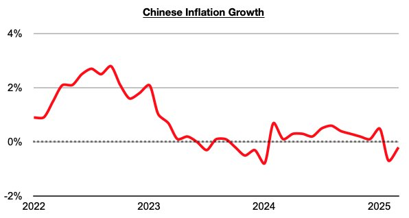

# China Very Uniquely Positioned

**Date:** April 24, 2025  
**Publisher:** Breakwave Advisors | **Category:** Market Insights  
**Original URL:** [https://www.breakwaveadvisors.com/insights/2025/4/24/china-very-uniquely-positioned](https://www.breakwaveadvisors.com/insights/2025/4/24/china-very-uniquely-positioned)  

---

*By*[*Jeffrey Landsberg*](https://www.linkedin.com/in/jeffrey-landsberg-70ab957/)

As we discussed in Commodore Research's most recent Weekly China Report, China’s inflation last month contracted year-on-year by 0.1%, which has marked a second consecutive month with a contraction. Prior to these last two months, inflation in China had not contracted on a year-on-year basis since January 2024.

> **Figure 1: Chart**  
> [Local Asset](file:///C:/Users/Dell/Github/Shipping/corpus/03-breakwave/insights/2025/assets/2025-04-24_china-very-uniquely-positioned_img_chart_986057c9b990.jpg)

Overall, a major issue that we have been stressing in our reports is that inflation remaining relatively low in China (compared to much of the rest of the world), has been continuing to provide the central government a luxury of more safely being able to carry out inflationary stimulus measures. With inflation remaining in a year-on-year contraction, we remain of our view that significant stimulus measures will be rolled out. We also continue to see significant silver linings from the trade war with the United States. We see China focusing on strengthening its domestic economy even more (at the expense of re-inflating its debt bubble). Revitalizing consumption has now become even more important to China's government. We see China as being keen to strengthen domestically also in order to be better positioned to become the world’s sole superpower. As the United States is turning more inwards, we expect that China will be turning more outwards and will again be working on gaining greater prominence globally,

---

**Tags:** China, Markets, Economy  
