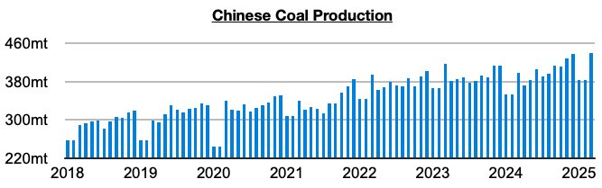
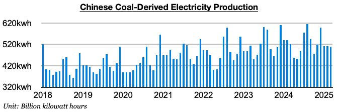

# China's 2025 Coal Import Prospects Remain Concerning

**Date:** April 28, 2025  
**Publisher:** Breakwave Advisors | **Category:** Market Insights  
**Original URL:** [https://www.breakwaveadvisors.com/insights/2025/4/27/chinas-2025-coal-import-prospects-remain-concerning](https://www.breakwaveadvisors.com/insights/2025/4/27/chinas-2025-coal-import-prospects-remain-concerning)  

---

*By*[*Jeffrey Landsberg*](https://www.linkedin.com/in/jeffrey-landsberg-70ab957/)

China's coal production in March totaled 440.6 million tons. This is up month-on-month by 57.9 million tons (15%), is up year-on-year by 41.3 (10%) million tons, and has set another record. China’s coal production has now grown on a year-on-year basis for ten straight months (after previously contracting on a year-on-year basis for five straight months), and has fared better than coal-derived electricity generation for six straight months. The 10% year-on-year growth has also marked the strongest growth seen since 2022.

> **Figure 1: Chart 1**  
> [Local Asset](file:///C:/Users/Dell/Github/Shipping/corpus/03-breakwave/insights/2025/assets/2025-04-28_chinas-2025-coal-import-prospects-remain-concerning_img_chart1_ac22b5c5d7a1.jpg)

Coal-derived electricity generation, which makes up the bulk of China's electricity generation, totaled 509.9 billion kilowatt hours. This is down month-on-month by 800 million kilowatt hours and is down year-on-year by 10.2 billion kilowatt hours (-2%). China’s coal-derived electricity generation has now contracted on a year-on-year basis for four straight months. After having long been bullish for China’s coal import prospects, we remain very concerned for this year’s prospects. We continue to discuss this extensively for our clients in Commodore Research's Weekly China Reports and Weekly Executive Reports.

> **Figure 2: Chart 2**  
> [Local Asset](file:///C:/Users/Dell/Github/Shipping/corpus/03-breakwave/insights/2025/assets/2025-04-28_chinas-2025-coal-import-prospects-remain-concerning_img_chart2_797fc7245b5c.jpg)

---

**Tags:** Coal, Markets, China  
