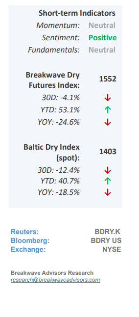
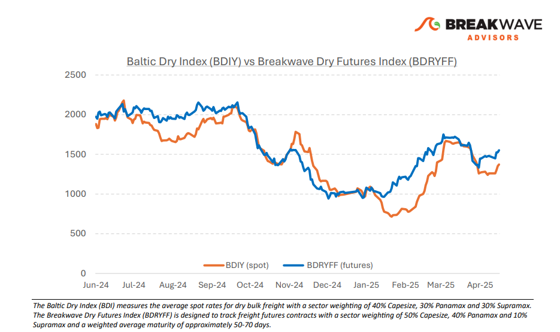
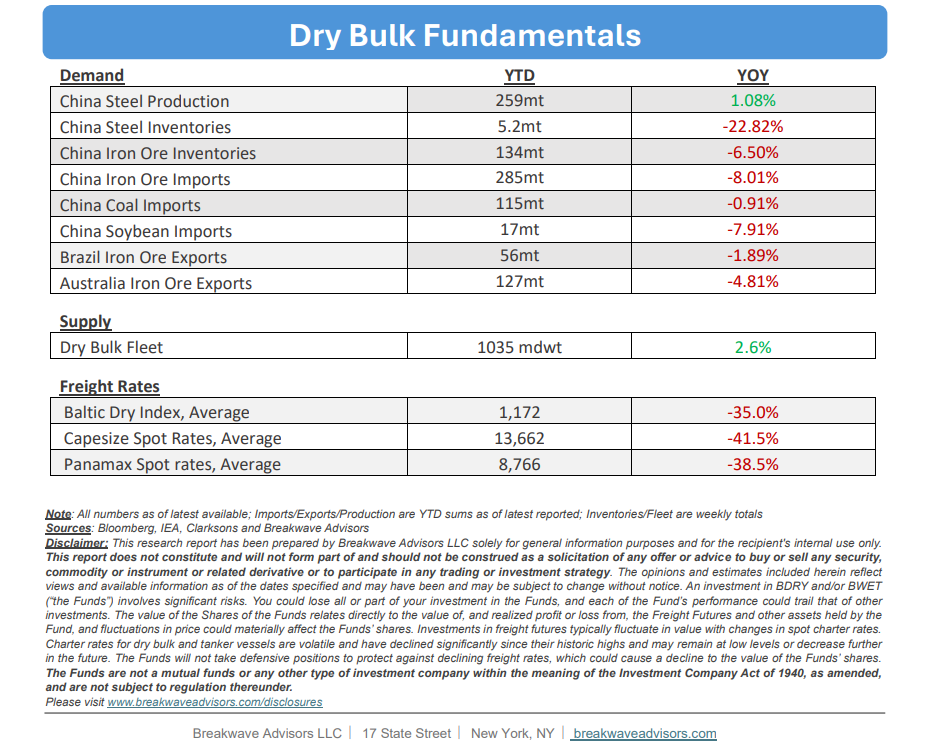

# Breakwave Bi-Weekly Dry Bulk Report - April 29, 2025

**Date:** April 29, 2025  
**Publisher:** Breakwave Advisors | **Category:** Market Insights  
**Original URL:** [https://www.breakwaveadvisors.com/insights/2025294-dry544lolk574](https://www.breakwaveadvisors.com/insights/2025294-dry544lolk574)  

---

•**Capesize Spot Rates Bounce Off Recent Lows on Positive Seasonality**– Following a significant decline from recent robust levels, spot**Capesize**rates have**rebounded**and are on an upward trajectory again, consistent with historical seasonal trends. As**weather conditions improve**in the Northern Hemisphere, iron ore volumes being transported tend to increase, benefiting the core Capesize sector and positively impacting smaller sub-segments as well. Although the current**complexities surrounding US tariffs**do not directly affect the dry bulk sector (bulk commodity volumes are largely insulated from the U.S. market)**global economic sentiment remains cautious.**Such caution is indirectly influencing the dry bulk market, and while the**futures curve**remaining in**slight contango**, we anticipate that spot rates will continue to rise into mid-May, aligning with expectations reflected in the futures curve.**Further increases**will**depend**largely on China’s short-term recovery prospects and any**additional stimulus**measures that could enhance investment sentiment and stimulate trade activity for bulk commodities. With a**stated GDP growth target of 5%**and a challenging trade outlook, the Chinese government will need to implement**substantial stimulus**measures to achieve this goal. As a result, the second half of the year may exhibit stronger commodity performance than what current futures prices indicate.

> **Figure 1: Στιγμιότυπο Οθόνης 2025 04 29 100157**  
> [Local Asset](file:///C:/Users/Dell/Github/Shipping/corpus/03-breakwave/insights/2025/assets/2025-04-29_2025294-dry544lolk574_img_cea3cf84ceb9ceb3cebcceb9cf8ccf84cf85_4e0c3c97da41.png)

•**Q1 Dry Bulk Volumes Disappoint Despite Relatively Strong Freight Rates**– During the first quarter of the year, iron ore and coal volumes reached their lowest levels in two years, significantly below the figures recorded in the fourth quarter. Weather disruptions in Australia, attributed to the cyclone season, adversely impacted iron ore exports, while coal demand decreased notably, resulting in coal prices hitting four-year lows. Although high congestion in West Africa has supported freight rates, particularly for Capesize vessels, the overall freight market remains relatively subdued compared to previous years. The Chinese steel market has not exhibited significant momentum in terms of profitability, and recent government initiatives aimed at reducing excess capacity in the steelmaking industry are expected to marginally lower iron ore demand. Conversely, we anticipate additional stimulus measures this year to mitigate the expected downturn resulting from the ongoing trade war, which should have positive spillover effects on industrial production and, consequently, demand for steel. Furthermore, iron ore inventories continue to decline, currently standing at 15-month lows, while iron ore prices have stabilized around $100 per ton, a level that remains profitable for most producers. Furthermore, the stability of the iron ore futures curve enhances confidence in the sustainability of this relatively favorable market environment, indirectly supporting freight.

•**Our Long-term View**– The last few years have been characterized by increased geopolitical uncertainty. Going forward, we expect such events to continue to affect global trade and have a meaningful impact on effective vessel supply. Combined with the potential for a multi-year cyclical rebound in China’s economic activity following the recent economic turmoil, dry bulk shipping should experience higher volatility on top of a secular tightness driven by stable bulk commodity demand and a slower fleet growth owing to a relatively low orderbook.

> **Figure 2: Στιγμιότυπο Οθόνης 2025 04 29 100103**  
> [Local Asset](file:///C:/Users/Dell/Github/Shipping/corpus/03-breakwave/insights/2025/assets/2025-04-29_2025294-dry544lolk574_img_cea3cf84ceb9ceb3cebcceb9cf8ccf84cf85_9fa03aab4aaa.png)

> **Figure 3: Στιγμιότυπο Οθόνης 2025 04 29 100144**  
> [Local Asset](file:///C:/Users/Dell/Github/Shipping/corpus/03-breakwave/insights/2025/assets/2025-04-29_2025294-dry544lolk574_img_cea3cf84ceb9ceb3cebcceb9cf8ccf84cf85_0fe7aa5b303d.png)

### Subscribe:
