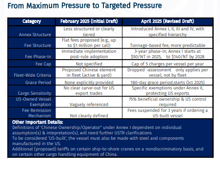
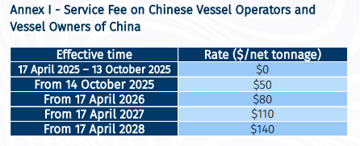
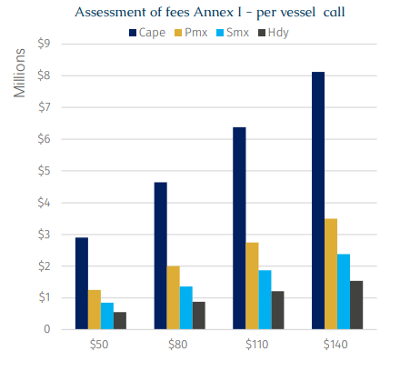
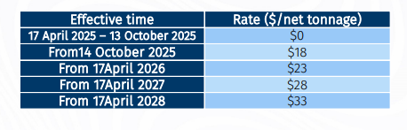
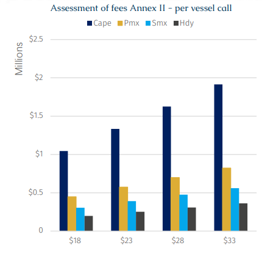

# USTR Proposal – More Clarity (or Not?)

**Date:** April 29, 2025  
**Publisher:** Breakwave Advisors | **Category:** Market Insights  
**Original URL:** [https://www.breakwaveadvisors.com/insights/2025/4/29/ustr-proposal-more-clarity-or-not](https://www.breakwaveadvisors.com/insights/2025/4/29/ustr-proposal-more-clarity-or-not)  

---

> **Figure 1: Rgb Color Brs Shipbrokers Monogram Logo**  
> [Local Asset](file:///C:/Users/Dell/Github/Shipping/corpus/03-breakwave/insights/2025/assets/2025-04-29_ustr-proposal-more-clarity-or-not_img_rgb-color-brs-shipbrokers-monogram-l_ee79606c8e74.png)

The Office of the United States Trade Representative (USTR), following extensive feedback from industry stakeholders, recently revised the Notice of Action and Proposed Action in Section 301 Investigation of China’s Targeting the Maritime, Logistics, and Shipbuilding Sectors for Dominance on 17 April 2025.

> **Figure 2: Στιγμιότυπο Οθόνης 2025 04 29 115253**  
> [Local Asset](file:///C:/Users/Dell/Github/Shipping/corpus/03-breakwave/insights/2025/assets/2025-04-29_ustr-proposal-more-clarity-or-not_img_cea3cf84ceb9ceb3cebcceb9cf8ccf84cf85_0b8b94e2e491.png)

In a nutshell, under the revised terms, a vessel will now be subject to either: (a) one of the three fees directed under Annex I, II, or III; or (b) a requirement under Annex IV. In addition, there is a preferential order for applying these fees as follows: Annex IV > III > I > II, and on a non-cumulative basis.

For the purpose of bulkers, only**Annex I (Service Fee on Chinese Vessel Operators and Vessel Owners of China)**&**Annex II (Service Fee on Vessel Operators of Chinese-Built Vessels)**are applicable, Annex III and IV does not.

**Annex I**– Annex I fees are solely based on ownership or operator, not on technical or voyage specifications. A bulker that meets the conditions of Annex I, e.g., a vessel operated by a Chinese entity or owned by a Chinese entity, will be subject to the fees imposed under Annex I. Once Annex I fees apply to a bulker, there is no need to consider Annex IIfees or its exemptions.

**Annex II**- A Chinese-built bulker under non-Chinese control is exempted from Annex II if it 1) US-owned, 2) equal or under 80,000 Dwt, 3) Arriving in ballast**or**4) Incoming voyage is within 2,000 nautical miles. If all these exemptions are not applicable, then the Chinese-built bulker under non-Chinese control will face the (less steeper) Annex II fees.

Nonetheless, the most fuss-free way to totally avoid Annex I and Annex II penalties is to simply use tonnage of

i) Non-Chinese owners/operators &

ii) Non-Chinese-built ships or Chinese-built ships that are sold to US’ ownership

> **Figure 3: Στιγμιότυπο Οθόνης 2025 04 29 115307**  
> [Local Asset](file:///C:/Users/Dell/Github/Shipping/corpus/03-breakwave/insights/2025/assets/2025-04-29_ustr-proposal-more-clarity-or-not_img_cea3cf84ceb9ceb3cebcceb9cf8ccf84cf85_f8387869d89d.png)

Based on the aforementioned table, the fees applicable to different vessel types are calculated as follows, according to their net tonnage (NT), which is a measure of a ship's cargo-carrying capacity, expressed in tons. It represents the volume of all cargo spaces on a vessel, calculated using a formula based on the ship's internal volume, excluding areas like crew quarters, machinery spaces, and navigation areas. It measures the volume of a vessel's revenue-generating spaces, reflecting its commercial value rather than physical weight.

> **Figure 4: Στιγμιότυπο Οθόνης 2025 04 29 115316**  
> [Local Asset](file:///C:/Users/Dell/Github/Shipping/corpus/03-breakwave/insights/2025/assets/2025-04-29_ustr-proposal-more-clarity-or-not_img_cea3cf84ceb9ceb3cebcceb9cf8ccf84cf85_4d8b1bb0fa10.png)

As shown in the figure, if Annex I were to be enforced, vessels operated by Chinese entities would almost cease traveling to the US. Taking Capesize vessels as an example, based on the Baltic C5TC index, assuming no off-hire, the total time charter revenue for a Capesize vessel in 2024 was $8.1 million. If a charge of $50 per net ton were applied upon delivery, the port fee would amount to $2.9 million - equivalent to 36% of the total annual revenue for just one port call. If the vessel were to call at US ports five times a year, the total charges would reach $14.5 million.

### Annex Ii - Service Fee on Vessel Operators of Chinese-Built Vessels

Subject to the coverage and special rules of this Annex II, upon the arrival of a Chinese-built bulker to a US port or point from outside the Customs territory on a particular string,**a vessel operator that is not a vessel operator of China (as defined in Annex I)**pay the following：

> **Figure 5: Στιγμιότυπο Οθόνης 2025 04 29 115326**  
> [Local Asset](file:///C:/Users/Dell/Github/Shipping/corpus/03-breakwave/insights/2025/assets/2025-04-29_ustr-proposal-more-clarity-or-not_img_cea3cf84ceb9ceb3cebcceb9cf8ccf84cf85_036e069bd7a8.png)

According to above table, the calculated charges for different vessel types are as follows.：

> **Figure 6: Στιγμιότυπο Οθόνης 2025 04 29 115336**  
> [Local Asset](file:///C:/Users/Dell/Github/Shipping/corpus/03-breakwave/insights/2025/assets/2025-04-29_ustr-proposal-more-clarity-or-not_img_cea3cf84ceb9ceb3cebcceb9cf8ccf84cf85_32dba438d798.png)

Although the charges have decreased under the revised standard compared to Annex I—by 64%, 70%, 75%, and 76% respectively for each vessel type—using Capsizes as an example, if the annual revenue is $8.1 million and the port fee is calculated at $18 per net ton, each port call would incur a fee of $1 million. If the vessel calls at the port five times or more per year, the total annual port fees would reach a maximum of $5 million. By extension, these additional fees to total port expenses would account for 64% of total revenue, making it economically unviable for Capsizes shipowners. Not to mention the fact that these fees are set to increase year by year. That said, as mentioned earlier on, general exemptions are explicitly afforded under Annex II.

### Tonnage Neutrality to Tonnage Nationality ?

In conclusion, the current draft, in essence, categorized bulkers as follows:

Annex 1 - Those owned and operated by Chinese companies versus everyone else, followed by

Annex 2 - For non-Chinese ownership/operators, we have non-Chinese-built ships versus Chinese-built ships (with generous exemptions)

In addition, this iteration also strives to balance with

i) The incumbent reality of non-Chinese shipowners/operators having extensive interests Chinese-built ships and

ii) The political need by US to curb Chinese shipbuilding’s dominance in the future.

It is also interesting to note that the USTR chose to cap the fees it can charge a vessel in a year at 5 calls. In theory, once a Chinese-linked bulker hits 5 calls at US, it becomes cost-efficient to use again for more US trades. However, a typical Supramax-Panamax bulker tends to complete 6-9 international voyages in a year. Hence, from this perspective, this cap relief is nominal in name.

Despite the compromises, we need to be vigilant in considering future changes to this policy should the US-China relationship sour further, or if there was a sudden pressing political need to accelerate US domestic maritime capabilities.

Nonetheless, this ‘watered-down’ proposal still sends a strong, clear message to the world that the US is committed to strategic economic decoupling from China, including the maritime and logistics sector, which has long flown under the radar in US-China tensions. After all, this is the first time the US has invoked Section 301 not for consumer goods (like solar panels or semiconductors), but for shipbuilding, shipping services and port infrastructure (cranes, chassis, containers)

Furthermore, this signals a shift from Tonnage Neutrality to Tonnage Nationality. Traditionally, the global bulk market has been flag, build and ownership-agnostic. Simply put, a ton is a ton — whether it’s Greek, Japanese, Chinese, or whatever it maybe. Moving forward, where your ship was built matters, who your ship is owned or controlled by matter and what cargo or region you serve matters, in a geopolitically fragmented environment.

---

**Tags:** Shipping, Drybulk, Markets  
