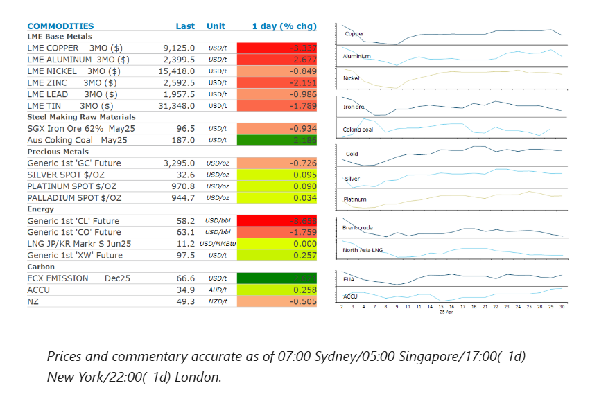
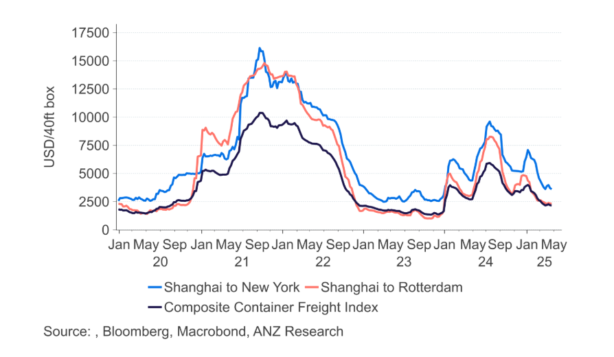

# Oil slumps amid fears of further OPEC supply hikes

**Date:** May 01, 2025  
**Publisher:** Breakwave Advisors | **Category:** Market Insights  
**Original URL:** [https://www.breakwaveadvisors.com/insights/2025/5/1/oil-slumps-amid-fears-of-further-opec-supply-hikes](https://www.breakwaveadvisors.com/insights/2025/5/1/oil-slumps-amid-fears-of-further-opec-supply-hikes)  

---

Weak economic data in China weighed on sentiment across the commodity complex. Prospects of another OPEC supply surge also pushed oil prices lower.

*By*[*Daniel Hynes*](https://www.linkedin.com/in/dahynes/)

> **Figure 1: Στιγμιότυπο Οθόνης 2025 05 01 103157**  
> **Interactive Data & Source:** [Linkedin](https://www.linkedin.com/newsletters/commodities-wrap-6692196755876012032/?fbclid=IwAR3kiXJqZdxmp9ZcRwBNI7FsBySI-XSC0pfPur1qzjt7OZp7PTE59Tsl1QI) | [Local Asset](file:///C:/Users/Dell/Github/Shipping/corpus/03-breakwave/insights/2025/assets/2025-05-01_oil-slumps-amid-fears-of-further-opec-supply-hikes_img_cea3cf84ceb9ceb3cebcceb9cf8ccf84cf85_d5bf5f4e4bca.png)

### Market Commentary

**Crude oil**prices slumped further amid concerns of further OPEC supply hikes. A Reuters report said that Saudi Arabian officials have been telling allies and industry experts that the Kingdom can endure sustained period of depressed prices. This added to existing concerns that Saudi Arabia, the de facto leader of the OPEC+ alliance, is planning to steer the group to agree to another increase in supply next week. Sentiment wasn’t helped by signs that the possibility of a quick breakthrough in US trade negotiations is fading. President Trump said China deserved the steep tariffs he imposed. The market shrugged off data showing slightly better demand. US crude oil inventories fell 2,696kbbl last week, according to the EIA data. More importantly, gasoline stockpiles fell by 4,003kbbl, suggesting demand is relatively robust despite weak economic data in recent weeks.

**North Asian LNG**prices slumped to their lowest in a year due to weak demand. The Japan-Korea LNG benchmark fell to USD10.614/mmBtu as concerns the ongoing US-China trade war would curb consumption in the region. The industrial sector makes up about 30% of overall demand, making in sensitive to changes in economic growth. China has been slashing imports, while Indian consumers are switching to cheaper oil products. This soft demand is outweighing concerns over supply disruptions in Malaysia, Australia and Brunei.**European benchmark gas****futures**ended the session higher, breaking a six-day stretch of losses as traders viewed the selloff as overdone.

**Copper**was under pressure in Asian trading after data showed a slowdown in China’s factory activity in April. Despite the slowdown in manufacturing activity, data suggests the copper market remains tight. The Yangshan premium has nearly tripled to USD94/t over the past three months. Inventories have fallen sharply in recent weeks, leading to a trading house warning that the market is suffering one of the greatest tightening shocks in history on fears of US tariffs. The Shanghai Futures Exchange reported copper inventories fell 24% yesterday to reach their lowest seasonal level since 2022. The selloff in copper prices was even greater on the Comex exchange as traders rushed to square their positions before the holiday in China. Investors have been engaging in arbitrage deals across New York, London and Shanghai amid the uncertainty caused by tariffs.

**Iron ore’s**run of monthly losses extended to three, amid signs of ongoing weakness in China’s steel sector. Angang Steel Co, the nation’s second largest producer, posted its 11th consecutive quarterly loss. This comes amid reports that mills are about to cut steel output due to the uncertain economic backdrop.

**Gold**prices fell after US data showed signs of economic contraction. The US economy contracted for the first time since 2022 on a pre-tariff import surge and more moderate consumer spending. The precious metal pared some of the earlier losses on rising expectations of further interest rate cuts by the Fed.

### Chart of the Day

Shipping rates are starting to fall sharply as US tariffs start to bite.

> **Figure 2: Στιγμιότυπο Οθόνης 2025 05 01 103226**  
> **Interactive Data & Source:** [Linkedin](https://www.linkedin.com/newsletters/commodities-wrap-6692196755876012032/?fbclid=IwAR3kiXJqZdxmp9ZcRwBNI7FsBySI-XSC0pfPur1qzjt7OZp7PTE59Tsl1QI) | [Local Asset](file:///C:/Users/Dell/Github/Shipping/corpus/03-breakwave/insights/2025/assets/2025-05-01_oil-slumps-amid-fears-of-further-opec-supply-hikes_img_cea3cf84ceb9ceb3cebcceb9cf8ccf84cf85_0b2ff32abcd0.png)

Data source:[Commodities Wrap](https://www.linkedin.com/newsletters/commodities-wrap-6692196755876012032/?fbclid=IwAR3kiXJqZdxmp9ZcRwBNI7FsBySI-XSC0pfPur1qzjt7OZp7PTE59Tsl1QI)

---

**Tags:** Commodities, Markets, Shipping  
