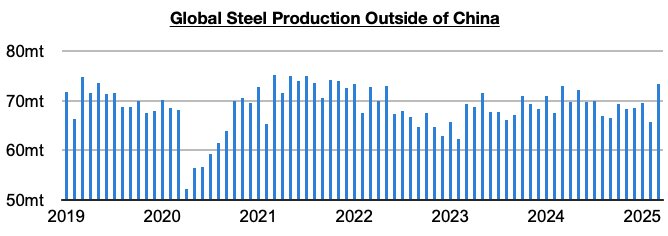
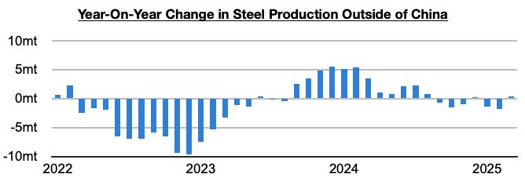
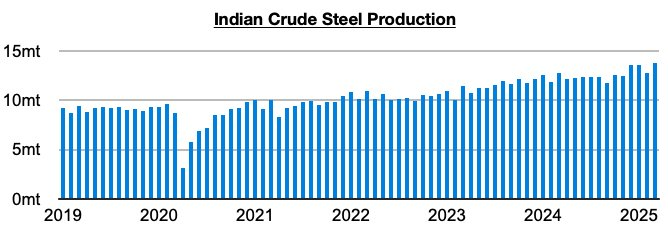

# Small Growth in Steel Production Outside of China

**Date:** May 02, 2025  
**Publisher:** Breakwave Advisors | **Category:** Market Insights  
**Original URL:** [https://www.breakwaveadvisors.com/insights/2025/5/2/small-growth-in-steel-production-outside-of-china](https://www.breakwaveadvisors.com/insights/2025/5/2/small-growth-in-steel-production-outside-of-china)  

---

*By*[*Jeffrey Landsberg*](https://www.linkedin.com/in/jeffrey-landsberg-70ab957/)

Global steel production totaled approximately 166.1 million tons in March. This is up month-on-month by 21.4 million tons (25%) and is up year-on-year by 4.9 million tons (3%). Steel production outside of China totaled approximately 73.3 million tons.

> **Figure 1: Chart 1**  
> [Local Asset](file:///C:/Users/Dell/Github/Shipping/corpus/03-breakwave/insights/2025/assets/2025-05-02_small-growth-in-steel-production-outside-of-china_img_chart1_deb08817cedd.jpg)

This is up month-on-month by 7.5 million tons (11%) and is up year-on-year by 400,000 tons (1%).

> **Figure 2: Chart 2**  
> [Local Asset](file:///C:/Users/Dell/Github/Shipping/corpus/03-breakwave/insights/2025/assets/2025-05-02_small-growth-in-steel-production-outside-of-china_img_chart2_044e62d57471.jpg)

As we have continued to stress in Commodore Research's Weekly China Reports and Weekly Executive Reports, China continues to fare better than many other economies (particularly on the industrial side), but India’s steel production has at least stayed strong. Indian steel production totaled a record 13.8 million tons in March. This is up month-on-month by 1.1 million tons (9%) and is also up year-on-year by 1.1 million tons (9%). India’s steel production has now grown on a year-on-year basis for twenty-five straight months.

> **Figure 3: Chart 3**  
> [Local Asset](file:///C:/Users/Dell/Github/Shipping/corpus/03-breakwave/insights/2025/assets/2025-05-02_small-growth-in-steel-production-outside-of-china_img_chart3_ca44bba3bf71.jpg)

---

**Tags:** Ironore, China, Commodities  
