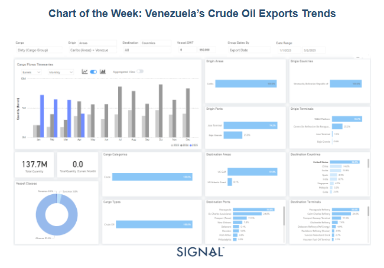
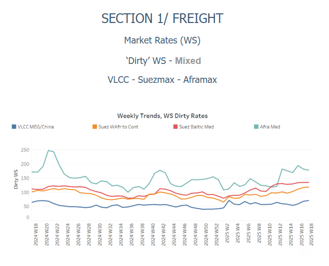
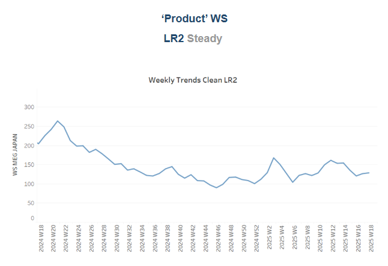
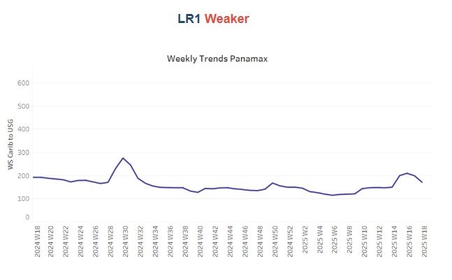
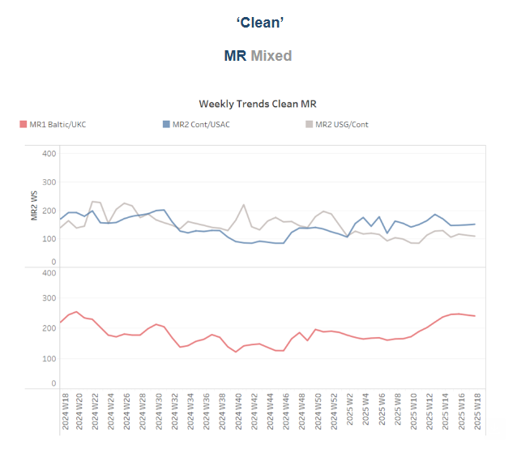
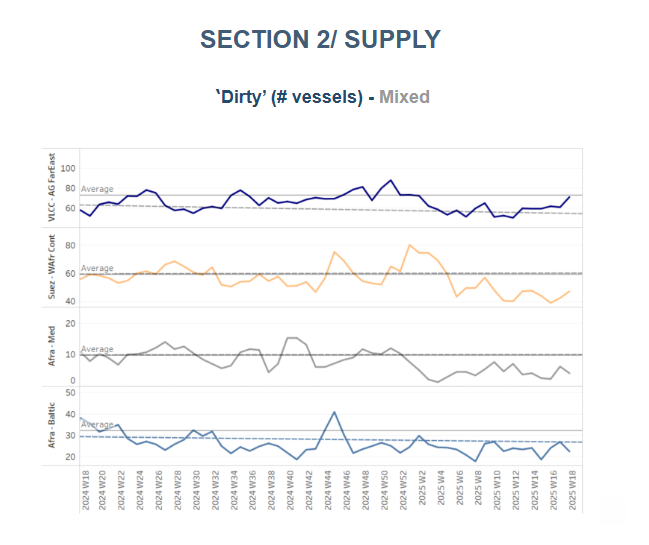
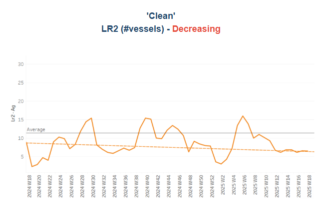
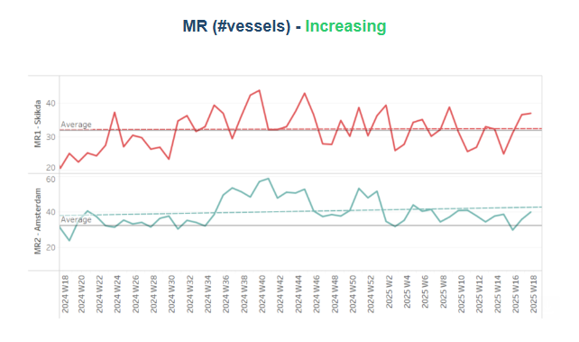
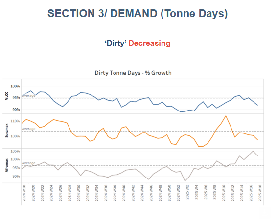
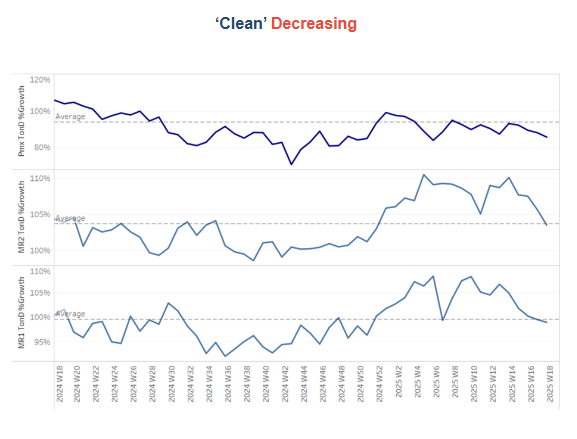

# Venezuela’s Crude Oil Exports Trends

**Date:** May 02, 2025  
**Publisher:** Breakwave Advisors | **Category:** Market Insights  
**Original URL:** [https://www.breakwaveadvisors.com/insights/2025/5/2/venezuelas-crude-oil-exports-trends](https://www.breakwaveadvisors.com/insights/2025/5/2/venezuelas-crude-oil-exports-trends)  

---

### Tanker - Weekly Market Monitor

Snapshot of Crude and Product Freight Rates, Supply-Demand

Week 18, 02 May, 2025

> **Figure 1: Στιγμιότυπο Οθόνης 2025 05 02 163818**  
> **Interactive Data & Source:** [Signal Ocean Platform](https://www.thesignalgroup.com/signal-ocean-platform) | [Local Asset](file:///C:/Users/Dell/Github/Shipping/corpus/03-breakwave/insights/2025/assets/2025-05-02_venezuelas-crude-oil-exports-trends_img_cea3cf84ceb9ceb3cebcceb9cf8ccf84cf85_0ebcd4fb3fec.png)

As of early May 2025, the crude oil trading relationship between the United States and Venezuela has undergone a major disruption, primarily due to recent geopolitical and regulatory shifts. The most pivotal development occurred in March 2025, when the U.S. Treasury revoked Chevron’s special license to operate in Venezuela. This license had previously allowed Chevron to export Venezuelan crude to the United States despite broader sanctions on the Maduro regime. The revocation was tied to the Venezuelan government’s failure to meet agreed electoral commitments. Consequently, Chevron has been instructed to wind down its operations entirely by May 27, 2025.

These policy changes are already clearly reflected in real-time oil flows data. According to the latest Signal Ocean data analytics, Venezuelan crude oil exports—categorized as “dirty cargo”—have plummeted in recent months. From a monthly high exceeding 8 million barrels in December 2024, volumes dropped sharply in April 2025. Notably, as of May 2, 2025, no export activity has been observed, suggesting a likely near-term halt in shipments following the Chevron wind-down. Over the monitored period (January 2023 to May 2025), a total of 137.7 million barrels were exported, with Chevron’s TAECJ Platform accounting for over 72% of these flows, highlighting the company’s dominant position in Venezuela’s export infrastructure.

The United States was the principal destination for this Venezuelan crude, receiving nearly 37% of all volumes. Key U.S. Gulf Coast ports—including Pascagoula (Mississippi), St. Charles (Louisiana), and Freeport (Texas)—absorbed the majority of these shipments. These destinations align closely with Chevron’s downstream refining and distribution network, confirming the direct link between U.S. refineries and Chevron’s Venezuelan operations. Additionally, almost all shipments used Aframax-class tankers (95.6%), a common vessel type for regional routes between the Caribbean and the U.S. Gulf Coast.

As Chevron exits Venezuela, the broader oil trade between the two countries continues to contract. Venezuelan crude exports declined by nearly 17% in April, with shipments to the U.S. falling notably, highlighting Chevron’s significant role in facilitating these flows. Looking ahead, Venezuela is increasingly turning to alternative markets, particularly China, as it adjusts to the decline in U.S. trade. The government has been engaging with Chinese refiners to expand crude exports, reflecting a broader shift in the country's energy strategy. This reorientation aims to sustain export revenues amid ongoing restrictions. While it remains uncertain whether Chinese demand will fully offset the reduction in U.S. activity, Venezuela’s oil sector continues to navigate a period of elevated uncertainty and constrained market access.

> **Figure 2: Στιγμιότυπο Οθόνης 2025 05 02 164153**  
> **Interactive Data & Source:** [Signal Ocean Platform](https://www.thesignalgroup.com/signal-ocean-platform) | [Local Asset](file:///C:/Users/Dell/Github/Shipping/corpus/03-breakwave/insights/2025/assets/2025-05-02_venezuelas-crude-oil-exports-trends_img_cea3cf84ceb9ceb3cebcceb9cf8ccf84cf85_9e15c026fcca.png)

Crude oil freight market sentiment shows signs of strengthening momentum in May; however, there has been a soft downward revision for the beginning of the month.

- **VLCC**freight rates on the**MEG–China**remained steady at WS68, reflecting a similar momentum to the previous week and a 3% decline month-on-month. Meanwhile, Suezmax rates from**West Africa to continental Europe**stayed above WS100, posting a 6% drop on the week but showing a 13% increase compared to the previous month. Meanwhile, rates on the**Baltic–Mediterranean route**held steady at WS132, reflecting the same firm sentiment seen a week ago and standing 16% higher than a year ago.
- **Aframax**freight rates in the Mediterranean held steady at WS180, matching the previous week's level but showing an 8% decrease compared to last month.

> **Figure 3: Στιγμιότυπο Οθόνης 2025 05 02 164203**  
> **Interactive Data & Source:** [Signal Ocean Platform](https://www.thesignalgroup.com/signal-ocean-platform) | [Local Asset](file:///C:/Users/Dell/Github/Shipping/corpus/03-breakwave/insights/2025/assets/2025-05-02_venezuelas-crude-oil-exports-trends_img_cea3cf84ceb9ceb3cebcceb9cf8ccf84cf85_aa79d657563a.png)

- **LR2**AG freight rates held nearly steady from the previous week at WS125, though they reflected a monthly drop of 20%.

> **Figure 4: Στιγμιότυπο Οθόνης 2025 05 02 164214**  
> **Interactive Data & Source:** [Signal Ocean Platform](https://www.thesignalgroup.com/signal-ocean-platform) | [Local Asset](file:///C:/Users/Dell/Github/Shipping/corpus/03-breakwave/insights/2025/assets/2025-05-02_venezuelas-crude-oil-exports-trends_img_cea3cf84ceb9ceb3cebcceb9cf8ccf84cf85_aa896b9b2d5e.png)

- **Panamax**Carib-to-USG rates experienced a further decline, settling near WS170. Despite this recent softening, these rates still represent a 15% increase compared to the previous month.

> **Figure 5: Στιγμιότυπο Οθόνης 2025 05 02 164223**  
> **Interactive Data & Source:** [Signal Ocean Platform](https://www.thesignalgroup.com/signal-ocean-platform) | [Local Asset](file:///C:/Users/Dell/Github/Shipping/corpus/03-breakwave/insights/2025/assets/2025-05-02_venezuelas-crude-oil-exports-trends_img_cea3cf84ceb9ceb3cebcceb9cf8ccf84cf85_5df2a39f6bad.png)

- MR1 freight rates for Baltic-to-Continent shipments hovered around WS165, representing a 6% monthly decrease.

- MR2 freight rates for shipments from the Continent to the US Atlantic Coast (USAC) reached WS150, a 12% monthly decrease. Meanwhile, MR2 rates on the US Gulf–to–Continent route hover around WS110, marking a 15% weekly decrease.

> **Figure 6: Στιγμιότυπο Οθόνης 2025 05 02 164237**  
> **Interactive Data & Source:** [Signal Ocean Platform](https://www.thesignalgroup.com/signal-ocean-platform) | [Local Asset](file:///C:/Users/Dell/Github/Shipping/corpus/03-breakwave/insights/2025/assets/2025-05-02_venezuelas-crude-oil-exports-trends_img_cea3cf84ceb9ceb3cebcceb9cf8ccf84cf85_43453e156e3e.png)

​​​​​Crude tanker availability is still lower than the yearly average, though VLCC and Suezmax sectors show signs of increasing pressure.

- **VLCC Ras Tanura**: The current number of ships is approaching the annual average, and in early May, stronger vessel activity is expected than was observed at the end of February.
- **Suezmax Wafr**: The current number of ships is around 48, 10 lower than the annual average.
- **Aframax Med**: Despite earlier signs of increased vessel activity, the end of the month has again shown a downward trend, with activity remaining well below the annual benchmark of 10.
- **Aframax Baltic**: The current ship count is estimated at around 23, which is roughly 10 vessels below the annual average.

> **Figure 7: Στιγμιότυπο Οθόνης 2025 05 02 164246**  
> **Interactive Data & Source:** [Signal Ocean Platform](https://www.thesignalgroup.com/signal-ocean-platform) | [Local Asset](file:///C:/Users/Dell/Github/Shipping/corpus/03-breakwave/insights/2025/assets/2025-05-02_venezuelas-crude-oil-exports-trends_img_cea3cf84ceb9ceb3cebcceb9cf8ccf84cf85_17b4b0e4c51e.png)

> **Figure 8: Στιγμιότυπο Οθόνης 2025 05 02 164255**  
> **Interactive Data & Source:** [Signal Ocean Platform](https://www.thesignalgroup.com/signal-ocean-platform) | [Local Asset](file:///C:/Users/Dell/Github/Shipping/corpus/03-breakwave/insights/2025/assets/2025-05-02_venezuelas-crude-oil-exports-trends_img_cea3cf84ceb9ceb3cebcceb9cf8ccf84cf85_16b6c42a5df8.png)

- **Clean LR2 AG Jubail:**The downward trend persists, with vessel count remaining below the annual average of 11 over the last ten weeks.

- **Clean MR:**Algeria’s Skikda port has seen a notable uptick in activity, with MR1 vessel calls rising to 37, six above the annual average, mirroring last week's elevated levels. Meanwhile, MR2 vessel calls at Amsterdam continue their upward trend, surpassing the yearly average of 32 for the second consecutive week, signaling sustained growth in vessel traffic this May.

> **Figure 9: Στιγμιότυπο Οθόνης 2025 05 02 164310**  
> **Interactive Data & Source:** [Signal Ocean Platform](https://www.thesignalgroup.com/signal-ocean-platform) | [Local Asset](file:///C:/Users/Dell/Github/Shipping/corpus/03-breakwave/insights/2025/assets/2025-05-02_venezuelas-crude-oil-exports-trends_img_cea3cf84ceb9ceb3cebcceb9cf8ccf84cf85_d4913cd609d2.png)

- **Dirty**tonne days: The end of the month followed a similar pattern to the previous week, with VLCC and Suezmax rates continuing to decline, while the Aframax segment maintained its earlier sharp upswing, though signs of a slight downward correction have begun to emerge.

> **Figure 10: Στιγμιότυπο Οθόνης 2025 05 02 164318**  
> **Interactive Data & Source:** [Signal Ocean Platform](https://www.thesignalgroup.com/signal-ocean-platform) | [Local Asset](file:///C:/Users/Dell/Github/Shipping/corpus/03-breakwave/insights/2025/assets/2025-05-02_venezuelas-crude-oil-exports-trends_img_cea3cf84ceb9ceb3cebcceb9cf8ccf84cf85_94b6b0e4805b.png)

- **Panamax**tonne days: Over the past six weeks, the growth rate has remained below this year's weekly average, in contrast to the end of Week 8, when levels were close to surpassing the annual average.

- **MR**tonne-days: The MR segment has experienced a steady decline in growth rate since the end of Week 5, with no signs of an upward reversal by the end of the month.

Data Source:[Signal Ocean Platform](https://www.thesignalgroup.com/signal-ocean-platform)

---

**Tags:** Tankers, Crude, Markets  
