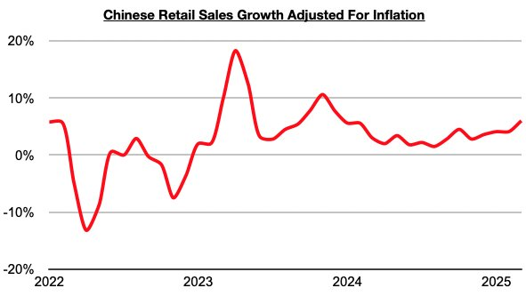

# Consumer Growth in China Continues To Increase

**Date:** May 05, 2025  
**Publisher:** Breakwave Advisors | **Category:** Market Insights  
**Original URL:** [https://www.breakwaveadvisors.com/insights/2025/5/5/consumer-growth-in-china-continues-to-increase](https://www.breakwaveadvisors.com/insights/2025/5/5/consumer-growth-in-china-continues-to-increase)  

---

*By*[*Jeffrey Landsberg*](https://www.linkedin.com/in/jeffrey-landsberg-70ab957/)

China’s retail sales in March grew year-on-year by 5.9%. This is up considerably from the 4% growth seen in January/February and is the strongest growth seen since December 2023. Taking March’s 0.1% deflation into account, retail sales adjusted for inflation/deflation increased year-on-year by 6%.

> **Figure 1: Chart**  
> [Local Asset](file:///C:/Users/Dell/Github/Shipping/corpus/03-breakwave/insights/2025/assets/2025-05-05_consumer-growth-in-china-continues-to-increase_img_chart_0e858143d0c0.jpg)

During each of the last twenty-seven months, retail sales growth has come in higher than any inflation. Prior to the last twenty-seven months, retail sales came in lower than inflation for four straight months. Of note on the consumer side is that furniture sales, clothing sales, and appliance sales (which includes consumer electronics) again all experienced year-on-year growth. These sectors are discussed in greater detail in Commodore Research's most recent Weekly China Report.

---

**Tags:** China, Economy, Markets  
