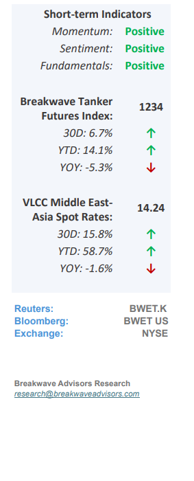
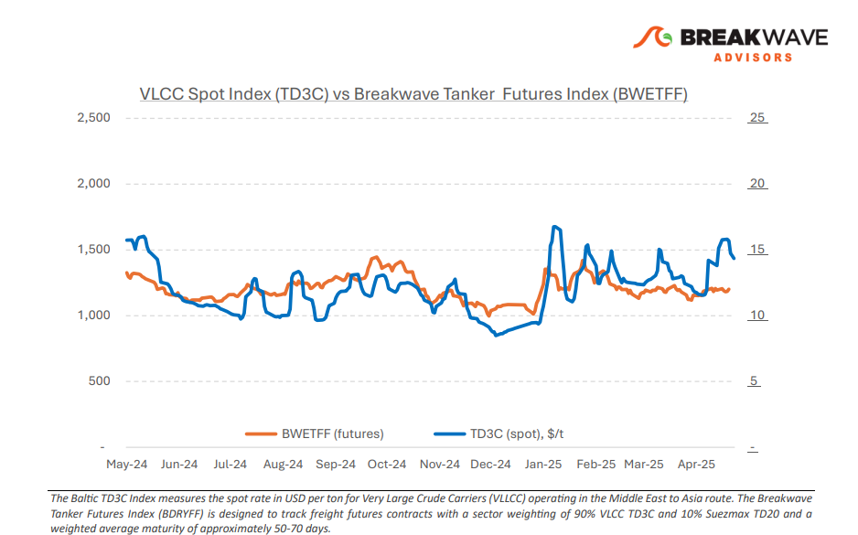
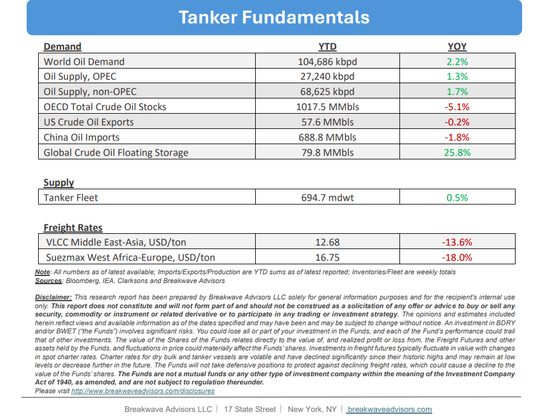

# Breakwave Bi-Weekly Tanker Report - May 6, 2025

**Date:** May 06, 2025  
**Publisher:** Breakwave Advisors | **Category:** Market Insights  
**Original URL:** [https://www.breakwaveadvisors.com/insights/202565wet8554l](https://www.breakwaveadvisors.com/insights/202565wet8554l)  

---

•**Spot VLCC Rates Ease Following Recent Strong Rally**– Over the past few weeks, positional imbalances have pushed freight rates toward the upper end of the recent range and at relatively flat levels versus last year. However, they remain subdued compared to historical averages, primarily due to the ongoing constrained Middle East export volumes, which continue to negatively impact demand. Recently, sentiment has shifted, as OPEC appears to plan a significant increase in oil production over the coming months. This development has bolstered confidence among market participants regarding a potential strengthening of the spot market in the near future. Nevertheless, sentiment alone is insufficient to sustain higher rates; the market also requires actual increased oil supply and a favorable trading environment to enable a sustained recovery in freight rates. Although it is still early, we believe both of these factors will materialize over the next several months. OPEC announced production increases and a steeper oil curve should aid freight rates throughout the summer months. With the freight futures curve relatively flat compared to the spot market, the market appears to be underpricing the upside potential of a firmer spot rate environment, providing an opportunity for those who are willing to look past the current freight rate weakness.

> **Figure 1: Στιγμιότυπο Οθόνης 2025 05 06 084902**  
> [Local Asset](file:///C:/Users/Dell/Github/Shipping/corpus/03-breakwave/insights/2025/assets/2025-05-06_202565wet8554l_img_cea3cf84ceb9ceb3cebcceb9cf8ccf84cf85_6509e409bf6e.png)

•**Party Like its 2014: OPEC Strategy Shifts Away From Price Control**– Recent developments in the oil markets may appear surprising to those accustomed to OPEC's traditional price control strategies. However, the recent policy shift aligns with a trend we identified six months ago, following our recognition of changing structural demand fundamentals last fall. The catalyst for this significant change is multifaceted, but central to it is Saudi Arabia’s pivot toward prioritizing market share, driven by the broader realization that global crude oil demand has effectively peaked. While lower prices may stimulate demand (particularly in sectors where fuel switching is viable) the broader picture reveals a persistent and strategic decline in oil dependency, most notably led by China. The widespread adoption of electric vehicles (EVs) and alternative fuel technologies is no longer an emerging trend but a firmly established reality, particularly in developed markets but also in China, where this transition is well underway. Despite headline data suggesting continued growth in oil demand, this growth is largely concentrated in gas-related fuels (see industrial) rather than crude oil (see transportation). Consequently, we maintain our expectation for continued downward pressure on oil prices. Yet importantly, lower oil prices typically lead to a steepening futures curve. The emergence of a pronounced contango scenario could drive significant demand for oil tankers and lead to higher spot rates, conditions reminiscent of the robust tanker markets seen in 2015–2017 and 2020–2022.

•**Our Long-term View**– The tanker market is recovering from a long period of staggered rates as the growth in new vessel supply shrinks while oil demand remains elevated in line with the global economy. A historically low orderbook combined with favorable shifting trade patterns should continue to support increased spot rate volatility, which combined with the ongoing geopolitical turmoil, should sustain freight rates in the medium to long term.

> **Figure 2: Στιγμιότυπο Οθόνης 2025 05 06 084819**  
> [Local Asset](file:///C:/Users/Dell/Github/Shipping/corpus/03-breakwave/insights/2025/assets/2025-05-06_202565wet8554l_img_cea3cf84ceb9ceb3cebcceb9cf8ccf84cf85_016ae305c39f.png)

> **Figure 3: Στιγμιότυπο Οθόνης 2025 05 06 084845**  
> [Local Asset](file:///C:/Users/Dell/Github/Shipping/corpus/03-breakwave/insights/2025/assets/2025-05-06_202565wet8554l_img_cea3cf84ceb9ceb3cebcceb9cf8ccf84cf85_928c21f17fab.png)

### Subscribe:
