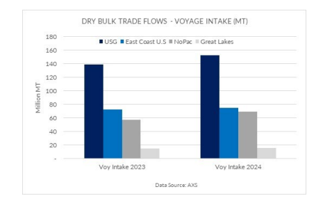
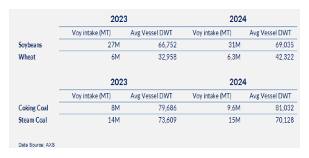
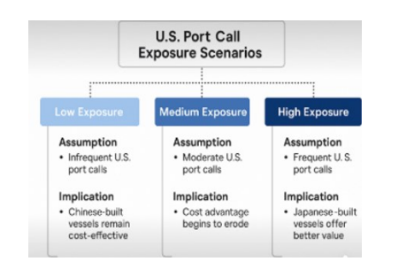

# Impact of U.S. Port Fees on Dry Bulk Vessel Economics and Fleet Strategy

**Date:** May 07, 2025  
**Publisher:** Breakwave Advisors | **Category:** Market Insights  
**Original URL:** [https://www.breakwaveadvisors.com/insights/2025/5/7/impact-of-us-port-fees-on-dry-bulk-vessel-economics-and-fleet-strategy](https://www.breakwaveadvisors.com/insights/2025/5/7/impact-of-us-port-fees-on-dry-bulk-vessel-economics-and-fleet-strategy)  

---

The United States remains a vital hub in the global dry bulk trade, with its ports—especially those along the Gulf Coast, East Coast, and Great Lakes— processing significant volumes of coal, grain, and iron ore. Between 2023 and 2024, total voyage intake rose across all major U.S. regions, led by the U.S. Gulf (USG), which grew from approximately 140 million to nearly 150 million metric tons (MT). This growth highlights the continued expansion of U.S. bulk exports, driven primarily by rising demand in Asia and Europe.

> **Figure 1: Στιγμιότυπο Οθόνης 2025 05 07 112918**  
> **Interactive Data & Source:** [Allied-shipbroking](https://www.allied-shipbroking.gr/) | [Local Asset](file:///C:/Users/Dell/Github/Shipping/corpus/03-breakwave/insights/2025/assets/2025-05-07_impact-of-us-port-fees-on-dry-bulk-vessel-economics-and-fleet-strategy_img_cea3cf84ceb9ceb3cebcceb9cf8ccf84cf85_067d9bbf41e0.png)

A closer look at port-level data reveals a high degree of concentration. For grain exports, roughly 80% of shipments are consolidated through a few strategic hubs: Convent and New Orleans account for 40%, while Destrehan and Houston handle another 40%. In coal, Mobile dominates coking coal exports, managing 87% of outbound volume, while Convent processes 45% of steam coal shipments. These figures highlight the Gulf Coast’s pivotal role in U.S. dry bulk trade.This evolving trade landscape is reshaping vessel deployment strategies. For soybean exports, average vessel size increased from 67,7k deadweight tons (DWT) in 2023 to 69k DWT in 2024. Wheat shipments experienced an even more pronounced shift, with average DWT rising from 33k deadweight to 42k. These trends point to a clear move toward larger, more efficient vessels. Coal exports already favor high-capacity ships, with average coking coal vessels exceeding 81,000 DWT in 2024.

> **Figure 2: Στιγμιότυπο Οθόνης 2025 05 07 112923**  
> **Interactive Data & Source:** [Allied-shipbroking](https://www.allied-shipbroking.gr/) | [Local Asset](file:///C:/Users/Dell/Github/Shipping/corpus/03-breakwave/insights/2025/assets/2025-05-07_impact-of-us-port-fees-on-dry-bulk-vessel-economics-and-fleet-strategy_img_cea3cf84ceb9ceb3cebcceb9cf8ccf84cf85_7c6a7198a7ba.png)

However, this growth in trade coincides with a new challenge: the U.S. Trade Representative’s (USTR) imposition of retaliatory port fees on Chinese-built vessels. These fees are reshaping the cost dynamics of vessel deployment depending on how frequently ships call at U.S. ports.

In a low exposure scenario, where vessels call at U.S. ports infrequently— perhaps only once per year—the impact of port fees is marginal. In these cases, the lower capital costs of Chinese-built vessels continue to offer a competitive edge, especially for operators focused on Asia–Middle East– Africa routes with limited U.S. interaction.

In a medium exposure scenario—three to five U.S. port calls per year—the cumulative burden of port fees begins to erode the initial cost advantages of Chinese shipbuilding. Over a vessel’s operational lifespan, these additional regulatory expenses can significantly affect overall profitability. For owners in this segment, the decision calculus must account not just for upfront savings, but for the total cost of ownership, including recurring fees and compliance considerations. The high exposure scenario is the most consequential. Vessels making monthly calls to the U.S. Gulf or East Coast face substantial cumulative port fees, potentially negating the benefits of lower newbuilding prices. In such cases, Japanese-built vessels—though more expensive at purchase—become more economically attractive due to their exemption from the USTR-imposed fees. For U.S.-focused routes, this trade-off increasingly favors long-term operating efficiency over short-term capital savings.

> **Figure 3: Στιγμιότυπο Οθόνης 2025 05 07 112932**  
> **Interactive Data & Source:** [Allied-shipbroking](https://www.allied-shipbroking.gr/) | [Local Asset](file:///C:/Users/Dell/Github/Shipping/corpus/03-breakwave/insights/2025/assets/2025-05-07_impact-of-us-port-fees-on-dry-bulk-vessel-economics-and-fleet-strategy_img_cea3cf84ceb9ceb3cebcceb9cf8ccf84cf85_4d9fb2348c68.png)

In response, shipowners must adopt a more strategic approach to fleet management. Route planning, fleet composition, and shipyard selection are now interlinked decisions. Operators with significant U.S. exposure should consider diversifying their fleets to include vessels from multiple shipbuilding jurisdictions, hedging against future policy shifts. Sourcing newbuilds from Japanese or South Korean yards may also offer a more sustainable balance between cost efficiency and regulatory compliance. In conclusion, while Chinese-built vessels remain cost-effective for operators with limited U.S. exposure, frequent engagement with U.S. ports increasingly demands a shift in strategic priorities—from minimizing capital expenditure to maximizing long-term operational and regulatory resilience.

Data Source:[Allied](https://www.allied-shipbroking.gr/)

---

**Tags:** Economy, Shipping, Markets  
