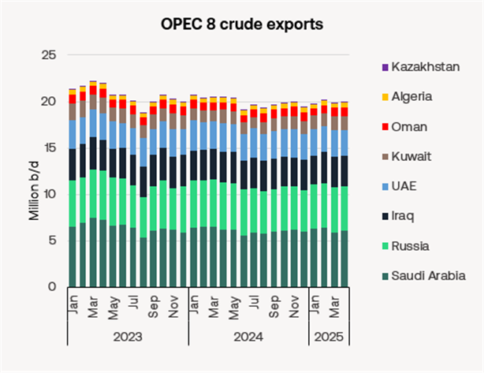
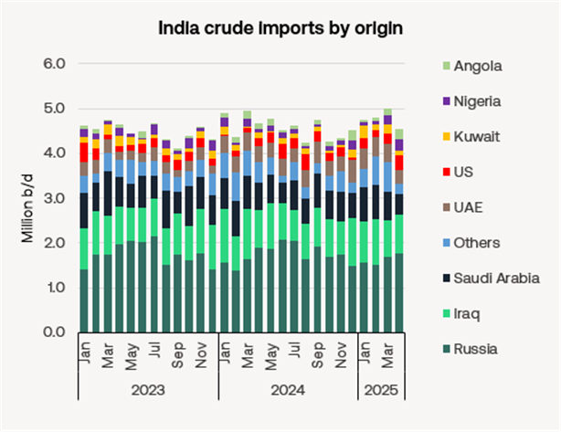

# Tankers Research Update

**Date:** May 07, 2025  
**Publisher:** Breakwave Advisors | **Category:** Market Insights  
**Original URL:** [https://www.breakwaveadvisors.com/insights/2025/5/7/tankers-research-update](https://www.breakwaveadvisors.com/insights/2025/5/7/tankers-research-update)  

---

### Vlccs to Benefit As Middle East Continues to Open Oil Taps

- OPEC+ leaders surprised the oil markets again on Saturday by agreeing to pump an extra 411k b/d of crude oil in June, on top of the previously agreed 411k b/d increase in May. This will add support to an already strong VLCC market in the Middle East (TD3c at $50k/day on Friday), but it is also likely to squeeze US oil production as oil prices are now projected to remain at current levels, or even fall slightly over the next few months.
- Under the agreement, the reversal of OPEC+ voluntary cuts would boost output by 960k b/d between April and June this year. Most of the increase will come from Saudi Arabia. Saudi crude exports rose by 200k b/d in April, according to Vortexa. May exports to date are below April levels according to the AIS data, but it is too early in the month to suggest a trend. UAE crude exports are up significantly so far in May, but again, too early top suggest a trend.
- The proposed output increase is partly accommodated by a drop in Venezuelan exports from around 900k b/d in January to 500k b/d in April and 300k b/d so far in May. In early April PDVSA blocked Chevron’s exports of Venezuelan crude, following Trump’s higher sanctions on Venezuelan oil exports and tariffs on its oil buyers. Iran also saw a cut in exports in April of 566k b/d vs. March as Trump ratcheted up his policy of maximum pressure on Iran. However, the loss of exports from Iran and Venezuela will have little negative impact on demand for compliant tankers.
- Prompt Brent crude oil at time of writing is trading at nearly $62/bbl, having recovered nearly $2/bbls since Saturday’s announcement as buyers pounced on the dip. Forward Brent prices are in a contango beyond Q3 this year (Brent hitting low of $59.7/bbl in October 2025) raising the prospect of oil oversupply. This would creating additional onshore stock-building demand for tankers. Tanker floating storage demand has been rising since Q4 last year, though principally to store oil from sanctioned countries. Onshore stocks in China have built strongly since February, but are still 4% off the levels seen in q3 2023.
- Huge uncertainty remains on the demand side. Optimism has been mounting recently over possible talks between China and the US to cut tariffs.
- Assuming OPEC’s over-producing members do not improve compliance with previously agreed production targets, OPEC+ currently now looks likely to unwind its full 2.2m b/d of voluntary cuts by October or November this year. Saudi has recently signalled it could cope with a prolonged low oil price environment. Observers see Saudi’s actions arising from frustrations over recent overproduction by certain OPEC members, notably Kazakhstan and Iraq, but also to reverse the loss of market share to US shale oil.
- While lower oil prices open Russian oil exports to a broader base of compliant tankers (that can move Russian oil below the price cap), it also gives western nations – notably the US - greater scope to squeeze oil exports from both Russia and Iran – both of which should support demand for compliant VLCCs.

> **Figure 1: 9acb Image 0 1746540093621**  
> [Local Asset](file:///C:/Users/Dell/Github/Shipping/corpus/03-breakwave/insights/2025/assets/2025-05-07_tankers-research-update_img_9acb-image-0-1746540093621_b133fba7d784.png)

### India Steps Up Us Crude Purchases

- Indian refiners are ramping up imports of US crude ahead of high-level trade negotiations with Washington scheduled for later this month. Approximately 470k b/d of US crude is expected to land in India in June, marking the highest monthly volume since August 2023 according to ship-tracking sources.
- The uptick in flows is driven largely by favourable pricing. WTI crude has seen widening discounts relative to other global benchmarks. But the threat of US tariffs may also have encouraged more buying of US crude.
- Exporters have intensified pressure on New Delhi to conclude a bilateral trade agreement with the US, after President Donald Trump delayed a proposed 26% tariff on Indian goods earlier this month. In-person negotiations are slated to begin in the second half of May.
- India imported 85k b/d more crude from the US in April than in March, mostly on VLCCs. India also lifted Russian crude imports in April. Shorter-haul crude imports from the Middle East declined in April. Overall India’s crude imports were down 9.5% in April vs March, although imports have since recovered some lost ground.

> **Figure 2: Bcae Image 1 1746540093623**  
> [Local Asset](file:///C:/Users/Dell/Github/Shipping/corpus/03-breakwave/insights/2025/assets/2025-05-07_tankers-research-update_img_bcae-image-1-1746540093623_38585421fc36.png)

### California Refinery Closures Could Boost Clean Tanker Demand

- Last week US independent Valero announced it would shut or repurpose its 145k b/d Benicia refinery by April 2026. The company is also evaluating strategic alternatives for its 85k b/d Wilmington facility in Los Angeles.
- These two refineries join Phillips 66’s 139k b/d Los Angeles refinery which was already slated to close in Q4 2025
- Combined, this would remove nearly 370k b/d or 17% of California’s refining capacity within the next 12 months.
- The shutdown of Phillips 66’s Los Angeles facility is expected to coincide with California’s seasonal inventory drawdowns as the region transitions from summer to winter gasoline blends. This period has historically been prone to price spikes, exacerbated by California's strict fuel specifications and its geographic isolation from alternative supply centres.
- California takes in around 200k b/d of clean refined products, mostly gasoline and jet fuel arriving from East Asia on MRs. The closures of these refineries is expected to increase California’s reliance on imported refined products. It would also reduce the region’s 1.4m b/d (q1 2025) seaborne crude oil imports.

---

**Tags:** Crude, Shipping, Markets  
