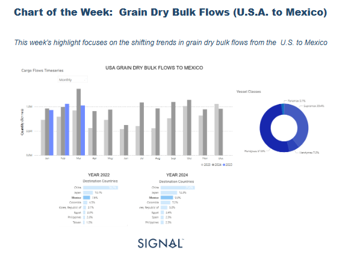
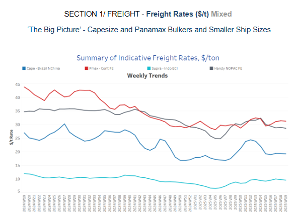
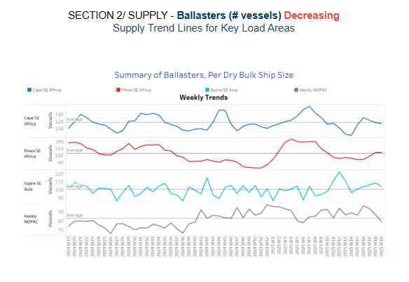
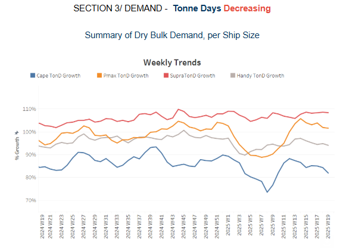
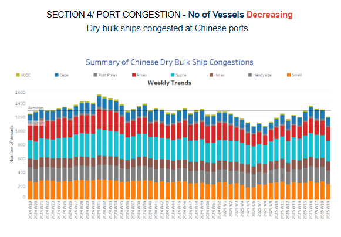

# Grain Dry Bulk Flows

**Date:** May 08, 2025  
**Publisher:** Breakwave Advisors | **Category:** Market Insights  
**Original URL:** [https://www.breakwaveadvisors.com/insights/2025/5/8/grain-dry-bulk-flows](https://www.breakwaveadvisors.com/insights/2025/5/8/grain-dry-bulk-flows)  

---

**Dry Weekly Market Monitor - Week 19, 2025**
Snapshot of Spot Freight Rates, Supply-Demand Trends, Port Congestions
May 07, 2025

> **Figure 1: Στιγμιότυπο Οθόνης 2025 05 08 093037**  
> **Interactive Data & Source:** [Signal Ocean Platform](https://www.thesignalgroup.com/signal-ocean-platform) | [Local Asset](file:///C:/Users/Dell/Github/Shipping/corpus/03-breakwave/insights/2025/assets/2025-05-08_grain-dry-bulk-flows_img_cea3cf84ceb9ceb3cebcceb9cf8ccf84cf85_828bd569478f.png)

Between 2022 and 2024, US grain exports to Mexico have shown a significant upward trend, with Mexico's share rising from 7.6% in 2022 to 9.3% in 2024, indicating a strong and growing demand from its southern neighbor. This 1.7 percentage point increase reflects deeper trade ties and potentially changing sourcing strategies amid ongoing global uncertainties.

A notable trend accompanying this growth is the increased utilization of smaller vessel classes, particularly Handysize (51.6%) and Supramax (39.4%), which together account for over 90% of total cargo shipments. The preference for these vessels likely stems from Mexico’s port infrastructure limitations and the relatively shorter distances involved, favoring more flexible and cost-efficient smaller tonnage. Panamax participation is negligible at just 0.1%, reinforcing this trend.

Looking forward to 2025, the upward momentum of US grain exports to Mexico could very well continue. The ongoing US-China trade war may incentivize US exporters to further pivot towards reliable and politically stable markets such as Mexico. In this context, Mexico emerges as a vital outlet for US agricultural goods, absorbing capacity and supporting freight volumes in the Handysize and Supramax segments.

However, if a thaw in US-China relations occurs in 2025, a potential revamp in grain purchases from China could redirect a portion of export volumes away from Latin America. While this would be bullish for total export demand, it could lead to a shift in the vessel mix, with larger Panamax vessels regaining market share due to their suitability for longer Pacific voyages.

In summary, the current growth of exports to Mexico and the prominence of smaller vessels underscore a robust and regionally integrated trade dynamic. Yet, the geopolitical landscape, particularly the trajectory of US-China relations, will play a critical role in shaping 2025’s export flows and fleet deployment strategies.

> **Figure 2: Στιγμιότυπο Οθόνης 2025 05 08 093341**  
> **Interactive Data & Source:** [Signal Ocean Platform](https://www.thesignalgroup.com/signal-ocean-platform) | [Local Asset](file:///C:/Users/Dell/Github/Shipping/corpus/03-breakwave/insights/2025/assets/2025-05-08_grain-dry-bulk-flows_img_cea3cf84ceb9ceb3cebcceb9cf8ccf84cf85_3a2295e95941.png)

Capesize freight market sentiment remains stable, supported by a slight decrease in the number of ballast vessels.

- **Capesize**vessel freight rates from Brazil to North China continue hovering around $19 per tonne, showing a 10% decrease compared to last month.
- **Panamax**from the Continent remained at nearly $31 per tonne, showing a similar trend to the previous month.
- **Supramax**vessel freight rates for the Indonesia to East Coast India route remained stable at around $9.5 per tonne, representing a 45% rise over the quarter.
- **Handysize**freight rates for the NOPAC Far East route slipped slightly below $28 per tonne, registering a 12% decline month-on-month.

> **Figure 3: Στιγμιότυπο Οθόνης 2025 05 08 093653**  
> **Interactive Data & Source:** [Signal Ocean Platform](https://www.thesignalgroup.com/signal-ocean-platform) | [Local Asset](file:///C:/Users/Dell/Github/Shipping/corpus/03-breakwave/insights/2025/assets/2025-05-08_grain-dry-bulk-flows_img_cea3cf84ceb9ceb3cebcceb9cf8ccf84cf85_812297bc1298.png)

The latest ballaster indicators point to downward momentum, with signals approaching the annual average for Capesize and Panamax activity in Southeast Africa.

- **Capesize, SE Africa**: The number of vessels has declined to 114, just two below the annual average, though it remains to be seen whether the first ten days of May will push levels further below that benchmark.
- **Panamax SE Africa**: Over the past two weeks, vessel counts have remained steady near the annual average, with the most recent low recorded at the end of Week 16, when levels hovered around 100, approximately 23 fewer than the current estimates.
- **Supramax SE Asia**: Current trends indicate a downward trajectory from the peak observed in Week 13, with recent levels now slightly above the annual average of 100.
- **Handysize NOPAC**: The Handy NOPAC segment's levels have decreased to 79, continuing a downward trend that began at the end of week 16.

> **Figure 4: Στιγμιότυπο Οθόνης 2025 05 08 093832**  
> **Interactive Data & Source:** [Signal Ocean Platform](https://www.thesignalgroup.com/signal-ocean-platform) | [Local Asset](file:///C:/Users/Dell/Github/Shipping/corpus/03-breakwave/insights/2025/assets/2025-05-08_grain-dry-bulk-flows_img_cea3cf84ceb9ceb3cebcceb9cf8ccf84cf85_d4b9734d27e6.png)

Tonne-day growth declined in the first week of May, with the Supramax segment appearing to be the only one showing resistance to this downward trend.

- **Capesize**: After peaking at the end of Week 11, the growth trend has since decreased, reaching a ten-week low.
- **Panamax**: A downward trend has emerged since the peak recorded six weeks ago, though levels remain elevated compared to the softer momentum observed in Week 8.
- **Supramax**: The growth rate remained elevated, marking a firmer pace than the levels observed in Week 11.
- **Handysize**: The growth rate has softened since its peak at the end of week 13, indicating a gentle downward trend.

> **Figure 5: Στιγμιότυπο Οθόνης 2025 05 08 093921**  
> **Interactive Data & Source:** [Signal Ocean Platform](https://www.thesignalgroup.com/signal-ocean-platform) | [Local Asset](file:///C:/Users/Dell/Github/Shipping/corpus/03-breakwave/insights/2025/assets/2025-05-08_grain-dry-bulk-flows_img_cea3cf84ceb9ceb3cebcceb9cf8ccf84cf85_f7628f085964.png)

Dry bulk port congestion in China began to ease in early May, following three consecutive weeks of increases.

- **Capesize**: Capesize vessel congestion dropped 109, down 13 compared to the previous week's end.
- **Panamax**: Panamax vessel congestion fell below the 200 mark in early May, approximately 13 fewer than at the end of April.
- **Supramax**: After a sharp spike just before the end of April, early May saw a downward trend, with levels falling below 290.
- **Handysize**: Congestion levels dropped around 200, marking a decrease of 16 compared to the end of the previous week.

Data Source:[Signal Ocean Platform](https://www.thesignalgroup.com/signal-ocean-platform)

---

**Tags:** Drybulk, Shipping, Markets  
