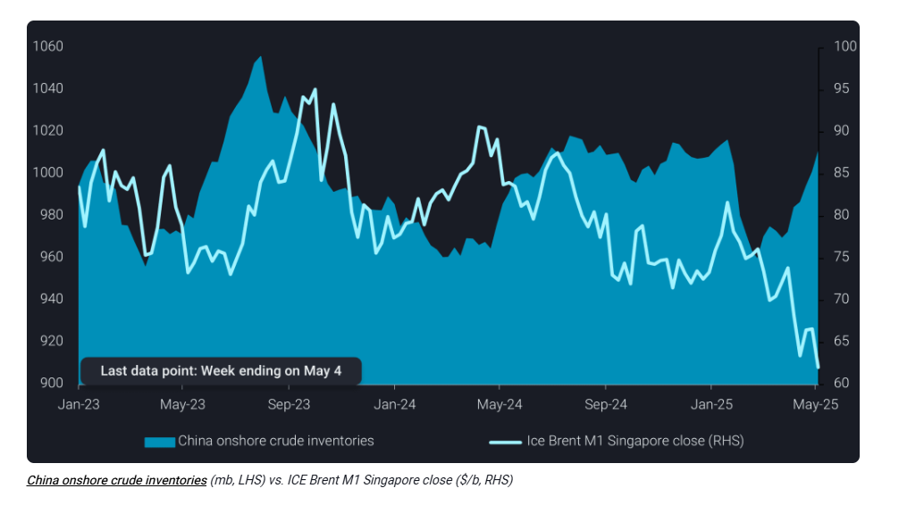
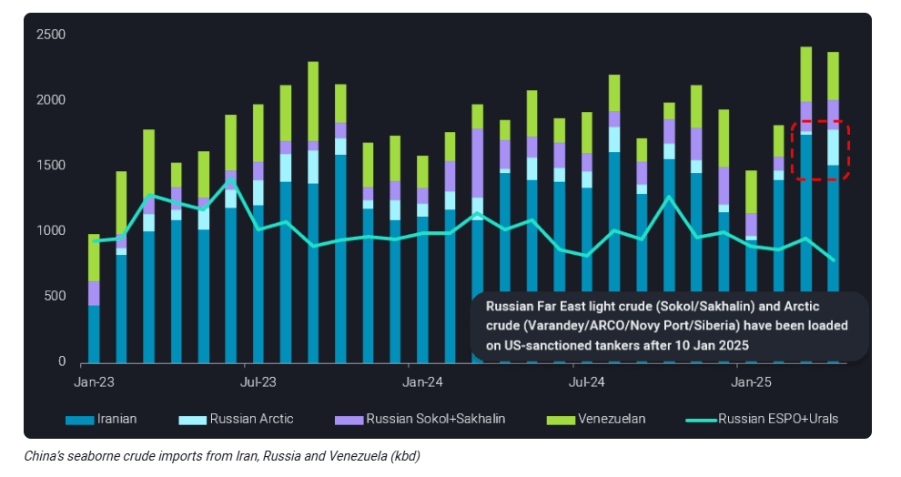

# Market volatility drives China’s crude stockpiling

**Date:** May 08, 2025  
**Publisher:** Breakwave Advisors | **Category:** Market Insights  
**Original URL:** [https://www.breakwaveadvisors.com/insights/2025/5/8/market-volatility-drives-chinas-crude-stockpiling](https://www.breakwaveadvisors.com/insights/2025/5/8/market-volatility-drives-chinas-crude-stockpiling)  

---

Uncertainty and lower oil prices prompt aggressive stockpiling by Chinese majors, while sanctioned crude imports hold near record highs.

*By*[*Emma Li*](https://www.linkedin.com/in/emma-li-73003443/)

China’s seaborne crude imports continued to climb in April, reaching an estimated 10.9 mbd—the highest monthly total since August 2023. This surge was initiated by concerns over potential supply disruptions amid tightening US sanctions, prompting Chinese refiners to ramp up bookings and bolster onshore inventories. But steadily falling prices over recent months are likely to support and prolong this pattern.

Crude stock builds in China’s onshore tanks accelerated significantly through April. The average build rate exceeded 1.1 mbd over the five weeks ending May 4—a notable uptick from March’s pace. While March’s build was concentrated in Shandong and driven by Iranian crude ([see blog link](https://www.vortexa.com/insights/crude/record-stockpile-of-sanctioned-crude-builds-in-shandong-amid-supply-disruption-fears/)), this latest wave saw approximately 80% of the increase occur outside Shandong, led by state-owned trading arms capitalising on international price swings.

As of May 4, China’s majors-owned crude tank utilisation rate stood at 62%, suggesting ample capacity remains for further stockpiling. With seasonal refinery maintenance ongoing and strategic restocking underway, inventory builds are expected to continue into Q3. The recent Saudi-led OPEC+ agreement to increase output in June—following sharp OSP cuts for Asian buyers in May—along with mounting oversupply in the Atlantic Basin, may further incentivise Chinese purchases for mainstream barrels.

> **Figure 1: Στιγμιότυπο Οθόνης 2025 05 08 103632**  
> **Interactive Data & Source:** [Vortexa](https://www.vortexa.com//oil-gas-data-traders-analysts-data-scientists?gclid=Cj0KCQjw8_qRBhCXARIsAE2AtRZKOvMnbilZ_6_91d7huSFFy71pWLrnPwGwOHVzXsmsG-1a1mZnQw8aAt89EALw_wcB&hsa_acc=1782073842&hsa_ad=548425387665&hsa_cam=14746637662&hsa_grp=125038601902&hsa_kw=&hsa_mt=&hsa_net=adwords&hsa_src=g&hsa_tgt=dsa-1431852288425&hsa_ver=3&utm_campaign=%5BCD%5D%20-%20DSA%20-%20EMEA&utm_medium=cpc&utm_medium=ppc&utm_source=google&utm_source=adwords&utm_term=) | [Local Asset](file:///C:/Users/Dell/Github/Shipping/corpus/03-breakwave/insights/2025/assets/2025-05-08_market-volatility-drives-chinas-crude-stockpiling_img_cea3cf84ceb9ceb3cebcceb9cf8ccf84cf85_32d9be89a57f.png)

## Tanker Sanctions Push Record Russian Arctic Crude Into China

China’s appetite for discounted feedstock remains resilient—particularly among private refiners who have grappled with weak margins since late 2023. These “teapot” refiners, concentrated along China’s coastline, are increasingly turning to sanctioned sources for cost-effective crude.

In April, imports of Iranian crude and condensate totaled just shy of 1.5 mbd—down from March’s record 1.8mbd, yet still above the 2024 average of 1.4mbd. Russian Arctic barrels have been strong competitors, loading onto US-sanctioned tankers since January 10 and subsequently rejected by traditional buyers.

Unable to access regular markets, these Arctic cargoes have been rerouted to China via STS transfers onto non-sanctioned tankers in the South China Sea. As a result, April imports of Russian Arctic crude surged to a record 280kbd, effectively offsetting the dip in Iranian volumes.

Meanwhile, China’s demand for Russian Far East light grades—notably Sokol and Sakhalin Blend—remained strong, with April imports exceeding 220kbd. These grades continue to attract smaller refiners due to their favourable distillate yield and proximity.

> **Figure 2: Στιγμιότυπο Οθόνης 2025 05 08 103727**  
> **Interactive Data & Source:** [Vortexa](https://www.vortexa.com//oil-gas-data-traders-analysts-data-scientists?gclid=Cj0KCQjw8_qRBhCXARIsAE2AtRZKOvMnbilZ_6_91d7huSFFy71pWLrnPwGwOHVzXsmsG-1a1mZnQw8aAt89EALw_wcB&hsa_acc=1782073842&hsa_ad=548425387665&hsa_cam=14746637662&hsa_grp=125038601902&hsa_kw=&hsa_mt=&hsa_net=adwords&hsa_src=g&hsa_tgt=dsa-1431852288425&hsa_ver=3&utm_campaign=%5BCD%5D%20-%20DSA%20-%20EMEA&utm_medium=cpc&utm_medium=ppc&utm_source=google&utm_source=adwords&utm_term=) | [Local Asset](file:///C:/Users/Dell/Github/Shipping/corpus/03-breakwave/insights/2025/assets/2025-05-08_market-volatility-drives-chinas-crude-stockpiling_img_cea3cf84ceb9ceb3cebcceb9cf8ccf84cf85_58ad1e3961d9.png)

By contrast, imports of Russian flagship ESPO Blend and Urals crude slid to multi-year lows, constrained by pricing pressures tied to elevated freight costs for direct shipments on non-sanctioned tankers—undermining their appeal relative to other discounted alternatives.

Despite logistical constraints, combined imports of discounted crude from Iran, Venezuela, and Russia’s northern ports—flows largely dependent on US-sanctioned tankers—hit a record ~2.4 mbd in both March and April. This underscores China’s expanding willingness on sanctioned crude and the so-called “dark fleet” as a means to secure affordable supply amid global uncertainty.

Looking ahead, sanctioned crude volumes may ease in May due to the delayed onset of spring maintenance among teapot refiners. However, underlying demand for discounted feedstock remains structurally robust. With US sanctions further restricting these barrels from traditional buyers, more volumes are likely to consolidate in China—reinforcing its strategic position as the key outlet for politically sensitive crude.

Absent a major policy shift or global demand disruption, this trend of stockpiling and reliance on sanctioned suppliers is expected to persist through the coming months.

Data Source:[Vortexa](https://www.vortexa.com//oil-gas-data-traders-analysts-data-scientists?gclid=Cj0KCQjw8_qRBhCXARIsAE2AtRZKOvMnbilZ_6_91d7huSFFy71pWLrnPwGwOHVzXsmsG-1a1mZnQw8aAt89EALw_wcB&hsa_acc=1782073842&hsa_ad=548425387665&hsa_cam=14746637662&hsa_grp=125038601902&hsa_kw=&hsa_mt=&hsa_net=adwords&hsa_src=g&hsa_tgt=dsa-1431852288425&hsa_ver=3&utm_campaign=%5BCD%5D%20-%20DSA%20-%20EMEA&utm_medium=cpc&utm_medium=ppc&utm_source=google&utm_source=adwords&utm_term=)

---

**Tags:** Crude, Tankers, Shipping  
