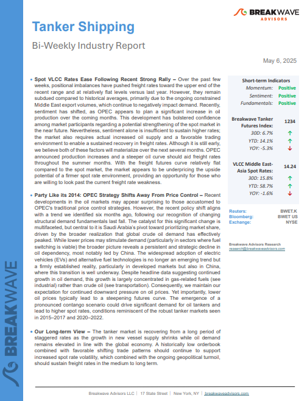
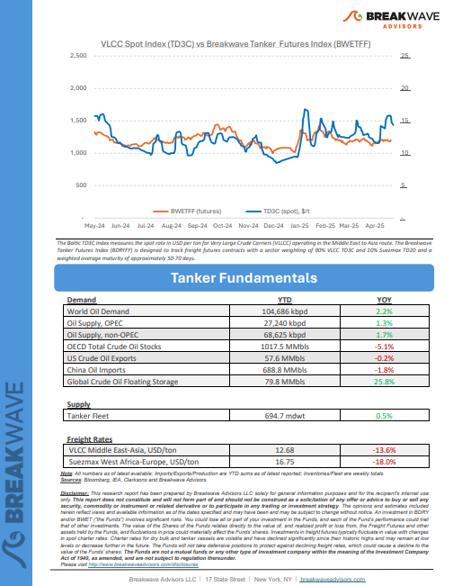
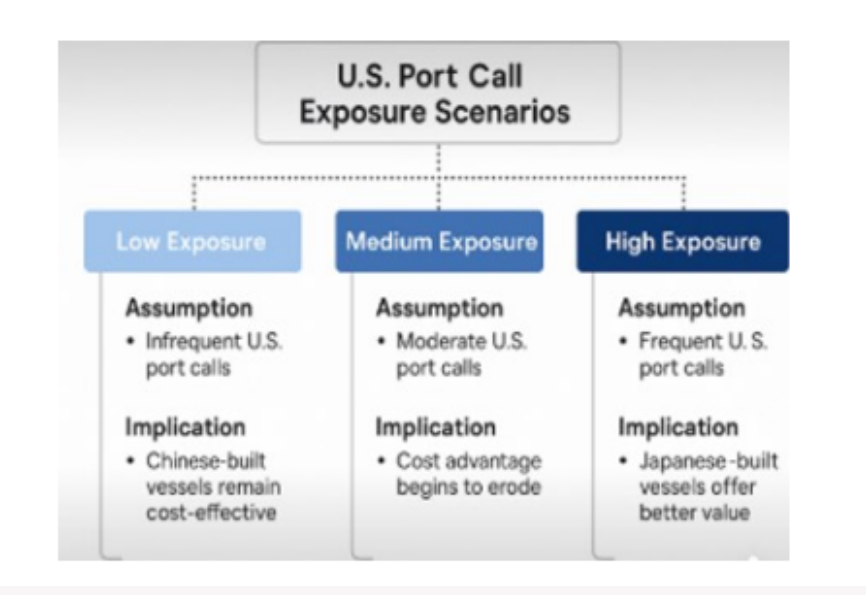

# Breakwave Weekend Read

**Date:** May 09, 2025  
**Publisher:** Breakwave Advisors | **Category:** Market Insights  
**Original URL:** [https://www.breakwaveadvisors.com/insights/2024/10/25/breakwave-weekend-read-4cn8n-wg9gj-jk5sb-4ckhh-cagw9-r4yzg-z4wst](https://www.breakwaveadvisors.com/insights/2024/10/25/breakwave-weekend-read-4cn8n-wg9gj-jk5sb-4ckhh-cagw9-r4yzg-z4wst)  

---

## Welcome Tobreakwave Advisorsweekend Read

***As the week comes to a close, take a moment to review the key insights from the past few days. Missed something? We've gathered all the top insights for you to catch up at your convenience.***

## Breakwave Shipping Report

**Spot VLCC Rates Ease Following Recent Strong Rally**– Over the past few weeks, positional imbalances have pushed freight rates toward the upper end of the recent range and at relatively flat levels versus last year.

[*Read More*](https://www.breakwaveadvisors.com/insights/202565wet8554l)

> **Figure 1: Στιγμιότυπο Οθόνης 2025 05 09 135732**  
> **Interactive Data & Source:** [Breakwave Advisors Market Insights](https://www.breakwaveadvisors.com/insights/2025/5/5/the-prisoners-dilemma) | [Local Asset](file:///C:/Users/Dell/Github/Shipping/corpus/03-breakwave/insights/2025/assets/2025-05-09_breakwave-weekend-read-4cn8n-wg9gj-jk5sb-4ckhh-cagw9-r4yzg-z4wst_img_cea3cf84ceb9ceb3cebcceb9cf8ccf84cf85_18011aad5d48.png)

> **Figure 2: Στιγμιότυπο Οθόνης 2025 05 09 135748**  
> **Interactive Data & Source:** [Breakwave Advisors Market Insights](https://www.breakwaveadvisors.com/insights/2025/5/5/the-prisoners-dilemma) | [Local Asset](file:///C:/Users/Dell/Github/Shipping/corpus/03-breakwave/insights/2025/assets/2025-05-09_breakwave-weekend-read-4cn8n-wg9gj-jk5sb-4ckhh-cagw9-r4yzg-z4wst_img_cea3cf84ceb9ceb3cebcceb9cf8ccf84cf85_1e04f88eac26.png)

## The Prisoner’s Dilemma

> **Figure 3: Ανώνυμο Σχέδιο**  
> **Interactive Data & Source:** [Breakwave Advisors Market Insights](https://www.breakwaveadvisors.com/insights/2025/5/5/the-prisoners-dilemma) | [Local Asset](file:///C:/Users/Dell/Github/Shipping/corpus/03-breakwave/insights/2025/assets/2025-05-09_breakwave-weekend-read-4cn8n-wg9gj-jk5sb-4ckhh-cagw9-r4yzg-z4wst_img_ce91cebdcf8ecebdcf85cebccebfcf83cf87_fa055f93046f.png)

In economics and international trade, decision-making under uncertainty often leads rational players to adopt strategies that, while individually rational, result in collectively suboptimal outcomes.

[Read More](https://www.breakwaveadvisors.com/insights/2025/5/5/the-prisoners-dilemma)

Doric Weekly Market Insights

## Consumer Growth in China Continues to Increase

> **Figure 4: Consumer Growth in China Continues to Increase**  
> **Interactive Data & Source:** [Breakwave Advisors Market Insights](https://www.breakwaveadvisors.com/insights/2025/5/5/consumer-growth-in-china-continues-to-increase) | [Local Asset](file:///C:/Users/Dell/Github/Shipping/corpus/03-breakwave/insights/2025/assets/2025-05-09_breakwave-weekend-read-4cn8n-wg9gj-jk5sb-4ckhh-cagw9-r4yzg-z4wst_img_consumergrowthinchinacontinuestoincr_48ca15299d60.png)

China’s retail sales in March grew year-on-year by 5.9%. This is up considerably from the 4% growth seen in January/February and is the strongest growth seen since December 2023.

[Read More](https://www.breakwaveadvisors.com/insights/2025/5/5/consumer-growth-in-china-continues-to-increase)

From Commodore's Weekly Dry Bulk Reports

## Japan Shipbuilding: Craft Over Quantity

> **Figure 5: Ανώνυμο Σχέδιο (1)**  
> **Interactive Data & Source:** [Breakwave Advisors Market Insights](https://www.breakwaveadvisors.com/insights/2025/5/6/japan-shipbuilding-craft-over-quantity) | [Local Asset](file:///C:/Users/Dell/Github/Shipping/corpus/03-breakwave/insights/2025/assets/2025-05-09_breakwave-weekend-read-4cn8n-wg9gj-jk5sb-4ckhh-cagw9-r4yzg-z4wst_img_ce91cebdcf8ecebdcf85cebccebfcf83cf87_102641efd942.png)

Japan’s shipbuilding capacity for bulkers, tankers, and container ships has undergone significant change over the past two decades.

[Read More](https://www.breakwaveadvisors.com/insights/2025/5/6/japan-shipbuilding-craft-over-quantity)

BRS Weekly Dry Bulk Newsletter

## OPEC+ Grabs Headlines

> **Figure 6: Ανώνυμο Σχέδιο (2)**  
> **Interactive Data & Source:** [Breakwave Advisors Market Insights](https://www.breakwaveadvisors.com/insights/2025/5/7/opec-grabs-headlines) | [Local Asset](file:///C:/Users/Dell/Github/Shipping/corpus/03-breakwave/insights/2025/assets/2025-05-09_breakwave-weekend-read-4cn8n-wg9gj-jk5sb-4ckhh-cagw9-r4yzg-z4wst_img_ce91cebdcf8ecebdcf85cebccebfcf83cf87_ac2147df63c0.png)

The global oil market has been riding through intense swings, with Brent crude tumbling 6.85% just last week after Saudi Arabia signaled it’s prepared to handle a stretch of lower prices.

[Read More](https://www.breakwaveadvisors.com/insights/2025/5/7/opec-grabs-headlines)

Intermodal Weekly Market Report

## Tankers Research Update

> **Figure 7: Προσθέστε Επικεφαλίδα**  
> **Interactive Data & Source:** [Breakwave Advisors Market Insights](https://www.breakwaveadvisors.com/insights/2025/5/7/tankers-research-update) | [Local Asset](file:///C:/Users/Dell/Github/Shipping/corpus/03-breakwave/insights/2025/assets/2025-05-09_breakwave-weekend-read-4cn8n-wg9gj-jk5sb-4ckhh-cagw9-r4yzg-z4wst_img_cea0cf81cebfcf83ceb8ceadcf83cf84ceb5_0fbe77ea1ed0.png)

VLCCs to benefit as Middle East continues to open oil taps

[Read More](https://www.breakwaveadvisors.com/insights/2025/5/7/tankers-research-update)

Braemar Research

## Impact of U.s. Port Fees on Dry Bulk Vessel Economics and Fleet Strategy

> **Figure 8: Στιγμιότυπο Οθόνης 2025 05 09 144542**  
> **Interactive Data & Source:** [Breakwave Advisors Market Insights](https://www.breakwaveadvisors.com/insights/2025/5/7/impact-of-us-port-fees-on-dry-bulk-vessel-economics-and-fleet-strategy) | [Local Asset](file:///C:/Users/Dell/Github/Shipping/corpus/03-breakwave/insights/2025/assets/2025-05-09_breakwave-weekend-read-4cn8n-wg9gj-jk5sb-4ckhh-cagw9-r4yzg-z4wst_img_cea3cf84ceb9ceb3cebcceb9cf8ccf84cf85_fd0a6f4aee33.png)

The United States remains a vital hub in the global dry bulk trade, with its ports—especially those along the Gulf Coast, East Coast, and Great Lakes— processing significant volumes of coal, grain, and iron ore.

Allied Weekly Report

## Grain Dry Bulk Flows

> **Figure 9: Ανώνυμο Σχέδιο (3)**  
> **Interactive Data & Source:** [Breakwave Advisors Market Insights](https://www.breakwaveadvisors.com/insights/2025/5/8/grain-dry-bulk-flows) | [Local Asset](file:///C:/Users/Dell/Github/Shipping/corpus/03-breakwave/insights/2025/assets/2025-05-09_breakwave-weekend-read-4cn8n-wg9gj-jk5sb-4ckhh-cagw9-r4yzg-z4wst_img_ce91cebdcf8ecebdcf85cebccebfcf83cf87_9c49dc1ea269.png)

Between 2022 and 2024, US grain exports to Mexico have shown a significant upward trend, with Mexico's share rising from 7.6% in 2022 to 9.3% in 2024,

Signal Ocean Dry Weekly Market Monitor

## How an Ageing VLCC Fleet Is Reshaping Market Dynamics

> **Figure 10: How+an+ageing+vlcc+fleet+is+reshaping+market+dynamics**  
> **Interactive Data & Source:** [Breakwave Advisors Market Insights](https://www.breakwaveadvisors.com/insights/2025/5/8/how-an-ageing-vlcc-fleet-is-reshaping-market-dynamics) | [Local Asset](file:///C:/Users/Dell/Github/Shipping/corpus/03-breakwave/insights/2025/assets/2025-05-09_breakwave-weekend-read-4cn8n-wg9gj-jk5sb-4ckhh-cagw9-r4yzg-z4wst_img_how2ban2bageing2bvlcc2bfleet2bis2bre_e47cb013bbeb.jpg)

The VLCC market is going through some significant transitions.

Tankers International Market Review

## Market Volatility Drives China’s Crude Stockpiling

> **Figure 11: Ανώνυμο Σχέδιο (4)**  
> **Interactive Data & Source:** [Breakwave Advisors Market Insights](https://www.breakwaveadvisors.com/insights/2025/5/8/market-volatility-drives-chinas-crude-stockpiling) | [Local Asset](file:///C:/Users/Dell/Github/Shipping/corpus/03-breakwave/insights/2025/assets/2025-05-09_breakwave-weekend-read-4cn8n-wg9gj-jk5sb-4ckhh-cagw9-r4yzg-z4wst_img_ce91cebdcf8ecebdcf85cebccebfcf83cf87_e356ef7bb8e9.png)

Uncertainty and lower oil prices prompt aggressive stockpiling by Chinese majors, while sanctioned crude imports hold near record highs.

Vortexa Freight Weekly

## The Big Picture: Slower Start to 2025 for Global Trade in Iron Ore

> **Figure 12: The Big Picture Slower Start to 2025 for Global Trade in Iron Ore**  
> **Interactive Data & Source:** [Breakwave Advisors Market Insights](https://www.breakwaveadvisors.com/insights/2025/5/9/the-big-picture-slower-start-to-2025-for-global-trade-in-iron-ore) | [Local Asset](file:///C:/Users/Dell/Github/Shipping/corpus/03-breakwave/insights/2025/assets/2025-05-09_breakwave-weekend-read-4cn8n-wg9gj-jk5sb-4ckhh-cagw9-r4yzg-z4wst_img_thebigpictureslowerstartto2025forglo_e82e5dd9eaa1.png)

The most severe supply-side constraint in early 2025 was in Australia, caused by four cyclones, which (1) impacted shipments from Dampier and Port Walcott in particular, and (2) limited total Q1 iron ore exports from Australia to a three-year low.

Braemar Weekly Dry Market Report

## Dry Bulk Fleet Growth Remains Moderate

> **Figure 13: Ανώνυμο Σχέδιο (5)**  
> **Interactive Data & Source:** [Breakwave Advisors Market Insights](https://www.breakwaveadvisors.com/insights/2025/5/9/dry-bulk-fleet-growth-remains-moderate) | [Local Asset](file:///C:/Users/Dell/Github/Shipping/corpus/03-breakwave/insights/2025/assets/2025-05-09_breakwave-weekend-read-4cn8n-wg9gj-jk5sb-4ckhh-cagw9-r4yzg-z4wst_img_ce91cebdcf8ecebdcf85cebccebfcf83cf87_1cc6988a221f.png)

Approximately 46 dry bulk newbuildings were delivered in March, which is 21 more than were delivered in February.

From Commodore's Weekly Dry Bulk Reports

## Decline in Saudi Oil Flows to China in Q2 2025

> **Figure 14: Ανώνυμο Σχέδιο (6)**  
> **Interactive Data & Source:** [Breakwave Advisors Market Insights](https://www.breakwaveadvisors.com/insights/2025/5/9/decline-in-saudi-oil-flows-to-china-in-q2-2025) | [Local Asset](file:///C:/Users/Dell/Github/Shipping/corpus/03-breakwave/insights/2025/assets/2025-05-09_breakwave-weekend-read-4cn8n-wg9gj-jk5sb-4ckhh-cagw9-r4yzg-z4wst_img_ce91cebdcf8ecebdcf85cebccebfcf83cf87_a67f036e454e.png)

In the second quarter of 2025, oil flows from Saudi Arabia to China declined sharply. This downturn can be attributed to a combination of seasonal and structural factors.

Signal Ocean Tanker Weekly Market Monitor

---

**Tags:** Shipping, Tankers, Drybulk  
