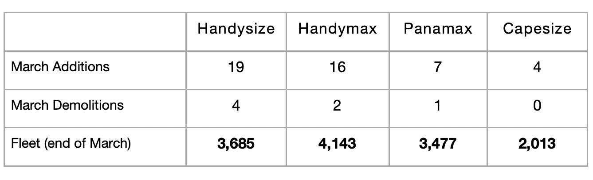

# Dry Bulk Fleet Growth Remains Moderate

**Date:** May 09, 2025  
**Publisher:** Breakwave Advisors | **Category:** Market Insights  
**Original URL:** [https://www.breakwaveadvisors.com/insights/2025/5/9/dry-bulk-fleet-growth-remains-moderate](https://www.breakwaveadvisors.com/insights/2025/5/9/dry-bulk-fleet-growth-remains-moderate)  

---

*By*[*Jeffrey Landsberg*](https://www.linkedin.com/in/jeffrey-landsberg-70ab957/)

Approximately 46 dry bulk newbuildings were delivered in March, which is 21 more than were delivered in February. March saw the delivery of 19 handysize vessels, 16 handymax vessels, 7 panamax vessels, and 4 capesize vessels. In comparison, February saw the delivery of 10 handysize vessels, 9 handymax vessels, 2 panamax vessels, and 4 capesize vessels. Approximately 7 dry bulk vessels were scrapped, which is 1 more than were scrapped in February. March saw the removal of 4 handysize vessels, 2 handymax vessels, and 1 panamax vessel. In comparison, February saw the removal of 1 handysize vessel, 1 handymax vessel, 3 panamax vessels, and 1 capesize vessel.

> **Figure 1: Chart 1**  
> [Local Asset](file:///C:/Users/Dell/Github/Shipping/corpus/03-breakwave/insights/2025/assets/2025-05-09_dry-bulk-fleet-growth-remains-moderate_img_chart1_fba0a6498248.jpg)

As we continue to stress in Commodore Research's Weekly Executive Reports, dry bulk fleet growth remains moderate. The fleet is not growing by an insignificant amount, and seemingly all segments of dry bulk trade volume still need to continue to grow for dry bulk rates to be able to climb.

---

**Tags:** Drybulk, Shipping, Capesize  
