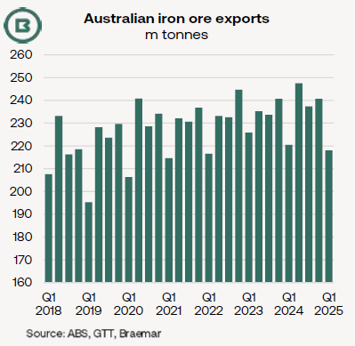
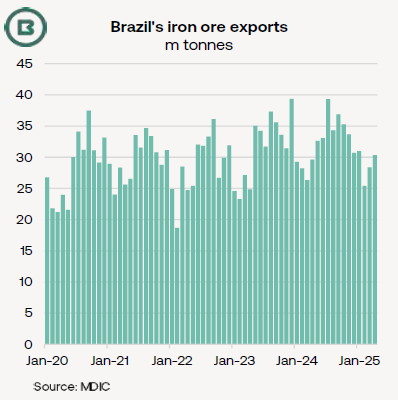

# The Big Picture: Slower start to 2025 for global trade in iron ore

**Date:** May 09, 2025  
**Publisher:** Breakwave Advisors | **Category:** Market Insights  
**Original URL:** [https://www.breakwaveadvisors.com/insights/2025/5/9/the-big-picture-slower-start-to-2025-for-global-trade-in-iron-ore](https://www.breakwaveadvisors.com/insights/2025/5/9/the-big-picture-slower-start-to-2025-for-global-trade-in-iron-ore)  

---

- *Judging by customs data gathered by Braemar, more than 120m tonnes of iron ore exports were added to annual seaborne trade in 2023 and 2024 combined—largely fuelled by China’s import appetite.*
- *However, in the first four months of 2025 global seaborne iron ore trade reversed the recent trend, falling behind the year-ago pace.*
- *Several supply-side constraints have been apparent in the 90%-Capesize iron ore trade this year.*

The most severe supply-side constraint in early 2025 was in Australia, caused by four cyclones, which (1) impacted shipments from Dampier and Port Walcott in particular, and (2) limited total Q1 iron ore exports from Australia to a three-year low (see chart below).

Rio Tinto, the mining company, whose operations faced the greatest disruption, did not change their production guidance for the 2025 calendar year.

> **Figure 1: All Volumes Have Been Converted Into Standard Wet Basis From**  
> *All volumes have been converted into standard wet basis from Australian Bureau of Statistics figures.*  
> [Local Asset](file:///C:/Users/Dell/Github/Shipping/corpus/03-breakwave/insights/2025/assets/2025-05-09_the-big-picture-slower-start-to-2025-for-global-trade-in-iron-ore_img_778a-image-0-1746720803245_7a28ce15444a.png)

The process of catch-up, as operations normalised, helped lift**Australian iron ore exports from the lowest month in almost six years in February**(60.2m tonnes) to the**second-highest month on record in March**(85.5m tonnes), as ore shipments caught up.

**Brazil’s exports in the first four months registered a slight yearly rise**to 114.9m tonnes, according to official data (see chart below).

> **Figure 2: 1d0a Image 0 1746720766838**  
> [Local Asset](file:///C:/Users/Dell/Github/Shipping/corpus/03-breakwave/insights/2025/assets/2025-05-09_the-big-picture-slower-start-to-2025-for-global-trade-in-iron-ore_img_1d0a-image-0-1746720766838_14aedc95d1a3.png)

While seasonal Q1 rains in Brazil have frequently hampered mining and supply chain operations in previous Q1s, the country’s iron ore production levels are not solely determined by rainfall.

The National Oceanic and Atmospheric Administration (NOAA) in the US described this year’s La Niña as “very brief” and had ended by March.

La Niña is associated with more rainfall than normal in the north of Brazil and less in the south; iron ore is mined in**both**regions.

As it happened, this year—despite drier conditions in the south and southeast compared with the previous year—Q1 output from the country’s largest miner Vale fell year-on-year “as planned” due to the company (1) prioritising higher-margin products and (2) undertaking corrective maintenance work.

Moreover, the highest-ever Q1 production at Vale’s S11D mine in the north was achieved in spite of higher rainfall.

Miner production guidance figures for Brazil in 2025 from the likes of Anglo American and Companhia Siderugica Nacional (CSN) are fairly consistent with 2024 levels.

Vale’s current project ramp-ups at Capanema, Serra Sul+20 and its Vargem Grande plant (VGR1) are underway to provide “greater operational flexibility” in the company’s own words.

With export volumes from Canada and South Africa flat year-on-year and India down,**only Sweden offers significant compensating growth**.

Nevertheless, annual comparisons of shipments of Swedish iron ore on Capesizes from Narvik and on smaller vessels from Lulea are massively distorted by rail line closures a year earlier caused by two derailments and subsequent repair work.

This limited Q1 Swedish exports to 2.1m tonnes in the Q1 2024, a total overtaken this year by the first half of February, judging by official data from Statistics Sweden.

---

**Tags:** Ironore, Drybulk, Shipping  
