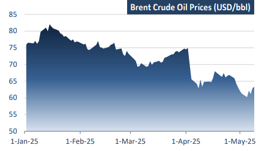
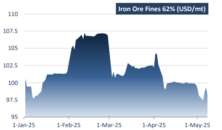

# Commodity markets are strategic arenas

**Date:** May 12, 2025  
**Publisher:** Breakwave Advisors | **Category:** Market Insights  
**Original URL:** [https://www.breakwaveadvisors.com/insights/2025/5/12/commodity-markets-are-strategic-arenas](https://www.breakwaveadvisors.com/insights/2025/5/12/commodity-markets-are-strategic-arenas)  

---

*By*[*Michalis Voutsinas*](https://www.linkedin.com/in/michalis-voutsinas-587544163/)

Within the OPEC framework, member states are far from equals. The cartel is marked by asymmetric power dynamics, with Saudi Arabia occupying a uniquely pivotal role. As the world's largest oil exporter and holder of substantial spare production capacity, Saudi Arabia often acts as a "swing producer" – a role that grants it significant influence over global oil prices but also imposes disproportionate burdens during times of supply restraint. Unlike smaller OPEC members, which typically operate near capacity and rely heavily on immediate export revenues, Saudi Arabia has both the fiscal room and strategic imperative to absorb output cuts for the sake of market stability. Saudi Arabia’s dominant position enables it to act in a leadership capacity, aligning its actions with long-term price stability rather than short-term revenue maximization.

This leadership behavior aligns closely with the Stackelberg model (leader-follower game) in game theory wherein a dominant player makes the first move, and others adjust their strategies in response. In this context, Saudi Arabia frequently announces production cuts or output hikes first, effectively setting the tone for the rest of OPEC+. By taking the initiative, Riyadh seeks to set the tone, restore investor confidence, and nudge oil prices toward a desired range. However, this role comes with challenges. Free-rider behavior – wherein smaller producers benefit from Saudi-led cuts without reducing their own output – can erode the effectiveness of collective decisions. The recent under-compliance by Iraq and Kazakhstan underscores this recurring dilemma.

In a demand-driven market of late, crude prices have been sliding throughout the year, now down over 20 percent since mid-January. The decline has been driven in part by US President Donald Trump’s prodrilling stance, the escalating global trade war, and rising US-China tensions. On Monday, crude oil prices fell to a multi-year low as OPEC+ confirmed plans to continue unwinding production cuts, accelerating output increases in June. The move, which appears aimed at penalizing quota violators, exacerbated a fragile market balance already weakened by sluggish demand. Brent futures fell as much as 4.6 percent to $58.50 per barrel, while WTI dropped nearly 5 percent to $55.53 – both hitting multi-year lows during Monday’s Asian session. While the latter half of the week brought a modest rebound – buoyed by hopes of a U.S.-China trade breakthrough and rising refinery runs ahead of summer driving season – the broader sentiment remains cautious. Refinery maintenance is tapering off, particularly in the Atlantic basin, which could support crude demand short-term. But longer-term price sustainability depends on more durable demand-side improvement and coherent supply discipline from OPEC+.

> **Figure 1: Στιγμιότυπο Οθόνης 2025 05 12 083023**  
> **Interactive Data & Source:** [Doric](https://www.doric.gr/) | [Local Asset](file:///C:/Users/Dell/Github/Shipping/corpus/03-breakwave/insights/2025/assets/2025-05-12_commodity-markets-are-strategic-arenas_img_cea3cf84ceb9ceb3cebcceb9cf8ccf84cf85_f48857c22204.png)

In parallel, the global iron ore market tells a different strategic story – one shaped by an oligopoly of suppliers and a dominant monopsonist buyer: China. Accounting for over 70 percent of global seaborne demand, China exerts immense influence on the pricing and procurement dynamics of this critical commodity. Miners’ collective incentive is to maintain discipline, but the temptation to expand capacity when prices are strong remains ever-present. China, as a monopsonist, faces a different set of incentives. Beijing’s long-term strategy has been to diversify sources of iron ore, enhance domestic production, and encourage price transparency through indexation. However, the physical limitations of inland supply and the high quality of seaborne ore – especially from Australia and Brazil – have constrained China’s options. In practice, China’s leverage has proven limited, especially when demand for steel is buoyant. It is during downturns, when consumption falters, that China attempts to rebalance its bargaining power.

The latest developments in iron ore prices underscores this delicate balance. Since October, prices have remained rangebound, oscillating between a high of $110 per tonne early that month and a low of $96 in early May. The recent decline has been driven largely by the Chinese government’s renewed efforts to cap crude steel output—part of a broader initiative aimed at curbing emissions and restoring mill profitability in an oversupplied market. The China Iron and Steel Association (CISA) reiterated that the industry’s “main task” is to maintain a balance between supply and subdued downstream demand. While specific output targets and implementation timelines remain unspecified, the direction of policy suggests a firm commitment to restricting production, rather than encouraging a rebound in output.

Iron ore futures retreated in the latter half of the week, reversing earlier gains after the People’s Bank of China (PBOC) announced a cut to the seven-day reverse repurchase rate on Wednesday. The initial optimism triggered by this monetary easing quickly faded, as investors reassessed the limited near-term impact of stimulus against the more immediate headwinds from output curbs and soft demand fundamentals. Traders also adopted a cautious stance ahead of the weekend’s scheduled SinoU.S. trade talks, adding to the risk-off tone. Despite these concerns, nearterm ore demand has remained relatively firm. According to the General Administration of Customs of China, iron ore imports rose to 103.14 million metric tonnes in April, marking an increase of 9.75 percent month-on-month and 1.3 percent year-on-year. Looking ahead, imports are expected to remain robust through May, supported by strong pig iron output and the seasonal ramp-up in shipments from overseas suppliers. Nonetheless, weakening indicators from downstream steel consumption and continued uncertainty over the trajectory of international trade relations may limit upside potential for seaborne iron ore.

> **Figure 2: Στιγμιότυπο Οθόνης 2025 05 12 083033**  
> **Interactive Data & Source:** [Doric](https://www.doric.gr/) | [Local Asset](file:///C:/Users/Dell/Github/Shipping/corpus/03-breakwave/insights/2025/assets/2025-05-12_commodity-markets-are-strategic-arenas_img_cea3cf84ceb9ceb3cebcceb9cf8ccf84cf85_6653ab97f963.png)

Whether in oil or iron ore, commodity markets are more than just reflections of supply and demand – they are strategic arenas where key players engage in calculated interaction. In oil, Saudi Arabia leads with deliberate moves, shaping outcomes through a leadership strategy rooted in game theory. In iron ore, the push-and-pull between a supplyside oligopoly and a powerful buyer creates a different set of interdependencies. Dry bulk shipping, which underpins the physical movement of these commodities, remains closely tethered to these strategic developments. Freight rates respond not only to shifts in cargo volumes, but also to the underlying decisions made by commodity producers and consumers. This week, the Baltic Dry Index declined to 1,299 points, with Capesize weakness offsetting more stable performance of the other segments. As China signals steel production cuts and oil markets recalibrate around the latest OPEC+ strategy, the dry bulk sector finds itself suspended between two competing forces – the structural games that define commodity markets and the cyclical volatility that governs freight.

Data source:[Doric](https://www.doric.gr/)

---

**Tags:** Economy, Markets, Shipping  
