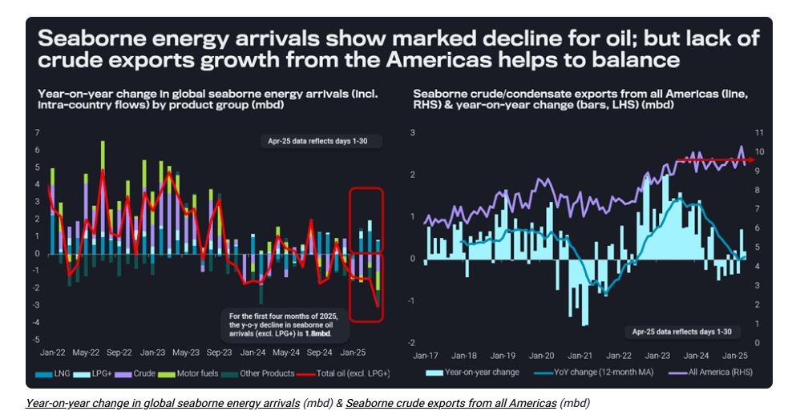
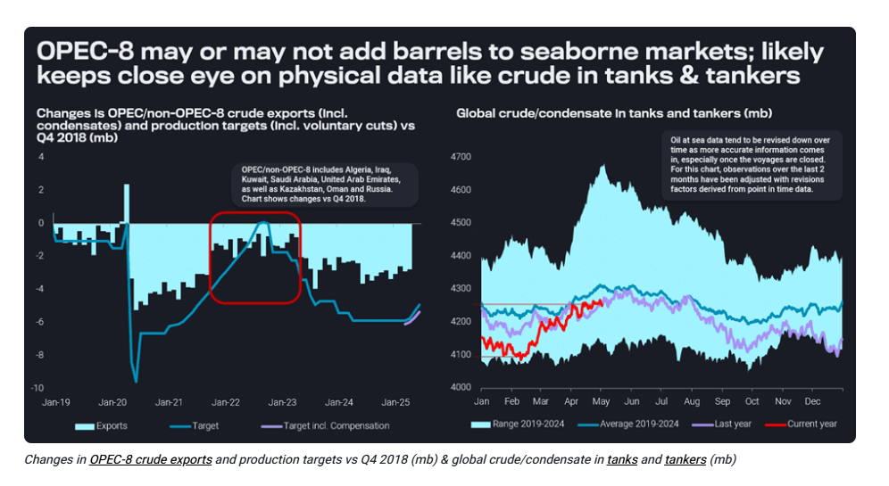

# Oil pricing and balances at the brink of recession territory

**Date:** May 12, 2025  
**Publisher:** Breakwave Advisors | **Category:** Market Insights  
**Original URL:** [https://www.breakwaveadvisors.com/insights/2025/5/12/oil-pricing-and-balances-at-the-brink-of-recession-territory](https://www.breakwaveadvisors.com/insights/2025/5/12/oil-pricing-and-balances-at-the-brink-of-recession-territory)  

---

In this big picture take, we look at demand, supply, trade, inventory and price indications to assess the state of the oil market, as well as whether the role of OPEC+ has changed.

*By*[*David Wech*](https://www.linkedin.com/in/david-wech-83a163165/)

The first Monday in May – after the subgroup of eight OPEC+ members agreed to unwind voluntary cuts at an accelerated speed again in June in a repeat of their May decision – ICE Brent futures briefly traded below $60/b. To the veterans in the industry, that may not sound particularly low, but looking at a stretch of 20 years, oil prices have only been persistently lower on three occasions:

(1) 2008/09 after the financial crisis;

(2) 2015-17 when the US shale boom hit the global industry the hardest, and;

(3) in the 2020 Covid-triggered demand meltdown.

And this is for nominal prices – considering inflation the number of months pricing below recent lows falls from about 70 to 20 during the last 20 years.

## Demand Indications Are Concerning

Albeit OPEC+ and US government policy announcements have been the catalysts for April and early May price declines, there are clearly worrisome indications in fundamental oil market data. Demand indicators for conventional liquid oil are particularly concerning. Every single month of this year so far, we have seen seaborne crude and motor fuel arrivals down year-on-year. On average, arrivals for liquids (excluding LPG+) are 1.8mbd lower than in January-April 2024. The April reading, as well as the three- or four-month moving averages, are all the lowest since February 2021.

Lower crude arrivals are not necessarily a surprise as mature refining hubs in Asia or Europe are experiencing declines in implied refining runs, as poor demand combined with high product exports from the Middle East and India are weighing on margins. Consequently, refiners in Asia and Europe tend to import more motor fuels and less crude, raising even more question marks about the global decline in gasoline, jet and diesel flows.

> **Figure 1: Στιγμιότυπο Οθόνης 2025 05 12 090852**  
> **Interactive Data & Source:** [Vortexa](https://www.vortexa.com//oil-gas-data-traders-analysts-data-scientists?gclid=Cj0KCQjw8_qRBhCXARIsAE2AtRZKOvMnbilZ_6_91d7huSFFy71pWLrnPwGwOHVzXsmsG-1a1mZnQw8aAt89EALw_wcB&hsa_acc=1782073842&hsa_ad=548425387665&hsa_cam=14746637662&hsa_grp=125038601902&hsa_kw=&hsa_mt=&hsa_net=adwords&hsa_src=g&hsa_tgt=dsa-1431852288425&hsa_ver=3&utm_campaign=%5BCD%5D%20-%20DSA%20-%20EMEA&utm_medium=cpc&utm_medium=ppc&utm_source=google&utm_source=adwords&utm_term=) | [Local Asset](file:///C:/Users/Dell/Github/Shipping/corpus/03-breakwave/insights/2025/assets/2025-05-12_oil-pricing-and-balances-at-the-brink-of-recession-territory_img_cea3cf84ceb9ceb3cebcceb9cf8ccf84cf85_cb2681936d86.png)

LNG and LPG are trending higher at the same time, as a function of growing availability and stronger demand in sectors such as power generation. LNG and LPG therefore are both directly but more so indirectly competing with oil liquids.

## Lack of Crude Supply Growth Keeps Balance Problem in Check

Disappointments are not limited to the demand side, though. In quite sharp contrast to most crude supply forecasts for 2024 and 2025, we observe crude/condensate exports from all countries in the Americas to be stagnant since mid-2023 (see right-hand chart above). Given the inclusion of prolific suppliers such as Canada, the US, Guyana, Brazil or Argentina, this development will be surprising to many, but Mexico and other longstanding producers appear to be in a constant decline. On a 12-month moving average basis, seaborne crude/condensate exports growth has been essentially zero so far this year.

Lacklustre supply therefore helps to counterbalance tepid demand, making the challenge for OPEC+ somewhat easier. Ever since the start of 2024, the group has managed to keep crude/condensate in tanks and tankers at levels below the seasonal average (see right-hand chart below). That helps to maintain backwardation as the standard market structure and curtails the downside risk to oil prices.

## How Many Barrels Will OPEC+ Really Add to the Market Over Coming Months?

Looking specifically at the eight countries contributing voluntary cuts on top of group-wide production targets, actual curtailments in terms of exports have been less pronounced than announced production cuts, especially since December 2022, would have suggested (see left-hand chart below). This observation may have contributed to the decision to speed up bringing barrels back. Specifically, by June, production targets for the eight countries will be 959kbd higher than in March.

> **Figure 2: Στιγμιότυπο Οθόνης 2025 05 12 090954**  
> **Interactive Data & Source:** [Vortexa](https://www.vortexa.com//oil-gas-data-traders-analysts-data-scientists?gclid=Cj0KCQjw8_qRBhCXARIsAE2AtRZKOvMnbilZ_6_91d7huSFFy71pWLrnPwGwOHVzXsmsG-1a1mZnQw8aAt89EALw_wcB&hsa_acc=1782073842&hsa_ad=548425387665&hsa_cam=14746637662&hsa_grp=125038601902&hsa_kw=&hsa_mt=&hsa_net=adwords&hsa_src=g&hsa_tgt=dsa-1431852288425&hsa_ver=3&utm_campaign=%5BCD%5D%20-%20DSA%20-%20EMEA&utm_medium=cpc&utm_medium=ppc&utm_source=google&utm_source=adwords&utm_term=) | [Local Asset](file:///C:/Users/Dell/Github/Shipping/corpus/03-breakwave/insights/2025/assets/2025-05-12_oil-pricing-and-balances-at-the-brink-of-recession-territory_img_cea3cf84ceb9ceb3cebcceb9cf8ccf84cf85_20bcda2eabba.png)

Prices came under pressure after this announcement, especially as market fundamentals are widely seen as challenging. In fact, crude oil in the supply chain – stored in tanks and tankers – has seen a substantial build of upwards of 150 million barrels since mid-February (see right-hand chart above). Starting from a level very close to the seasonal low, they are now close to the seasonal norm. Significant extra supplies would be likely to move stocks above that crucial benchmark over the next couple of months.

## Has the OPEC+ Price or Balance Target Shifted?

This raises the question why the producer group would accept lower prices. There are various candidate reasons and they all may play a certain role.

- Stay off the radar of attention of the Trump administration, which has made clear repeatedly that it targets lower energy prices. This pledge is only gaining importance amid tariff-related inflationary risks.
- At the same time, lower prices curtail investments into competing supply, especially US shale.
- Give an internal signal on compliance needs, by implicitly recalling April 2020, when for a brief period there was no agreement between producers how to handle the Covid crisis, and exports were even hiked (see left-hand chart above).
- Potentially support oil demand and the economy in difficult times.

So, are we set for a re-run of 2020 events? That is surely a much too early or daring call. Firstly, while fundamentals are weak the market is overall still balanced, despite the concerning trends outlined above. The announced returning barrels should also be curtailed by a Q2 average of 344kbd in compensation cuts agreed between the eight countries.

Anyway, the announcement alone does not guarantee that more barrels will be brought back to the market. Even if higher production materialises, it does not necessarily mean more seaborne supplies. Saudi Arabia, for instance, may use more crude for domestic power generation during the upcoming summer season. Furthermore, OSPs for June – coming in at the higher end of expectations – do not suggest a particular urge to sell additional barrels.

In conclusion, while there are surely indications and expectations of economic contraction, we are not yet in recession territory from a oil market perspective. Inventories and market structure are key indicators to look at. It is true that backwardation has eased substantially over the last couple of weeks, but it is still the structure of the first three months (down from about nine months). While there is not much strength in other price indicators like cracks, margins and crude differentials, neither do they suggest imminent collapse. Even a mild economic recession could leave the oil market relatively unscathed if the supply side is curtailed alongside demand trends, as has generally been the case in recent years.

Data Source:[Vortexa](https://www.vortexa.com//oil-gas-data-traders-analysts-data-scientists?gclid=Cj0KCQjw8_qRBhCXARIsAE2AtRZKOvMnbilZ_6_91d7huSFFy71pWLrnPwGwOHVzXsmsG-1a1mZnQw8aAt89EALw_wcB&hsa_acc=1782073842&hsa_ad=548425387665&hsa_cam=14746637662&hsa_grp=125038601902&hsa_kw=&hsa_mt=&hsa_net=adwords&hsa_src=g&hsa_tgt=dsa-1431852288425&hsa_ver=3&utm_campaign=%5BCD%5D%20-%20DSA%20-%20EMEA&utm_medium=cpc&utm_medium=ppc&utm_source=google&utm_source=adwords&utm_term=)

---

**Tags:** Crude, Tankers, Shipping  
