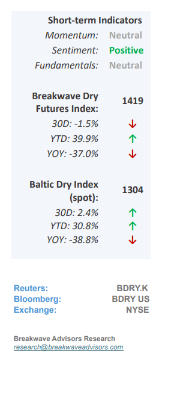
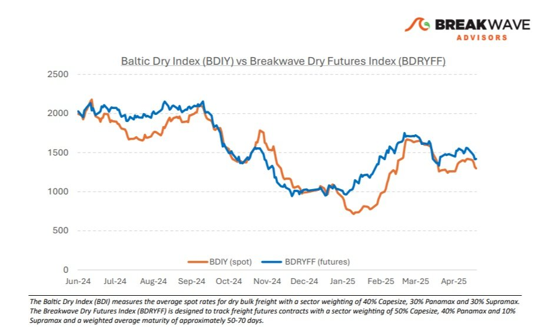
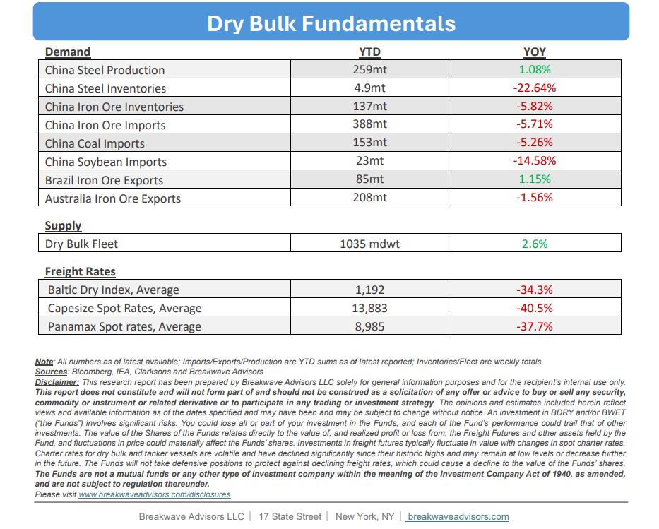

# Breakwave Bi-Weekly Dry Bulk Report - May 13, 2025

**Date:** May 13, 2025  
**Publisher:** Breakwave Advisors | **Category:** Market Insights  
**Original URL:** [https://www.breakwaveadvisors.com/insights/2025135-dry544547-88](https://www.breakwaveadvisors.com/insights/2025135-dry544547-88)  

---

•**Peak Trade War Behind Us, Dry Bulk Could See Higher US Exports**– The recent announcement regarding**a reset in trade relations**between the U.S. and China is a**positive development**for the dry bulk shipping market. Firstly, the easing of tensions between the two largest economies has**improved global growth sentiment**. Secondly, the potential**increase in U.S. dry bulk exports,**particularly agricultural products and coal, could lead to marginally stronger demand for dry bulk shipping than previously anticipated. These factors are expected to support both spot rates and freight futures in the near term. That said,**uncertainties remain**regarding global dry bulk demand. Chinese coal imports and iron ore consumption, both heavily influenced by the country’s energy transition and subdued real estate activity, continue to be key variables. Nevertheless, on the margin, this**trade news**provides a**welcome boost**to what has otherwise been a relatively uneventful month for the dry bulk market. Currently, freight futures remain in contango with elevated futures relative to spot rates. However, we anticipate**increased activity**over the remainder of the month, which should help spot rates align more closely with the optimistic futures curve. In addition, seasonal trends also point to improved rates as we move into the summer months. Nonetheless, as we look further into mid-summer,**weather conditions**may begin to affect operations in the crucial**West African bauxite**market, which in recent years has been a significant contributor to ton-mile growth for the Capesize segment.

> **Figure 1: Στιγμιότυπο Οθόνης 2025 05 13 085159**  
> [Local Asset](file:///C:/Users/Dell/Github/Shipping/corpus/03-breakwave/insights/2025/assets/2025-05-13_2025135-dry544547-88_img_cea3cf84ceb9ceb3cebcceb9cf8ccf84cf85_7f84f7d29443.png)

•**Weak Coal Volumes Remain a Significant Headwind for Dry Bulk**– Coal has traditionally been the cornerstone of dry bulk demand. While iron ore dominates in terms of total volume, primarily under long-term contracts, coal remains the key driver of spot cargo activity, making it a significant variable in dry bulk market dynamics. So far this year,**China’s coal imports have been notably weak**, and this trend may persist for the rest of the year in the absence of weather-related disruptions (i.e. less hydro generation, weaker solar/wind). Although China continues to expand its coal-fired power generation capacity, the growth**of renewable energy is outpacing**these additions, thereby gradually increasing the share of renewables in the national energy mix. Moreover, the rapid expansion of**behind-the-meter solar capacity**, much of which is not fully reflected in official energy statistics, is further reducing reliance on coal. As a result, many coal-fired power plants are operating at**low utilization rates**under normal conditions, leading to decreased coal consumption. While temporary surges in coal demand may occur due to seasonal or exceptional factors, the**long-term outlook**for coal imports into China appears**uncertain**, especially without a significant acceleration in economic growth beyond any current reasonable projections.

•**Our Long-term View**– The last few years have been characterized by increased geopolitical uncertainty. Going forward, we expect such events to continue to affect global trade and have a meaningful impact on effective vessel supply. Combined with the potential for a multi-year cyclical rebound in China’s economic activity following the recent economic turmoil, dry bulk shipping should experience higher volatility on top of a secular tightness driven by stable bulk commodity demand and a slower fleet growth owing to a relatively low orderbook.

> **Figure 2: %Ce%a3%cf%84%ce%b9%ce%b3%ce%bc%ce%b9%cf%8c%cf%84%cf%85%cf%80%ce%bf+%ce%bf%ce%b8%cf%8c%ce%bd%ce%b7%cf%82+2025 05 13+085132**  
> [Local Asset](file:///C:/Users/Dell/Github/Shipping/corpus/03-breakwave/insights/2025/assets/2025-05-13_2025135-dry544547-88_img_25ce25a325cf258425ce25b925ce25b325ce_8f5e4c056503.jpg)

> **Figure 3: Στιγμιότυπο Οθόνης 2025 05 13 085146**  
> [Local Asset](file:///C:/Users/Dell/Github/Shipping/corpus/03-breakwave/insights/2025/assets/2025-05-13_2025135-dry544547-88_img_cea3cf84ceb9ceb3cebcceb9cf8ccf84cf85_d8e87b5a302c.png)

### Subscribe:
