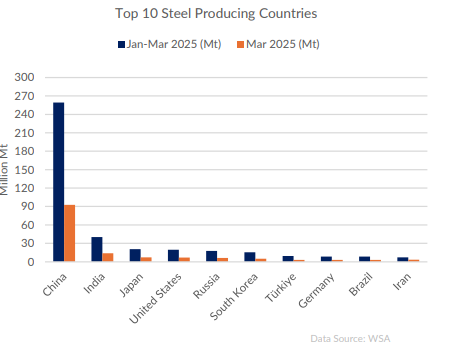
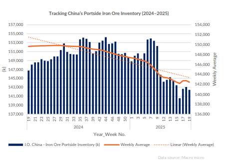
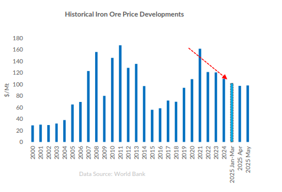

# Global Iron Ore Boom: Rising supply threatens to depress prices

**Date:** May 14, 2025  
**Publisher:** Breakwave Advisors | **Category:** Market Insights  
**Original URL:** [https://www.breakwaveadvisors.com/insights/2025/5/14/global-iron-ore-boom-rising-supply-threatens-to-depress-prices](https://www.breakwaveadvisors.com/insights/2025/5/14/global-iron-ore-boom-rising-supply-threatens-to-depress-prices)  

---

As projected in our March outlook, the global iron ore market has entered a supply-led phase, with prices indicating a significant downward trend. As of May 2025, the benchmark price hovers around $98/ton, continuing its descent from the recent peak of nearly $140/ton seen in early 2024. According to Trading Economics, iron ore is expected to average $96.63/ ton by the end of Q2 2025, with a 12-month forecast of $91.09/ton— unchanged from previous estimates. This aligns with our earlier projections, suggesting the market remains in a gradual correction phase.

> **Figure 1: Στιγμιότυπο Οθόνης 2025 05 14 161803**  
> **Interactive Data & Source:** [Allied-shipbroking](https://www.allied-shipbroking.gr/) | [Local Asset](file:///C:/Users/Dell/Github/Shipping/corpus/03-breakwave/insights/2025/assets/2025-05-14_global-iron-ore-boom-rising-supply-threatens-to-depress-prices_img_cea3cf84ceb9ceb3cebcceb9cf8ccf84cf85_51da55b4506a.png)

**Supply Expansion Accelerates :**The key development this month is Rio Tinto's confirmation that the long-delayed Simandou project in Guinea is on track to deliver its first shipments by November 2025. This milestone marks a new frontier for seaborne supply and underscores our previous warning: if demand fails to keep pace, prices are likely to come under sustained pressure.

**China’s Demand Still a Pillar —**But for How Long? According to the SMM report based on customs data, China's iron ore imports rose by almost 10% in April compared to the previous month, driven by increased demand from steel mills and lower port inventories. Furthermore, there is optimism for a further increase in May, supported by the continued high levels of pig iron ore production and the onset of the peak shipping season for overseas mines. This seems to have created a “decoupling” of iron ore from China’s general slowdown narrative, at least for now.

> **Figure 2: Στιγμιότυπο Οθόνης 2025 05 14 161811**  
> **Interactive Data & Source:** [Allied-shipbroking](https://www.allied-shipbroking.gr/) | [Local Asset](file:///C:/Users/Dell/Github/Shipping/corpus/03-breakwave/insights/2025/assets/2025-05-14_global-iron-ore-boom-rising-supply-threatens-to-depress-prices_img_cea3cf84ceb9ceb3cebcceb9cf8ccf84cf85_0692eccadf4e.png)

**Iron Ore Prices at a Crossroads :**As new entrants like Guinea’s Simandou come online, the seaborne market could experience a glut. Without a matching surge in demand — either from China or emerging economies — prices will likely face sustained pressure. Goldman Sachs' latest forecast, projecting average spot prices of $85/ton in Q4 2025 with temporary dips below $80/ton, reflects growing consensus around this risk.

> **Figure 3: Στιγμιότυπο Οθόνης 2025 05 14 161820**  
> **Interactive Data & Source:** [Allied-shipbroking](https://www.allied-shipbroking.gr/) | [Local Asset](file:///C:/Users/Dell/Github/Shipping/corpus/03-breakwave/insights/2025/assets/2025-05-14_global-iron-ore-boom-rising-supply-threatens-to-depress-prices_img_cea3cf84ceb9ceb3cebcceb9cf8ccf84cf85_51da6ffbc893.png)

**The freight market is confronting increased volatility:**Capesize freight markets will likely face increased volatility. In the near term, continued Chinese buying and infrastructure activity should support steady vessel demand. However, as new supply flows from West Africa shift traditional trade routes, we can anticipate notable impacts on voyage durations, freight spreads, and port utilization. New shipping corridors from Guinea to Asia, bypassing established Australia-China and Brazil-China routes, could disrupt prevailing deployment strategies. Operators may need to adapt to more dynamic, less predictable trading patterns as supply centers become increasingly diversified.

### Looking Ahead

Iron ore demand remains robust, largely supported by China's specific industrial requirements. However, this does not shield it from mounting macroeconomic and political headwinds. On the supply side, a new wave of global production is gaining traction and is likely to outpace consumption by the end of 2025, putting downward pressure on prices. If steel production weakens or China’s restocking cycle ends abruptly, downward price corrections could be sharper than expected. In this context, mining companies may need to shift focus toward cost optimization, diversify their offtake agreements, and brace for tighter profit margins.

Data Source:[Allied](https://www.allied-shipbroking.gr/)

---

**Tags:** Ironore, Shipping, Markets  
