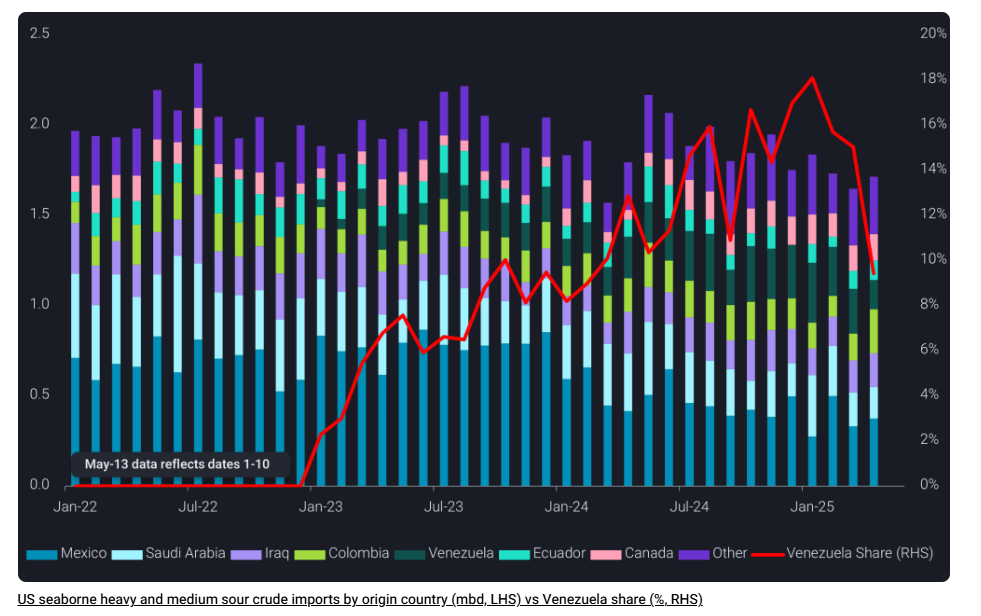
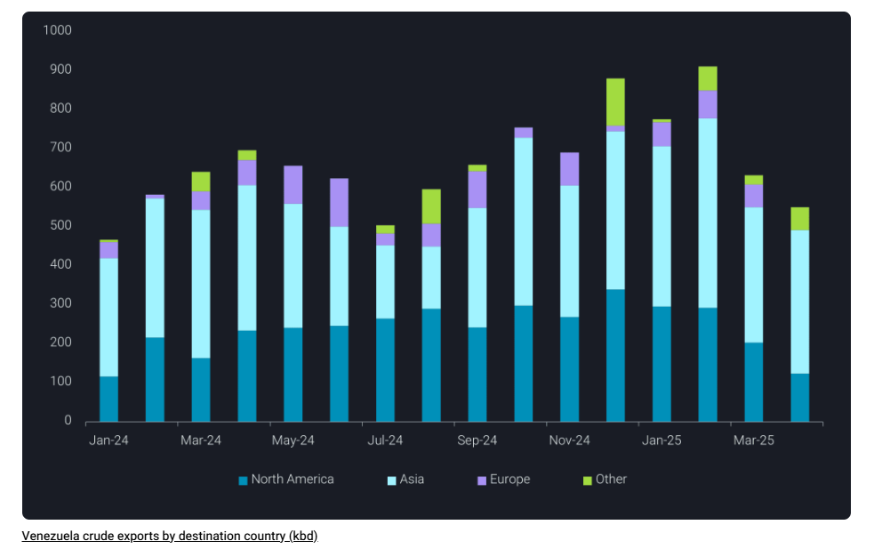

# Venezuelan crude exports drop in April amid export licence revocation

**Date:** May 15, 2025  
**Publisher:** Breakwave Advisors | **Category:** Market Insights  
**Original URL:** [https://www.breakwaveadvisors.com/insights/2025/5/15/venezuelan-crude-exports-drop-in-april-amid-export-licence-revocation](https://www.breakwaveadvisors.com/insights/2025/5/15/venezuelan-crude-exports-drop-in-april-amid-export-licence-revocation)  

---

In this piece, we examine the impact of the United States revoking Chevron’s licence to operate in Venezuela. What could happen to US Gulf Coast refiners and Venezuela’s future crude exports?

*By*[*Florence Yu*](https://www.linkedin.com/in/florence-yu-042110120/)

Venezuela’s crude exports fell 7% m-o-m in April, following the Trump administration’s decision to revoke foreign companies’ licences to operate in Venezuela, and payment uncertainties that led to cargo cancellations. The United States – which was the top destination for Venezuelan crude exports since early 2023 when sanctions waivers were issued – was the primary contributor behind this decline. Vortexa data shows these exports dropped to 140kbd in April vs 200kbd in March, reaching the lowest level in 15 months.

## Usgc Could See a Reshuffling of Flows

The relationship between the Trump administration and Venezuela’s government is the most critical factor shaping Venezuela’s oil exports outlook. As it currently stands, Chevron is expected to wind down operations by 27 May, per the Office of Foreign Assets Control’s latest mandate. Vortexa data shows that US imports of Venezuelan crude peaked at 340kbd in December 2024 – a record high since the Biden administration authorised Chevron to restart production in November 2022 – but have gradually declined since then.

By April, exports had dropped by 62% from that November peak. The steep decline in April can be especially attributed to PDVSA’s concerns over payment processing issues arising from US sanctions. In response, PDVSA suspended loadings and ordered two vessels,[Carina Voyager](https://analytics.vortexa.com/Map?page=Map&tabId=7cc9105c-6759-4a20-a839-900da43c803d&v=3)and[Dubai Attraction](https://analytics.vortexa.com/Map?page=Map&tabId=7cc9105c-6759-4a20-a839-900da43c803d&v=3)that were en route to the US to return their cargoes.

> **Figure 1: Στιγμιότυπο Οθόνης 2025 05 15 161323**  
> **Interactive Data & Source:** [Vortexa](https://www.vortexa.com/insights/crude/market-volatility-drives-chinas-crude-stockpiling/) | [Local Asset](file:///C:/Users/Dell/Github/Shipping/corpus/03-breakwave/insights/2025/assets/2025-05-15_venezuelan-crude-exports-drop-in-april-amid-export-licence-revocation_img_cea3cf84ceb9ceb3cebcceb9cf8ccf84cf85_7dea4068dd06.png)

USGC refiners will likely need to look at other sources as Venezuelan barrels are expected to be phased out from the US market, leaving a shortfall of 250kbd of heavy crude. Vortexa data suggests Chevron Pascagoula and Valero St. Charles have been the key destinations for Venezuelan barrels and accounted for 67% and 80% of their seaborne crude intake over the past two years, respectively.

Replacement barrels for US refiners could come from Canada, Mexico, Colombia, and the Middle East, all which offer similar heavy and medium sour grades. Seaborne volume flows could increase from the Middle East, especially Saudi Arabia and Iraq, which were the key suppliers prior to the Venezuelan sanction waiver. However, these long-haul barrels from the Middle East will incur higher freight rates due to the longer voyages, further pressuring refining margins.

From a demand perspective, the shutdown of LyondellBasell’s 264kbd refinery in Houston should free up ~200kbd of sour crude, giving some breathing room to other USGC buyers. Meanwhile, Phillips 66’s Sweeny refinery recently completed a project enabling it to shift its feedstock by ~40kbd between heavy and light grades, which should also help ease the demand for heavy crudes from the USGC.

## Upside Expected for Exports to China

> **Figure 2: Στιγμιότυπο Οθόνης 2025 05 15 161440**  
> **Interactive Data & Source:** [Vortexa](https://www.vortexa.com/insights/crude/market-volatility-drives-chinas-crude-stockpiling/) | [Local Asset](file:///C:/Users/Dell/Github/Shipping/corpus/03-breakwave/insights/2025/assets/2025-05-15_venezuelan-crude-exports-drop-in-april-amid-export-licence-revocation_img_cea3cf84ceb9ceb3cebcceb9cf8ccf84cf85_a09c11c3480f.png)

On 24 March, the Trump administration issued an executive order imposing a 25% secondary tariff on any country importing Venezuelan oil or gas, effective from 2 April. Additionally, it revoked the permits of foreign firms such as Repsol and Eni, which had been receiving Venezuelan oil as debt repayment.

European buyers loaded their last cargo in March and haven’t loaded anything in April. Meanwhile, India’s Reliance loaded one cargo in April but is also expected to wind down its purchases given the tariff, potentially leaving China as Venezuela’s sole outlet.

China has been the main buyer for nearly half of Venezuela’s exports in the last 12 months, with loadings to China increasing to 320kbd during January-April, compared to 190kbd for the same period in 2024.

Since the sanctions imposed in 2019, Venezuela has been relying heavily on the dark fleet to export oil to China. According to Vortexa’s data, some common methods used by the dark tankers include AIS disabling, where the signal goes dark, making it difficult to track. AIS spoofing disguises the Venezuelan origin, falsely labelling the oil as originating from other countries, particularly Malaysia and Brazil.

Additionally, the fleet is increasingly using zombie tankers, which use the identities of scrapped tankers to appear legitimate and avoid scrutiny. Despite the sanctions and logistics hurdles, China’s demand for discounted barrels is expected to remain[structurally robust](https://www.vortexa.com/insights/crude/market-volatility-drives-chinas-crude-stockpiling/)due to its prioritisation for supply security, making China Venezuela’s last resort.

Going forward, we should see Venezuela increasing exports to China since it will likely be the only buyer in the market. While there are still two weeks until Chevron officially ends operations in Venezuela, some negotiations between Chevron and the US government are still possible. Looking ahead, US Gulf refiners could source their heavy sour barrels from elsewhere, while Venezuela’s exports will solely head to China.

Data Source:[Vortexa](https://www.vortexa.com//oil-gas-data-traders-analysts-data-scientists?gclid=Cj0KCQjw8_qRBhCXARIsAE2AtRZKOvMnbilZ_6_91d7huSFFy71pWLrnPwGwOHVzXsmsG-1a1mZnQw8aAt89EALw_wcB&hsa_acc=1782073842&hsa_ad=548425387665&hsa_cam=14746637662&hsa_grp=125038601902&hsa_kw=&hsa_mt=&hsa_net=adwords&hsa_src=g&hsa_tgt=dsa-1431852288425&hsa_ver=3&utm_campaign=%5BCD%5D%20-%20DSA%20-%20EMEA&utm_medium=cpc&utm_medium=ppc&utm_source=google&utm_source=adwords&utm_term=)

---

**Tags:** Crude, Tankers, Shipping  
