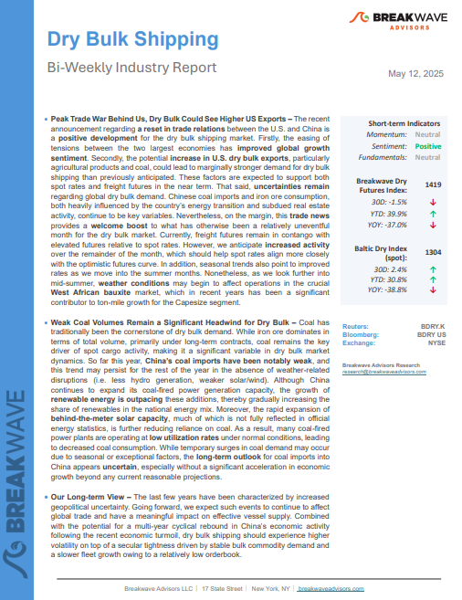
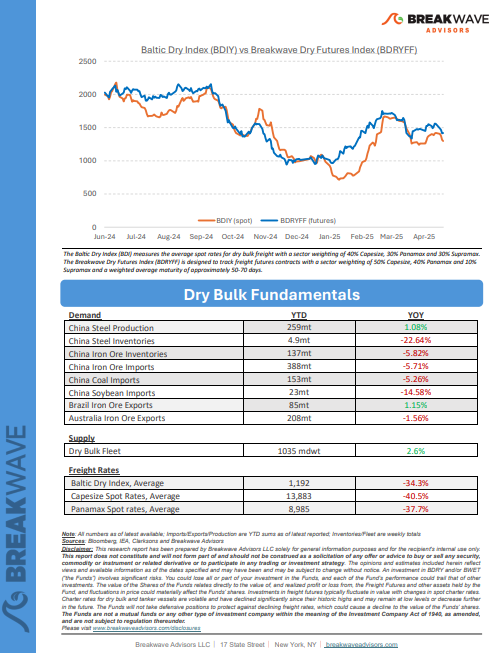

# Breakwave Weekend Read

**Date:** May 16, 2025  
**Publisher:** Breakwave Advisors | **Category:** Market Insights  
**Original URL:** [https://www.breakwaveadvisors.com/insights/2024/10/25/breakwave-weekend-read-4cn8n-wg9gj-jk5sb-4ckhh-cagw9-r4yzg-z4wst-a4dht](https://www.breakwaveadvisors.com/insights/2024/10/25/breakwave-weekend-read-4cn8n-wg9gj-jk5sb-4ckhh-cagw9-r4yzg-z4wst-a4dht)  

---

## Welcome Tobreakwave Advisorsweekend Read

***As the week comes to a close, take a moment to review the key insights from the past few days. Missed something? We've gathered all the top insights for you to catch up at your convenience.***

## Breakwave Shipping Report

**Peak Trade War Behind Us, Dry Bulk Could See Higher US Exports**– The recent announcement regarding**a reset in trade relations**between the U.S. and China is a**positive development**for the dry bulk shipping market.

[Read More](https://www.breakwaveadvisors.com/insights/2025135-dry544547-88)

> **Figure 1: Στιγμιότυπο Οθόνης 2025 05 16 133410**  
> **Interactive Data & Source:** [Breakwave Advisors Market Insights](https://www.breakwaveadvisors.com/insights/2025/5/12/commodity-markets-are-strategic-arenas) | [Local Asset](file:///C:/Users/Dell/Github/Shipping/corpus/03-breakwave/insights/2025/assets/2025-05-16_breakwave-weekend-read-4cn8n-wg9gj-jk5sb-4ckhh-cagw9-r4yzg-z4wst-a4dht_img_cea3cf84ceb9ceb3cebcceb9cf8ccf84cf85_8d9e8573d85f.png)

> **Figure 2: Στιγμιότυπο Οθόνης 2025 05 16 133427**  
> **Interactive Data & Source:** [Breakwave Advisors Market Insights](https://www.breakwaveadvisors.com/insights/2025/5/12/commodity-markets-are-strategic-arenas) | [Local Asset](file:///C:/Users/Dell/Github/Shipping/corpus/03-breakwave/insights/2025/assets/2025-05-16_breakwave-weekend-read-4cn8n-wg9gj-jk5sb-4ckhh-cagw9-r4yzg-z4wst-a4dht_img_cea3cf84ceb9ceb3cebcceb9cf8ccf84cf85_f381a35ba92d.png)

## Commodity Markets Are Strategic Arenas

> **Figure 3: Ανώνυμο Σχέδιο (1)**  
> **Interactive Data & Source:** [Breakwave Advisors Market Insights](https://www.breakwaveadvisors.com/insights/2025/5/12/commodity-markets-are-strategic-arenas) | [Local Asset](file:///C:/Users/Dell/Github/Shipping/corpus/03-breakwave/insights/2025/assets/2025-05-16_breakwave-weekend-read-4cn8n-wg9gj-jk5sb-4ckhh-cagw9-r4yzg-z4wst-a4dht_img_ce91cebdcf8ecebdcf85cebccebfcf83cf87_f772450bfda8.png)

Within the OPEC framework, member states are far from equals.

Doric Weekly Market Insights

## Oil Pricing and Balances at the Brink of Recession Territory

> **Figure 4: Oil Pricing and Balances at the Brink of Recession Territory (1)**  
> **Interactive Data & Source:** [Breakwave Advisors Market Insights](https://www.breakwaveadvisors.com/insights/2025/5/12/oil-pricing-and-balances-at-the-brink-of-recession-territory) | [Local Asset](file:///C:/Users/Dell/Github/Shipping/corpus/03-breakwave/insights/2025/assets/2025-05-16_breakwave-weekend-read-4cn8n-wg9gj-jk5sb-4ckhh-cagw9-r4yzg-z4wst-a4dht_img_oilpricingandbalancesatthebrinkofrec_f08165f2a8da.png)

In this big picture take, we look at demand, supply, trade, inventory and price indications to assess the state of the oil market, as well as whether the role of OPEC+ has changed.

Vortexa Freight Weekly

## Market Shifts and Shipping’s Crosswinds: Fixed Income, Commodities and Currencies

> **Figure 5: Ανώνυμο Σχέδιο (1)**  
> **Interactive Data & Source:** [Breakwave Advisors Market Insights](https://www.breakwaveadvisors.com/insights/2025/5/13/market-shifts-and-shippings-crosswinds-fixed-income-commodities-and-currencies) | [Local Asset](file:///C:/Users/Dell/Github/Shipping/corpus/03-breakwave/insights/2025/assets/2025-05-16_breakwave-weekend-read-4cn8n-wg9gj-jk5sb-4ckhh-cagw9-r4yzg-z4wst-a4dht_img_ce91cebdcf8ecebdcf85cebccebfcf83cf87_102641efd942.png)

Markets remain volatile, seemingly lurching from one macroeconomic crisis to the next, with few moments of stability.

BRS Weekly Dry Bulk Newsletter

## Tariffs Are Still +10%

> **Figure 6: Ανώνυμο Σχέδιο (2)**  
> **Interactive Data & Source:** [Breakwave Advisors Market Insights](https://www.breakwaveadvisors.com/insights/2025/5/12/tariffs-are-still-10) | [Local Asset](file:///C:/Users/Dell/Github/Shipping/corpus/03-breakwave/insights/2025/assets/2025-05-16_breakwave-weekend-read-4cn8n-wg9gj-jk5sb-4ckhh-cagw9-r4yzg-z4wst-a4dht_img_ce91cebdcf8ecebdcf85cebccebfcf83cf87_ac2147df63c0.png)

The US reached a business deal with the UK alleviating pressures on steel and aluminium and promoting sales of industrial products, but 10% tariffs remained.

[Read More](https://www.breakwaveadvisors.com/insights/2025/5/12/tariffs-are-still-10)

Forvis Mazars Weekly Note

## Global Trade and Shipping Markets

> **Figure 7: Ανώνυμο Σχέδιο**  
> **Interactive Data & Source:** [Breakwave Advisors Market Insights](https://www.breakwaveadvisors.com/insights/2025/5/14/global-trade-and-shipping-markets) | [Local Asset](file:///C:/Users/Dell/Github/Shipping/corpus/03-breakwave/insights/2025/assets/2025-05-16_breakwave-weekend-read-4cn8n-wg9gj-jk5sb-4ckhh-cagw9-r4yzg-z4wst-a4dht_img_ce91cebdcf8ecebdcf85cebccebfcf83cf87_0b8c16463416.png)

Last weekend brought encouraging news for global trade and shipping markets, as progress on two key fronts helped ease geopolitical tensions and lift market sentiment.

Intermodal Weekly Market Report

## Global Iron Ore Boom: Rising Supply Threatens to Depress Prices

> **Figure 8: Unsplash Image Ce0qefufae8**  
> **Interactive Data & Source:** [Breakwave Advisors Market Insights](https://www.breakwaveadvisors.com/insights/2025/5/14/global-iron-ore-boom-rising-supply-threatens-to-depress-prices) | [Local Asset](file:///C:/Users/Dell/Github/Shipping/corpus/03-breakwave/insights/2025/assets/2025-05-16_breakwave-weekend-read-4cn8n-wg9gj-jk5sb-4ckhh-cagw9-r4yzg-z4wst-a4dht_img_unsplash-image-ce0qefufae8_cc6bbc2a2178.jpg)

As projected in our March outlook, the global iron ore market has entered a supply-led phase, with prices indicating a significant downward trend.

Allied Weekly Report

## Soybean Dry Bulk Flows

> **Figure 9: Ανώνυμο Σχέδιο (1)**  
> **Interactive Data & Source:** [Breakwave Advisors Market Insights](https://www.breakwaveadvisors.com/insights/2025/5/15/soybean-dry-bulk-flows) | [Local Asset](file:///C:/Users/Dell/Github/Shipping/corpus/03-breakwave/insights/2025/assets/2025-05-16_breakwave-weekend-read-4cn8n-wg9gj-jk5sb-4ckhh-cagw9-r4yzg-z4wst-a4dht_img_ce91cebdcf8ecebdcf85cebccebfcf83cf87_f772450bfda8.png)

Brazil continues to strengthen its position as China's primary soybean supplier, with this dominance mainly attributed to the country's record harvests,

Signal Ocean Dry Weekly Market Monitor

## Venezuelan Crude Exports Drop in April Amid Export Licence Revocation

> **Figure 10: Ανώνυμο Σχέδιο (2)**  
> **Interactive Data & Source:** [Breakwave Advisors Market Insights](https://www.breakwaveadvisors.com/insights/2025/5/15/venezuelan-crude-exports-drop-in-april-amid-export-licence-revocation) | [Local Asset](file:///C:/Users/Dell/Github/Shipping/corpus/03-breakwave/insights/2025/assets/2025-05-16_breakwave-weekend-read-4cn8n-wg9gj-jk5sb-4ckhh-cagw9-r4yzg-z4wst-a4dht_img_ce91cebdcf8ecebdcf85cebccebfcf83cf87_0e311cba99b2.png)

In this piece, we examine the impact of the United States revoking Chevron’s licence to operate in Venezuela.

Vortexa Freight Weekly

## Growth in Coal India's Production

> **Figure 11: Growth in Coal India's Production**  
> **Interactive Data & Source:** [Breakwave Advisors Market Insights](https://www.breakwaveadvisors.com/insights/2025/5/16/growth-in-coal-indias-production) | [Local Asset](file:///C:/Users/Dell/Github/Shipping/corpus/03-breakwave/insights/2025/assets/2025-05-16_breakwave-weekend-read-4cn8n-wg9gj-jk5sb-4ckhh-cagw9-r4yzg-z4wst-a4dht_img_growthincoalindia27sproduction_994d47de52d8.png)

As we discussed in Commodore Research's most recent Weekly Executive Report, Coal India (which is responsible for over 75% of India’s coal output) produced approximately 62.1 million tons of coal last month.

From Commodore's Weekly Dry Bulk Reports

## Shift in Cpc Crude Exports Towards Suezmax Utilisation

> **Figure 12: Shift in Cpc Crude Exports Towards Suezmax Utilisation**  
> **Interactive Data & Source:** [Breakwave Advisors Market Insights](https://www.breakwaveadvisors.com/insights/2025/5/16/shift-in-cpc-crude-exports-towards-suezmax-utilisation) | [Local Asset](file:///C:/Users/Dell/Github/Shipping/corpus/03-breakwave/insights/2025/assets/2025-05-16_breakwave-weekend-read-4cn8n-wg9gj-jk5sb-4ckhh-cagw9-r4yzg-z4wst-a4dht_img_shiftincpccrudeexportstowardssuezmax_45cc9c03489c.png)

The 2025 outlook for crude oil exports from the CPC terminal at Novorossiysk indicates a decisive structural shift toward Suezmax utilisation, with a marked decline in Aframax deployment.

Signal Ocean Tanker Weekly Market Monitor

---

**Tags:** Shipping, Tankers, Drybulk  
