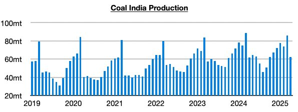
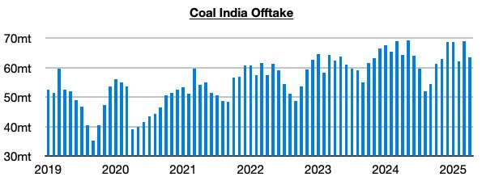

# Growth in Coal India's Production

**Date:** May 16, 2025  
**Publisher:** Breakwave Advisors | **Category:** Market Insights  
**Original URL:** [https://www.breakwaveadvisors.com/insights/2025/5/16/growth-in-coal-indias-production](https://www.breakwaveadvisors.com/insights/2025/5/16/growth-in-coal-indias-production)  

---

*By*[*Jeffrey Landsberg*](https://www.linkedin.com/in/jeffrey-landsberg-70ab957/)

As we discussed in Commodore Research's most recent Weekly Executive Report, Coal India (which is responsible for over 75% of India’s coal output) produced approximately 62.1 million tons of coal last month. This is down month-on-month by 23.7 million tons (-28%) but is up year-on-year by 300,000 tons (1%). It is normal for production to plummet in April (a surge always occurs in March). The year-on-year change is always most important to us. Noteworthy is that production had previously fallen on a year-on-year basis for three straight months.

> **Figure 1: Chart 1**  
> [Local Asset](file:///C:/Users/Dell/Github/Shipping/corpus/03-breakwave/insights/2025/assets/2025-05-16_growth-in-coal-indias-production_img_chart1_b81db87b301a.jpg)

Offtake (the amount sent to customers) totaled 63.4 million tons, which marks a month-on-month drop of 5.6 million tons (-8%) and a year-on-year drop of 900,000 tons (-1%). This has marked the first time since September that Coal India’s offtake has exceeded production.

> **Figure 2: Chart 2**  
> [Local Asset](file:///C:/Users/Dell/Github/Shipping/corpus/03-breakwave/insights/2025/assets/2025-05-16_growth-in-coal-indias-production_img_chart2_f5db1d1a4df0.jpg)

---

**Tags:** Coal, Economy, Markets  
