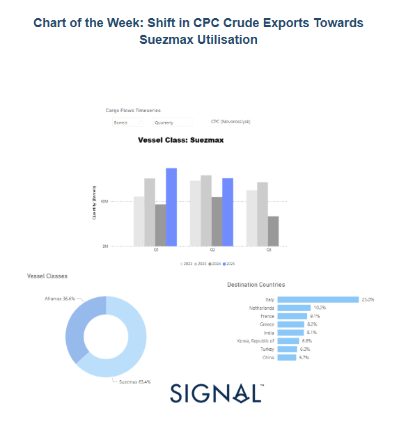
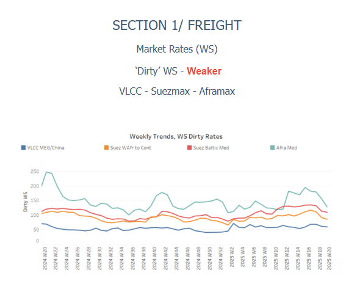
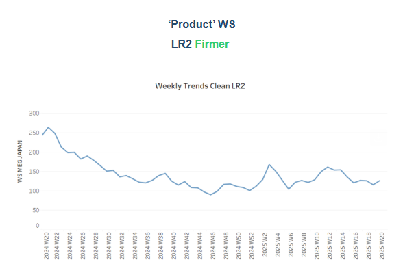
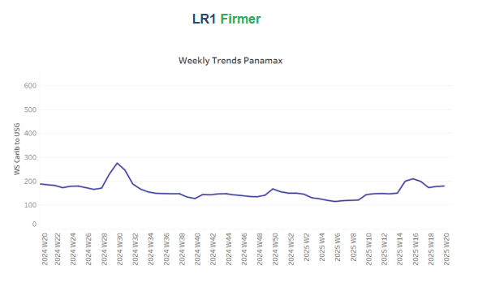
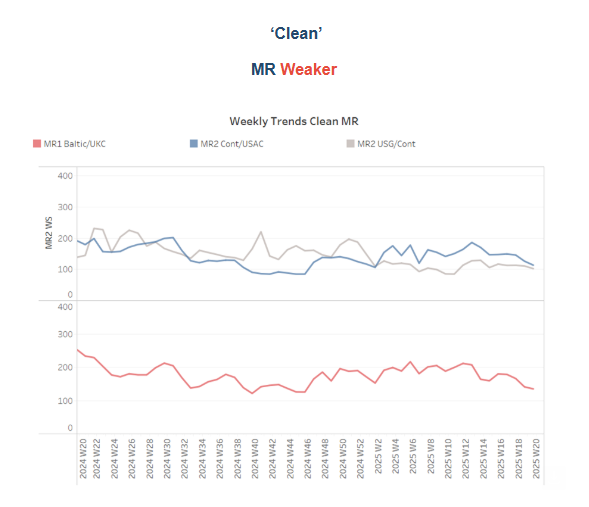
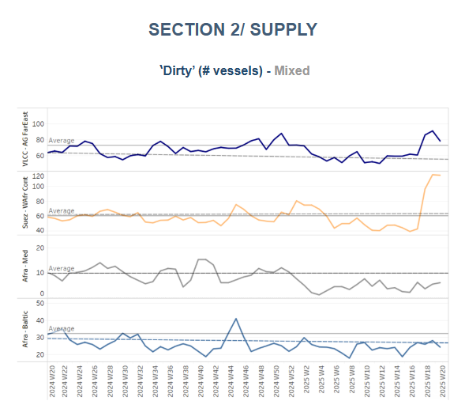
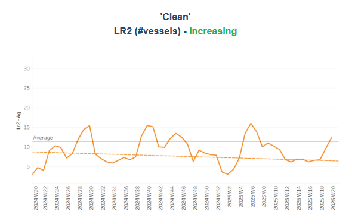
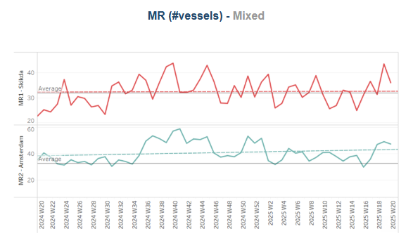
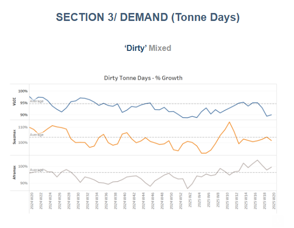
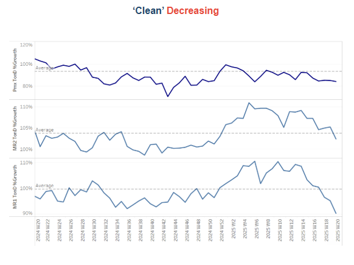

# Shift in CPC Crude Exports Towards Suezmax Utilisation

**Date:** May 16, 2025  
**Publisher:** Breakwave Advisors | **Category:** Market Insights  
**Original URL:** [https://www.breakwaveadvisors.com/insights/2025/5/16/shift-in-cpc-crude-exports-towards-suezmax-utilisation](https://www.breakwaveadvisors.com/insights/2025/5/16/shift-in-cpc-crude-exports-towards-suezmax-utilisation)  

---

### Tanker - Weekly Market Monitor

Snapshot of Crude and Product Freight Rates, Supply-Demand

Week 20, 16 May, 2025

> **Figure 1: Στιγμιότυπο Οθόνης 2025 05 16 125845**  
> **Interactive Data & Source:** [Signal Ocean Platform](https://www.thesignalgroup.com/signal-ocean-platform) | [Local Asset](file:///C:/Users/Dell/Github/Shipping/corpus/03-breakwave/insights/2025/assets/2025-05-16_shift-in-cpc-crude-exports-towards-suezmax-utilisation_img_cea3cf84ceb9ceb3cebcceb9cf8ccf84cf85_988458480f33.png)

### Shift in Cpc Crude Exports Towards Suezmax Utilisation

The 2025 outlook for crude oil exports from the CPC terminal at Novorossiysk indicates a decisive structural shift toward Suezmax utilisation, with a marked decline in Aframax deployment. Data visualisations from Signal Ocean reveal that Q1 2025 recorded the highest quarterly volume of Suezmax loadings across the past four years, significantly surpassing figures for 2022 through 2024.

This evolving vessel preference appears driven by both logistical efficiency and shifting trade dynamics. The increase in Kazakhstani crude production, notably from Chevron’s Tengiz expansion project, has boosted throughput on the CPC pipeline. Larger Suezmax vessels offer a clear advantage in transporting bulk volumes, reducing per-barrel freight costs and optimizing port calls, especially as terminal infrastructure adapts to accommodate these larger tankers more regularly.

Another significant driver is the growing importance of long-haul destinations, especially in Asia. While Italy remains the top recipient (25%), countries such as India (8.1%) and China (5.7%) now represent a non-negligible share of CPC crude flows. These markets are more economically served by Suezmax vessels, which can undertake longer voyages with fewer transshipments and better fuel efficiency per ton-mile.

Notably, Suezmaxes now account for 63.4% of total CPC cargoes, up from previous years, while Aframax usage has fallen to 36.6%. The growing share of Suezmaxes suggests a strategic reallocation of tanker capacity, supported by destination shifts and changes in commercial preferences. European destinations—Italy, the Netherlands, and France—remain key markets, but the increasing share of Asian destinations underlines a broader eastward reorientation of CPC crude exports. Meanwhile, concerns over possible blending of CPC crude with Russian barrels, while not directly impacting vessel choice, highlight broader regional logistical and geopolitical considerations.

Although market sources hint at a possible temporary uptick in Aframax activity in June 2025, potentially tied to inventory draws or regional port constraints, the overarching trend favors Suezmax dominance. This shift also reflects a broader pattern of fleet optimization amid geopolitical complexity, with continued scrutiny over the composition and routing of CPC crude, particularly regarding concerns of Russian blending, adding another layer of strategic consideration.

In summary, the CPC terminal’s evolving export dynamics underscore the growing alignment of shipping strategy with global demand shifts, where Suezmax tankers are positioned as the preferred vector for scalable, cost-efficient crude flows from the Black Sea to increasingly distant markets.

> **Figure 2: Στιγμιότυπο Οθόνης 2025 05 16 130447**  
> **Interactive Data & Source:** [Signal Ocean Platform](https://www.thesignalgroup.com/signal-ocean-platform) | [Local Asset](file:///C:/Users/Dell/Github/Shipping/corpus/03-breakwave/insights/2025/assets/2025-05-16_shift-in-cpc-crude-exports-towards-suezmax-utilisation_img_cea3cf84ceb9ceb3cebcceb9cf8ccf84cf85_12d44e962b92.png)

Crude oil tanker freight markets showed mixed sentiment. The Aframax Mediterranean route displayed a notable downward trend, while the VLCC MEG-China route hinted at a potential upturn

- VLCC freight rates on the MEG–China rose to WS 63, reflecting a 5% weekly increase. Meanwhile, Suezmax rates from West Africa to continental Europe dropped below WS90, showing a 20% monthly decrease. Meanwhile, rates on the Baltic–Mediterranean route dropped to WS110, standing 19% lower than a month ago.
- Aframax freight rates in the Mediterranean dropped below WS120, showing a 20% weekly decrease.

> **Figure 3: Στιγμιότυπο Οθόνης 2025 05 16 130458**  
> **Interactive Data & Source:** [Signal Ocean Platform](https://www.thesignalgroup.com/signal-ocean-platform) | [Local Asset](file:///C:/Users/Dell/Github/Shipping/corpus/03-breakwave/insights/2025/assets/2025-05-16_shift-in-cpc-crude-exports-towards-suezmax-utilisation_img_cea3cf84ceb9ceb3cebcceb9cf8ccf84cf85_92a09b1abaed.png)

- **LR2**AG freight rates rose to WS150, reflecting a monthly increase of 20%.

> **Figure 4: Στιγμιότυπο Οθόνης 2025 05 16 130506**  
> **Interactive Data & Source:** [Signal Ocean Platform](https://www.thesignalgroup.com/signal-ocean-platform) | [Local Asset](file:///C:/Users/Dell/Github/Shipping/corpus/03-breakwave/insights/2025/assets/2025-05-16_shift-in-cpc-crude-exports-towards-suezmax-utilisation_img_cea3cf84ceb9ceb3cebcceb9cf8ccf84cf85_2a50086f1a7a.png)

- **Panamax**Carib-to-USG rates reflected a similar sentiment to the previous week, remaining around WS180. However, these rates are still 15% lower than the levels observed a month ago.

> **Figure 5: Στιγμιότυπο Οθόνης 2025 05 16 130515**  
> **Interactive Data & Source:** [Signal Ocean Platform](https://www.thesignalgroup.com/signal-ocean-platform) | [Local Asset](file:///C:/Users/Dell/Github/Shipping/corpus/03-breakwave/insights/2025/assets/2025-05-16_shift-in-cpc-crude-exports-towards-suezmax-utilisation_img_cea3cf84ceb9ceb3cebcceb9cf8ccf84cf85_acfa34fdefe6.png)

- **MR1**freight rates for Baltic-to-Continent shipments hovered around WS1435, representing a 20% monthly decrease.

- **MR2**freight rates for shipments from the Continent to the US Atlantic Coast (USAC) reached WS115, reflecting an 8% monthly decrease. MR2 rates from the US Gulf to the Continent saw a significant decline, dropping below WS100. This marks an 18% decrease week-on-week and a 10% decrease compared to rates from a month ago.

> **Figure 6: Στιγμιότυπο Οθόνης 2025 05 16 130525**  
> **Interactive Data & Source:** [Signal Ocean Platform](https://www.thesignalgroup.com/signal-ocean-platform) | [Local Asset](file:///C:/Users/Dell/Github/Shipping/corpus/03-breakwave/insights/2025/assets/2025-05-16_shift-in-cpc-crude-exports-towards-suezmax-utilisation_img_cea3cf84ceb9ceb3cebcceb9cf8ccf84cf85_c3fe4f2905d6.png)

​​​​​The upward pressure observed at the close of April continues to intensify in the second week of May for the VLCC and Suezmax, with a downward trend seen in the Aframax.

- **VLCC Ras Tanura:**The current fleet size remains 26 vessels above the yearly average. Early signs of a gentle downward trend have emerged but require further confirmation in the third week of May.
- **Suezmax Wafr:**The current ship count (around 120) is persisting double the annual trend for a second consecutive week, while it seems that has reached a peak for the current year.
- **Aframax Med**: The current number continues with a downward trend, still well below the annual benchmark of 10.
- **Aframax Baltic:**The current number of ships is approximately 24, a decrease of nearly 8 vessels compared to the annual trend.

> **Figure 7: Στιγμιότυπο Οθόνης 2025 05 16 130534**  
> **Interactive Data & Source:** [Signal Ocean Platform](https://www.thesignalgroup.com/signal-ocean-platform) | [Local Asset](file:///C:/Users/Dell/Github/Shipping/corpus/03-breakwave/insights/2025/assets/2025-05-16_shift-in-cpc-crude-exports-towards-suezmax-utilisation_img_cea3cf84ceb9ceb3cebcceb9cf8ccf84cf85_6b41aa7e3ea0.png)

> **Figure 8: Στιγμιότυπο Οθόνης 2025 05 16 130542**  
> **Interactive Data & Source:** [Signal Ocean Platform](https://www.thesignalgroup.com/signal-ocean-platform) | [Local Asset](file:///C:/Users/Dell/Github/Shipping/corpus/03-breakwave/insights/2025/assets/2025-05-16_shift-in-cpc-crude-exports-towards-suezmax-utilisation_img_cea3cf84ceb9ceb3cebcceb9cf8ccf84cf85_31b20ea75950.png)

- **Clean LR2 AG Jubail**: The number of vessels has increased in recent weeks, rising slightly above the annual average of 11 for the first time since the end of week 6.

- **Clean MR**: Following a peak in week 18, Skikda, Algeria, has shown a downward trend, reaching 36 in the current week (week 20). This figure is four points higher than the annual average. In Amsterdam, MR2 vessel calls have exceeded the yearly average of 32 for the fourth consecutive week, demonstrating a sustained increase in vessel traffic throughout May.

> **Figure 9: Στιγμιότυπο Οθόνης 2025 05 16 130553**  
> **Interactive Data & Source:** [Signal Ocean Platform](https://www.thesignalgroup.com/signal-ocean-platform) | [Local Asset](file:///C:/Users/Dell/Github/Shipping/corpus/03-breakwave/insights/2025/assets/2025-05-16_shift-in-cpc-crude-exports-towards-suezmax-utilisation_img_cea3cf84ceb9ceb3cebcceb9cf8ccf84cf85_3fc05a05d582.png)

- **Dirty**tonne days: VLCC tonne-day growth sharply declined in the second ten days of May. Aframax tonne days are also decreasing and are currently near the average trend. Suezmax tonne-day growth showed a slight recovery but remains below its week 18 peak.

> **Figure 10: Στιγμιότυπο Οθόνης 2025 05 16 130601**  
> **Interactive Data & Source:** [Signal Ocean Platform](https://www.thesignalgroup.com/signal-ocean-platform) | [Local Asset](file:///C:/Users/Dell/Github/Shipping/corpus/03-breakwave/insights/2025/assets/2025-05-16_shift-in-cpc-crude-exports-towards-suezmax-utilisation_img_cea3cf84ceb9ceb3cebcceb9cf8ccf84cf85_ec2561e4aa5a.png)

- **Panamax**tonne days: The growth rate has consistently remained below the April-May weekly average for this year and appears to have stabilized at a lower trend towards the end of the month.

- **MR**tonne-days: The growth rate in the MR tanker segment has been decreasing since the end of Week 5 of 2025, with MR1 vessels experiencing a particularly sharp decline.

Data Source:[Signal Ocean Platform](https://www.thesignalgroup.com/signal-ocean-platform)

---

**Tags:** Tankers, Markets, Shipping  
