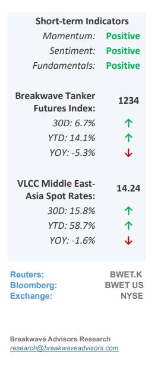
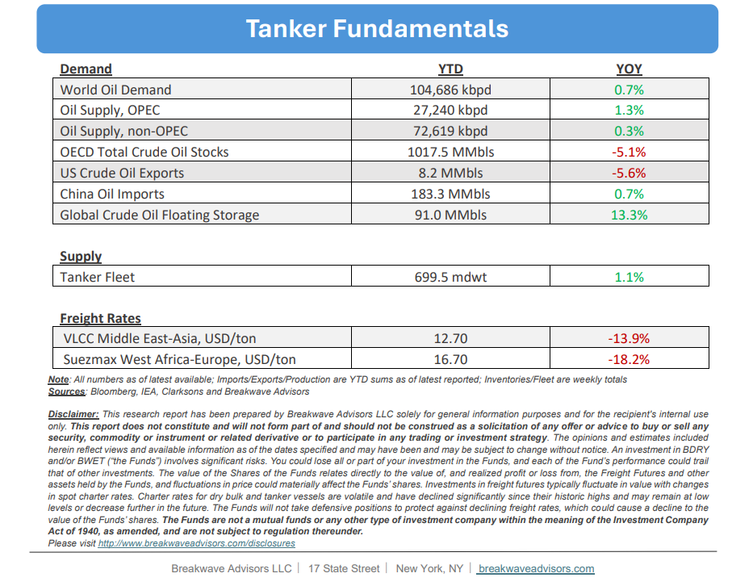

# Breakwave Bi-Weekly Tanker Report - May 20, 2025

**Date:** May 20, 2025  
**Publisher:** Breakwave Advisors | **Category:** Market Insights  
**Original URL:** [https://www.breakwaveadvisors.com/insights/2025205wet855547pp](https://www.breakwaveadvisors.com/insights/2025205wet855547pp)  

---

•**Stability Brings Optimism**– The VLCC market has shown signs of**stabilization**, particularly on Eastern routes. Middle East to Asia and WAF to Asia trades are gradually firming, supported by a combination of increased inquiry, a tightening tonnage list, and the ongoing uplift in OPEC output. The shift in sentiment is palpable: while not a breakout, it marks a**constructive turn**for owners after weeks of subdued spot activity. From a trading perspective, confidence has improved.**Owners**are demonstrating**firmer resistance,**and charterers are increasingly meeting a more clearly defined rate floor. The MEG-Asia and WAF-Asia routes are currently leading the recovery, while the Atlantic, especially the US Gulf, remains relatively soft. Limited USG activity and ample tonnage availability continue to weigh on transatlantic sentiment, although there is**growing market chatter**that a handful of mid-June stems could emerge next week. If realized, this could start to rebalance the Atlantic and allow Eastern strength to bleed westward. In short, the VLCC market is in**a holding pattern with an upward bias.**If activity in the AG and WAF remains steady, and if the USG begins to show signs of life, the setup for early June could be firmer than many had anticipated.

> **Figure 1: Στιγμιότυπο Οθόνης 2025 05 20 104500**  
> [Local Asset](file:///C:/Users/Dell/Github/Shipping/corpus/03-breakwave/insights/2025/assets/2025-05-20_2025205wet855547pp_img_cea3cf84ceb9ceb3cebcceb9cf8ccf84cf85_46259a4db845.png)

•**Chinese Oil Demand Continues to Surprise to the Downside**– Recent economic data from China indicates a**persistent weakness**in oil**demand**, with apparent demand in April declining by over 5% compared to the previous year. Despite elevated oil imports, refinery throughput continues to decrease, suggesting a buildup of inventories. Additionally, ongoing**US-Iran negotiations**have reduced the geopolitical premium, while the**oversupply**resulting from OPEC+’s decision to increase output remains a bearish factor for oil prices. Constructing an outlook where**oil demand growth**outpaces production for the remainder of the year appears**challenging**, as China, the world's second-largest oil consumer, appears to be transitioning to a less oil-intensive economy more rapidly than previously anticipated. The proliferation of electric vehicles, renewable energy sources, and advancements in energy efficiency are driving**downward pressure**on the country’s crude oil demand at a faster pace than previously thought. Although demand for gas-linked oil for industrial production is expected to remain robust, for the liquid crude oil tanker market, oil prices and the shape of the futures curve are likely to be the key drivers influencing the freight rate outlook moving forward.

•**Our Long-term View**– The tanker market is recovering from a long period of staggered rates as the growth in new vessel supply shrinks while oil demand remains elevated in line with the global economy. A historically low orderbook combined with favorable shifting trade patterns should continue to support increased spot rate volatility, which combined with the ongoing geopolitical turmoil, should sustain freight rates in the medium to long term.

> **Figure 2: Στιγμιότυπο Οθόνης 2025 05 06 084819**  
> [Local Asset](file:///C:/Users/Dell/Github/Shipping/corpus/03-breakwave/insights/2025/assets/2025-05-20_2025205wet855547pp_img_cea3cf84ceb9ceb3cebcceb9cf8ccf84cf85_016ae305c39f.png)

> **Figure 3: Στιγμιότυπο Οθόνης 2025 05 20 104516**  
> [Local Asset](file:///C:/Users/Dell/Github/Shipping/corpus/03-breakwave/insights/2025/assets/2025-05-20_2025205wet855547pp_img_cea3cf84ceb9ceb3cebcceb9cf8ccf84cf85_7c8341e725f3.png)

### Subscribe:
