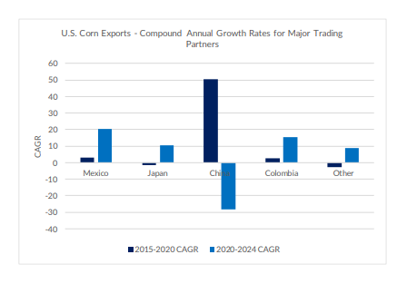
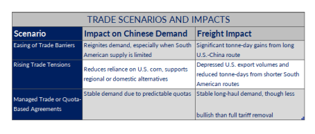

# U.S. Corn Exports in 2025 – A Banner Year Amid Shifting Trade Dynamics

**Date:** May 21, 2025  
**Publisher:** Breakwave Advisors | **Category:** Market Insights  
**Original URL:** [https://www.breakwaveadvisors.com/insights/2025/5/21/us-corn-exports-in-2025-a-banner-year-amid-shifting-trade-dynamics](https://www.breakwaveadvisors.com/insights/2025/5/21/us-corn-exports-in-2025-a-banner-year-amid-shifting-trade-dynamics)  

---

In 2025, U.S. corn exports are on track to reach historic highs, supported by a convergence of favorable agricultural, economic, and geopolitical factors. Yet, while volume prospects look strong, the geographical spread of export destinations—and the policies shaping those flows—will critically determine the impact on maritime freight demand, particularly in terms of tonne-days.

**Record Production and Competitive Pricing:**According to the USDA, U.S. corn production for the 2025–26 marketing year is forecast at an unprecedented 15.8 billion bushels. This growth is supported by expanded planting, reaching 95.3 million acres—the highest in over a decade—and a robust trendline yield of 181 bushels per acre. With an ample supply base, the USDA estimates the season-average farm price at $4.20 per bushel, a decrease from prior years. This lower price point increases the global competitiveness of U.S. corn, positioning it as an attractive option for pricesensitive importers

**Export Market Trends:****Post-2020 Acceleration**Historically, from 2015 to 2020, U.S. corn exports grew modestly at about 2.3% annually. However, the post-2020 period saw an accelerated compound annual growth rate (CAGR) of over 10.7%, indicating a shift driven by better trade agreements, reduced global supply from competitors, and rising global demand.

**Consistent Demand Anchors:****Japan and Mexico**While China remains a volatile demand source, Japan and Mexico serve as dependable outlets for U.S. corn. Mexico has emerged as a particularly strong and consistent growth market, with a CAGR of 20% since 2020, thanks in part to trade facilitation under the USMCA (United States-Mexico-Canada Agreement) and sustained demand from its feed and food sectors. Japan—despite showing signs of stagnation before 2020 and lying roughly 9,500 nautical miles from the U.S.—continues to be a reliable importer of American corn, supported by stable feed demand and competitive pricing. In contrast, exports to China have declined sharply since 2020, following a period of rapid growth. From 2015 to 2020, U.S. corn exports to China surged at a remarkable CAGR of 50.6%, only to reverse to -28.2% post-2020, highlighting the volatility of politically influenced trade flows. Colombia has emerged as a steadily growing market, likely driven by increasing protein consumption and a corresponding rise in grain demand.

> **Figure 1: Στιγμιότυπο Οθόνης 2025 05 21 123509**  
> **Interactive Data & Source:** [Allied-shipbroking](https://www.allied-shipbroking.gr/) | [Local Asset](file:///C:/Users/Dell/Github/Shipping/corpus/03-breakwave/insights/2025/assets/2025-05-21_us-corn-exports-in-2025-a-banner-year-amid-shifting-trade-dynamics_img_cea3cf84ceb9ceb3cebcceb9cf8ccf84cf85_2dd2d099ad65.png)

**Mapping Scenarios: Tariffs**The future of U.S. corn exports in 2025 hinges heavily on the evolving dynamics of trade policy—particularly the U.S.- China relationship.

**Scenario 1| Easing of Trade Barriers:**A relaxation or suspension of tariffs on U.S. corn could reignite Chinese demand, especially during periods when South American supply is limited. Given the long sailing distance between the U.S. Gulf and China (~11,500 nautical miles), even modest volumes could drive significant tonne-day gains. In high-consumption years such as 2021, China imported a record ~28.35 million metric tons of corn, according to China Customs data, corroborated by the USDA and IGC. This surge was fuelled by robust domestic demand, limited local supply, and competitive international prices—particularly from the U.S. and Ukraine.

**Scenario 2| Ongoing or Rising Trade Tensions:**If tariffs persist or escalate under a more protectionist U.S. stance, Chinese importers are likely to reduce reliance on American corn, supporting regional alternatives like Brazil, Argentina, or domestic substitutes such as barley and sorghum. These shifts would not only depress U.S. export volumes but also compress tonne-days, given the shorter shipping distances from South America.

**Scenario 3|Managed Trade or Quota-Based Agreements**An intermediate possibility involves the implementation of quotas or managed trade agreements. In such a case, China could commit to a fixed volume of U.S. corn purchases annually, insulating part of the trade from broader tensions. While not as bullish as a full tariff removal, this scenario would offer predictable volume flows and stabilize some long-haul shipping demand.

> **Figure 2: Στιγμιότυπο Οθόνης 2025 05 21 123522**  
> **Interactive Data & Source:** [Allied-shipbroking](https://www.allied-shipbroking.gr/) | [Local Asset](file:///C:/Users/Dell/Github/Shipping/corpus/03-breakwave/insights/2025/assets/2025-05-21_us-corn-exports-in-2025-a-banner-year-amid-shifting-trade-dynamics_img_cea3cf84ceb9ceb3cebcceb9cf8ccf84cf85_c9d4a30c3e39.png)

**Looking ahead**from recent geopolitical shifts, the global grain trade is entering a complex phase. In May 2025, Brazilian President Lula da Silva deepened ties with China, signing 20 agreements with President Xi Jinping to boost agricultural exports and secure $4.8 billion in Chinese investment. This occurred alongside the China-CELAC Forum, where China pledged $9 billion in credit to Latin America—underscoring its expanding regional footprint. Meanwhile, the U.S., under President Donald Trump, is recalibrating its trade strategy by strengthening ties with Mexico, Japan, and South Korea. Mexico is seeking an early USMCA review, and both Japan and South Korea are engaging to resolve tariff disputes—efforts that reflect Washington’s broader move to reduce reliance on China and diversify its trade relationships.

In this shifting landscape, the 2025 outlook for U.S. corn exports remains solid in volume, buoyed by dependable markets in North America and Asia. However, the real story for dry bulk shipping lies in tonne-day growth, which will be driven by how trade routes evolve—especially in relation to China. Whether the freight market leans bullish or stays flat will depend on how far U.S. corn travels.

Data Source:[Allied](https://www.allied-shipbroking.gr/)

---

**Tags:** Drybulk, Shipping, Markets  
