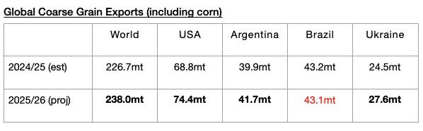

# Jump In Global Grain Trade Expected

**Date:** May 22, 2025  
**Publisher:** Breakwave Advisors | **Category:** Market Insights  
**Original URL:** [https://www.breakwaveadvisors.com/insights/2025/5/22/jump-in-global-grain-trade-expected](https://www.breakwaveadvisors.com/insights/2025/5/22/jump-in-global-grain-trade-expected)  

---

*By*[*Jeffrey Landsberg*](https://www.linkedin.com/in/jeffrey-landsberg-70ab957/)

As we discussed for clients in Commodore Research's most recent Weekly Executive Report, the United States Department of Agriculture has released its initial forecast for the upcoming 2025/26 grain trade season and is predicting that global coarse grain, wheat, soybean, and soymeal exports will collectively total a very impressive 720.2 million tons. This would mark a year-on-year increase of 26.9 million tons (4%) from the 693.4 million tons expected for the current 2024/25 season. Stronger harvests are all expected for coarse grain, wheat, soybeans, and soymeal. As we have discussed often in our Weekly Executive Reports, growth has been needed considering that the entire dry bulk fleet this year remains very likely to grow by a net addition of at least another 350 vessels. For the current 2024/25 grain season, a year-on-year contraction of 18 million tons (-3%) is now expected.

The United States Department of Agriculture is forecasting that global coarse grain exports in 2025/26 will total 238 million tons. This would mark a year-on-year increase of 11.3 million tons (5%) from the 226.7 million tons expected for the current 2024/25 season. Coarse grain exports will remain the grain market’s largest cargo by volume. A fairly large year-on-year increase in coarse grain exports is expected from the United States. Moderate year-on-year increases in coarse grain exports are expected from Argentina and Ukraine. A very small year-on-year decline is expected from Brazil.

> **Figure 1: Chart**  
> [Local Asset](file:///C:/Users/Dell/Github/Shipping/corpus/03-breakwave/insights/2025/assets/2025-05-22_jump-in-global-grain-trade-expected_img_chart_cf4e00172be7.jpg)

---

**Tags:** Shipping, Drybulk, Markets  
