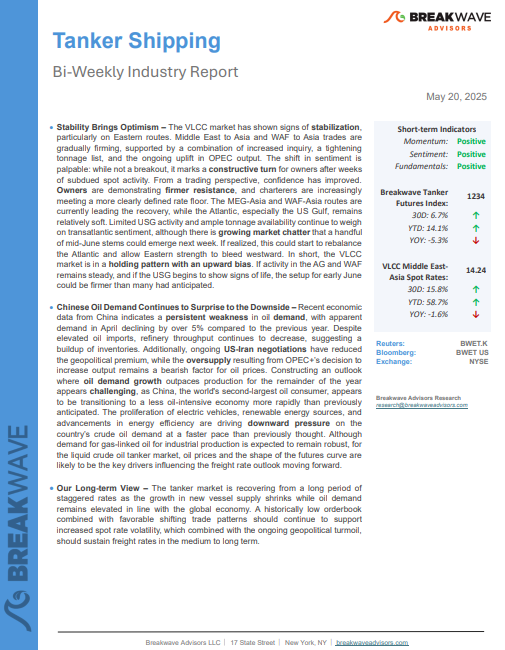
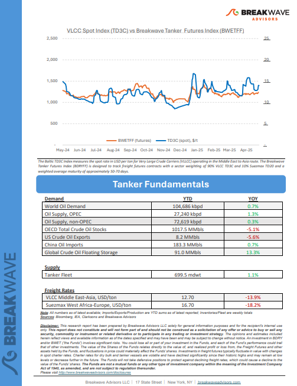
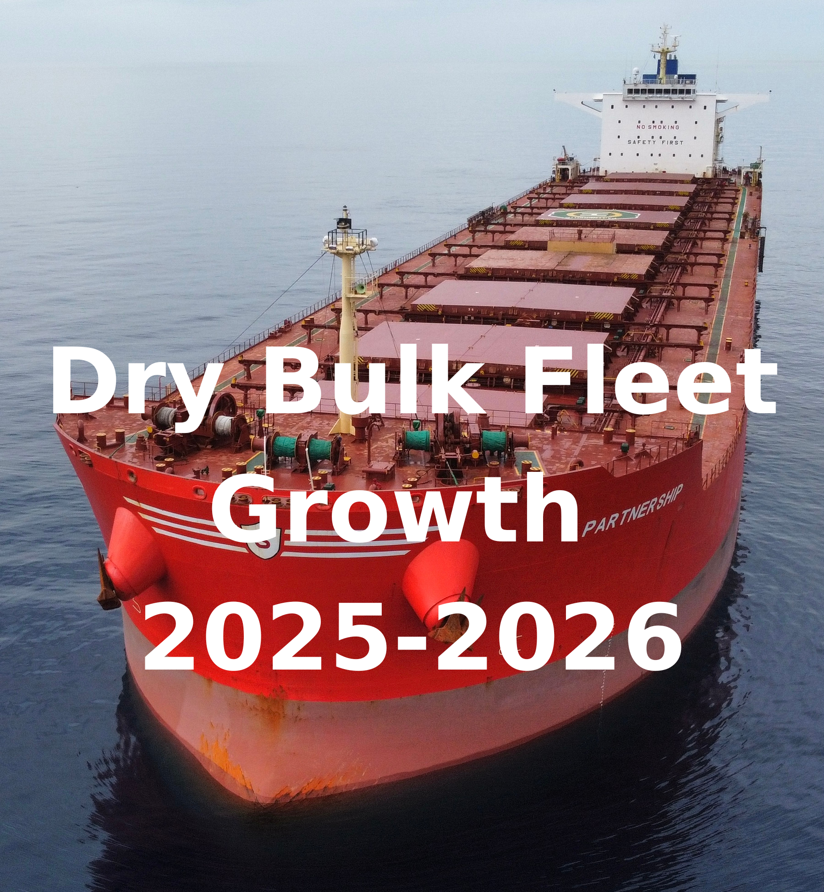

# Breakwave Weekend Read

**Date:** May 23, 2025  
**Publisher:** Breakwave Advisors | **Category:** Market Insights  
**Original URL:** [https://www.breakwaveadvisors.com/insights/2024/10/25/breakwave-weekend-read-547kk](https://www.breakwaveadvisors.com/insights/2024/10/25/breakwave-weekend-read-547kk)  

---

## Welcome Tobreakwave Advisorsweekend Read

***As the week comes to a close, take a moment to review the key insights from the past few days. Missed something? We've gathered all the top insights for you to catch up at your convenience.***

## Breakwave Shipping Report

**Stability Brings Optimism**– The VLCC market has shown signs of**stabilization**, particularly on Eastern routes.

[Read More](https://www.breakwaveadvisors.com/insights/2025205wet855547pp)

> **Figure 1: Στιγμιότυπο Οθόνης 2025 05 23 124235**  
> **Interactive Data & Source:** [Breakwave Advisors Market Insights](https://www.breakwaveadvisors.com/insights/2025/5/19/90-day-trade-truce) | [Local Asset](file:///C:/Users/Dell/Github/Shipping/corpus/03-breakwave/insights/2025/assets/2025-05-23_breakwave-weekend-read-547kk_img_cea3cf84ceb9ceb3cebcceb9cf8ccf84cf85_279728951a3a.png)

> **Figure 2: Στιγμιότυπο Οθόνης 2025 05 23 124251**  
> **Interactive Data & Source:** [Breakwave Advisors Market Insights](https://www.breakwaveadvisors.com/insights/2025/5/19/90-day-trade-truce) | [Local Asset](file:///C:/Users/Dell/Github/Shipping/corpus/03-breakwave/insights/2025/assets/2025-05-23_breakwave-weekend-read-547kk_img_cea3cf84ceb9ceb3cebcceb9cf8ccf84cf85_9557a232ded7.png)

## 90-Day Trade Truce

> **Figure 3: Ανώνυμο Σχέδιο**  
> **Interactive Data & Source:** [Breakwave Advisors Market Insights](https://www.breakwaveadvisors.com/insights/2025/5/19/90-day-trade-truce) | [Local Asset](file:///C:/Users/Dell/Github/Shipping/corpus/03-breakwave/insights/2025/assets/2025-05-23_breakwave-weekend-read-547kk_img_ce91cebdcf8ecebdcf85cebccebfcf83cf87_a58958e3f832.png)

The recent 90-day trade truce between the United States and China has offered a brief pause in an otherwise protracted and disruptive chapter for global trade.

Doric Weekly Market Insights

## China's Coal Imports From the United States Could Now Increase

> **Figure 4: Ανώνυμο Σχέδιο (3)**  
> **Interactive Data & Source:** [Breakwave Advisors Market Insights](https://www.breakwaveadvisors.com/insights/2025/5/19/chinas-coal-imports-from-the-united-states-could-now-increase) | [Local Asset](file:///C:/Users/Dell/Github/Shipping/corpus/03-breakwave/insights/2025/assets/2025-05-23_breakwave-weekend-read-547kk_img_ce91cebdcf8ecebdcf85cebccebfcf83cf87_376d12f86dea.png)

As we discussed in Commodore Research's most recent Weekly China Report, Indonesia not surprisingly has remained China's primary source of coal imports.

From Commodore's Weekly Dry Bulk Reports

## Aging Fleet

> **Figure 5: Προσθέστε Επικεφαλίδα**  
> **Interactive Data & Source:** [Breakwave Advisors Market Insights](https://www.breakwaveadvisors.com/insights/2025/5/19/aging-fleet) | [Local Asset](file:///C:/Users/Dell/Github/Shipping/corpus/03-breakwave/insights/2025/assets/2025-05-23_breakwave-weekend-read-547kk_img_cea0cf81cebfcf83ceb8ceadcf83cf84ceb5_28e79e1fac5f.png)

The tanker fleet is aging. The last couple of years have seen few deliveries and little scrapping as a strong market and a growing dark fleet has kept many vessels from being beached.

Gibson Tanker Market Report

## Eyes on Borrowing Costs

> **Figure 6: Ανώνυμο Σχέδιο (1)**  
> **Interactive Data & Source:** [Breakwave Advisors Market Insights](https://www.breakwaveadvisors.com/insights/2025/5/20/eyes-on-borrowing-costs) | [Local Asset](file:///C:/Users/Dell/Github/Shipping/corpus/03-breakwave/insights/2025/assets/2025-05-23_breakwave-weekend-read-547kk_img_ce91cebdcf8ecebdcf85cebccebfcf83cf87_e0664c173c5c.png)

Investor optimism about rebounding equity markets was tempered by concerns over rising borrowing costs for the US government.

[Read More](https://www.breakwaveadvisors.com/insights/2025/5/20/eyes-on-borrowing-costs)

Forvis Mazars Weekly Note

## MEG Offshore Activity

> **Figure 7: MEG Offshore Activity**  
> **Interactive Data & Source:** [Breakwave Advisors Market Insights](https://www.breakwaveadvisors.com/insights/2025/5/21/meg-offshore-activity) | [Local Asset](file:///C:/Users/Dell/Github/Shipping/corpus/03-breakwave/insights/2025/assets/2025-05-23_breakwave-weekend-read-547kk_img_megoffshoreactivity_a789dd8288b8.png)

The offshore energy market in the Middle East Gulf (MEG) has progressed through distinct cycles of growth, decline, and recovery, shaped by global oil price movements, national energy policies, and the evolution of LNG markets.

Intermodal Weekly Market Report

## U.s. Corn Exports in 2025 – A Banner Year Amid Shifting Trade Dynamics

> **Figure 8: Ανώνυμο Σχέδιο (2)**  
> **Interactive Data & Source:** [Breakwave Advisors Market Insights](https://www.breakwaveadvisors.com/insights/2025/5/21/us-corn-exports-in-2025-a-banner-year-amid-shifting-trade-dynamics) | [Local Asset](file:///C:/Users/Dell/Github/Shipping/corpus/03-breakwave/insights/2025/assets/2025-05-23_breakwave-weekend-read-547kk_img_ce91cebdcf8ecebdcf85cebccebfcf83cf87_be1a91fc9eb1.png)

In 2025, U.S. corn exports are on track to reach historic highs, supported by a convergence of favorable agricultural, economic, and geopolitical factors.

Allied Weekly Report

## Jump in Global Grain Trade Expected

> **Figure 9: Προσθέστε Επικεφαλίδα (2)**  
> **Interactive Data & Source:** [Breakwave Advisors Market Insights](https://www.breakwaveadvisors.com/insights/2025/5/22/jump-in-global-grain-trade-expected) | [Local Asset](file:///C:/Users/Dell/Github/Shipping/corpus/03-breakwave/insights/2025/assets/2025-05-23_breakwave-weekend-read-547kk_img_cea0cf81cebfcf83ceb8ceadcf83cf84ceb5_9e021ee2eeb5.png)

As we discussed for clients in Commodore Research's most recent Weekly Executive Report, the United States Department of Agriculture has released its initial forecast for the upcoming 2025/26 grain trade season..

From Commodore's Weekly Dry Bulk Reports

## Ageing Vlccs Are an Unlikely Source of Support to Market for Now

> **Figure 10: Ανώνυμο Σχέδιο (4)**  
> **Interactive Data & Source:** [Breakwave Advisors Market Insights](https://www.breakwaveadvisors.com/insights/2025/5/22/ageing-vlccs-are-an-unlikely-source-of-support-to-market-for-now) | [Local Asset](file:///C:/Users/Dell/Github/Shipping/corpus/03-breakwave/insights/2025/assets/2025-05-23_breakwave-weekend-read-547kk_img_ce91cebdcf8ecebdcf85cebccebfcf83cf87_ae8743dda8d9.png)

The utilisation of ageing VLCCs is supportive of crude freight for now, but they will soon be squeezed out of the mainstream market into scrapping or servicing opaque flows.

Vortexa Freight Weekly

## Dry Bulk Fleet Growth 2025-2026

> **Figure 11: Ανώνυμο Σχέδιο (5)**  
> **Interactive Data & Source:** [Breakwave Advisors Market Insights](https://www.breakwaveadvisors.com/insights/2025/5/23/dry-bulk-fleet-growth-2025-2026) | [Local Asset](file:///C:/Users/Dell/Github/Shipping/corpus/03-breakwave/insights/2025/assets/2025-05-23_breakwave-weekend-read-547kk_img_ce91cebdcf8ecebdcf85cebccebfcf83cf87_5f053e043c1a.png)

According to Signal Ocean Orderbook Data Analytics – Dry Bulk Fleet Projection Analysis, between 2020 In 2024, the global dry bulk fleet experienced steady expansion,

Signal Ocean Dry Weekly Market Monitor

## Oil Falls As OPEC Considers Further Supply Hikes

> **Figure 12: Oil Falls As OPEC Considers Further Supply Hikes (1)**  
> **Interactive Data & Source:** [Breakwave Advisors Market Insights](https://www.breakwaveadvisors.com/insights/2025/5/23/oil-falls-as-opec-considers-further-supply-hikes) | [Local Asset](file:///C:/Users/Dell/Github/Shipping/corpus/03-breakwave/insights/2025/assets/2025-05-23_breakwave-weekend-read-547kk_img_oilfallsasopecconsidersfurthersupply_01be2e00c72e.png)

A risk-off tone weighed on sentiment across the commodity complex. Fear of rising supply pushed oil lower. Gold weakened amid a stronger USD.

Commodities Wrap

---

**Tags:** Shipping, Tankers, Drybulk  
