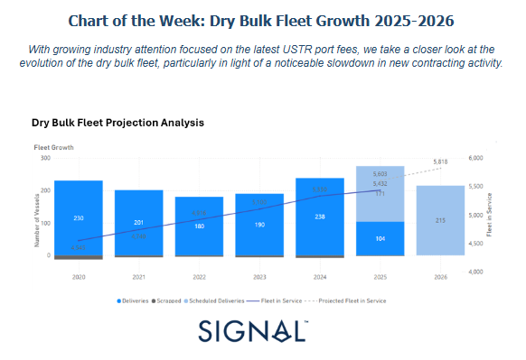
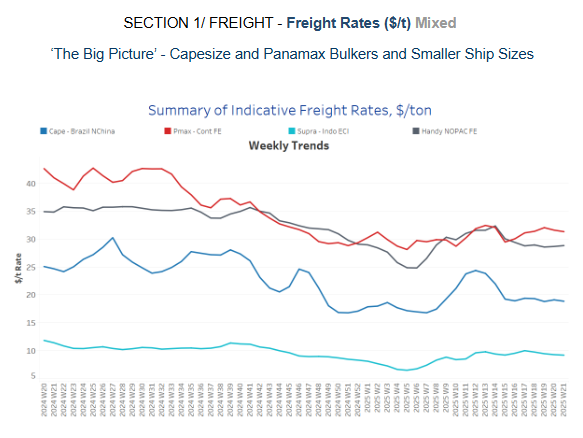
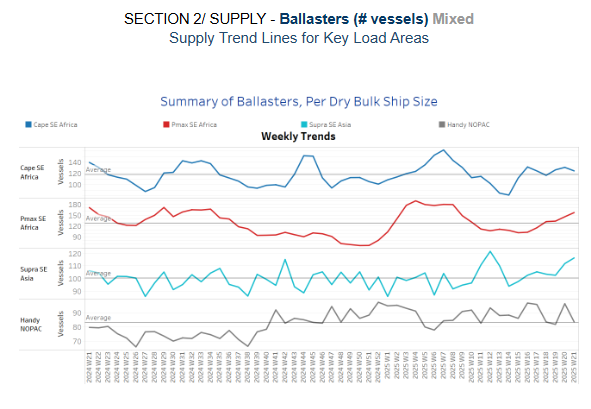
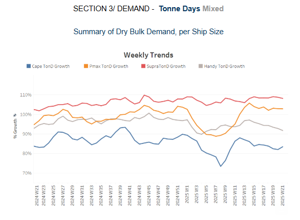
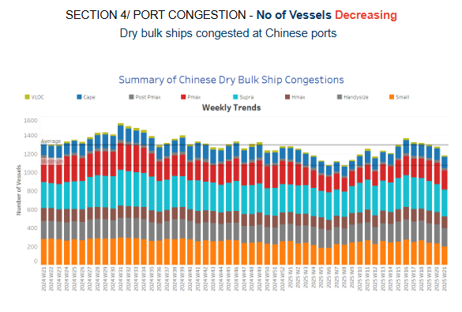

# Dry Bulk Fleet Growth 2025-2026

**Date:** May 23, 2025  
**Publisher:** Breakwave Advisors | **Category:** Market Insights  
**Original URL:** [https://www.breakwaveadvisors.com/insights/2025/5/23/dry-bulk-fleet-growth-2025-2026](https://www.breakwaveadvisors.com/insights/2025/5/23/dry-bulk-fleet-growth-2025-2026)  

---

**Dry Weekly Market Monitor - Week 21, 2025**
Snapshot of Spot Freight Rates, Supply-Demand Trends, Port Congestions
May 22, 2025

> **Figure 1: Στιγμιότυπο Οθόνης 2025 05 23 110855**  
> **Interactive Data & Source:** [Signal Ocean Platform](https://www.thesignalgroup.com/signal-ocean-platform) | [Local Asset](file:///C:/Users/Dell/Github/Shipping/corpus/03-breakwave/insights/2025/assets/2025-05-23_dry-bulk-fleet-growth-2025-2026_img_cea3cf84ceb9ceb3cebcceb9cf8ccf84cf85_c161033b6b57.png)

According to Signal Ocean Orderbook Data Analytics – Dry Bulk Fleet Projection Analysis, between 2020 In 2024, the global dry bulk fleet experienced steady expansion, increasing from 4,545 vessels in 2020 to 5,330 vessels by the end of 2024. This growth was primarily supported by sustained newbuilding deliveries and relatively low levels of scrapping activity.

In 2020, deliveries surged to 230 vessels, likely reflecting the resumption of shipyard activity following early pandemic disruptions. Deliveries then declined year over year, falling to 201 vessels in 2021, 180 in 2022, and 190 in 2023, before climbing again to 238 vessels in 2024—the highest figure during this period. Scrapping volumes remained limited throughout, ranging from -13 vessels in 2020 to between -4 and -8 vessels in the subsequent years.

This supply-side dynamic, characterized by continued inflows and limited vessel removal, drove consistent fleet growth. By 2023, the fleet in service had reached 5,100 vessels, and by 2024 it stood at 5,330, reflecting a compound annual growth of over 3% since 2020.

Looking ahead to 2025 and 2026, projections from Signal Ocean’s orderbook data suggest that the dry bulk fleet will continue to expand. Deliveries are expected to sharply decline to 104 vessels in 2025, representing a 75% decrease from 2024. However, this apparent slowdown in delivery volumes is offset by the inclusion of scheduled deliveries, amounting to 171 vessels in 2025 and 215 vessels in 2026. As a result, the fleet is projected to increase to 5,603 vessels in 2025 and 5,818 vessels by 2026.

This forecasted slowdown in actual newbuilding deliveries is occurring alongside rising cost pressures and policy headwinds—most notably the impact of U.S. Trade Representative (USTR) port fees, which have discouraged U.S.-linked shipowners from contracting vessels at Chinese shipyards. Given China’s dominant role in the global shipbuilding industry, the tariffs have introduced new friction into the orderbook pipeline. There is growing evidence that some shipowners have either postponed newbuilding commitments or redirected interest toward non-Chinese yards, despite their generally higher costs and longer delivery times. The recent decline in scheduled deliveries for 2025 and 2026 may, at least in part, reflect this shift in contracting behavior.

While the fleet is still projected to grow by nearly 500 vessels by the end of 2026, the composition and timing of that growth are changing. If scrapping activity remains limited and demand growth does not match capacity additions, there is potential for a supply overhang in the dry bulk sector by the end of 2026.

> **Figure 2: Στιγμιότυπο Οθόνης 2025 05 23 111418**  
> **Interactive Data & Source:** [Signal Ocean Platform](https://www.thesignalgroup.com/signal-ocean-platform) | [Local Asset](file:///C:/Users/Dell/Github/Shipping/corpus/03-breakwave/insights/2025/assets/2025-05-23_dry-bulk-fleet-growth-2025-2026_img_cea3cf84ceb9ceb3cebcceb9cf8ccf84cf85_028ccd82e49d.png)

Capesize freight market sentiment held a relatively flat momentum, while the Panamax market on the Continent–Far East route recorded a soft downward trend.

- **Capesize**vessel freight rates from Brazil to North China held sentiment below $18 per tonne, showing a 1.6% decrease compared to last month.
- **Panamax**from the Continent held recovered levels at nearly $31 per tonne, showing a 2% monthly decrease.
- **Supramax**vessel freight rates for the Indonesia to East Coast remained stable at approximately $9 per tonne over the last four weeks.
- **Handysize**freight rates for the NOPAC Far East route held similar sentiment to the previous two weeks at around $28 per tonne.

> **Figure 3: Στιγμιότυπο Οθόνης 2025 05 23 111907**  
> **Interactive Data & Source:** [Signal Ocean Platform](https://www.thesignalgroup.com/signal-ocean-platform) | [Local Asset](file:///C:/Users/Dell/Github/Shipping/corpus/03-breakwave/insights/2025/assets/2025-05-23_dry-bulk-fleet-growth-2025-2026_img_cea3cf84ceb9ceb3cebcceb9cf8ccf84cf85_fd7d4d80b0bb.png)

Capesize and Panamax activity in Southeast Africa remains above the annual average, according to Ballaster indicators.

- **Capesize SE Africa**: The number of vessels dropped to 125, while the last bottom was seen at the end of week 15.

- **Panamax SE Africa**: The third decade of May held the rising trend with levels approaching nearly 160, nearly 30 more than the annual trend.
- **Supramax SE Asia**: The dry market is experiencing a strong upward trend, exceeding the previous peak in Week 13. For the past three weeks, levels have been above the annual average of 100, indicating a significant increase.
- **Handysize NOPAC**: The Handy NOPAC segment's levels indicated a downward reversal to levels aligned with the annual average, while a spike was seen at the end of week 20.

> **Figure 4: Στιγμιότυπο Οθόνης 2025 05 23 111954**  
> **Interactive Data & Source:** [Signal Ocean Platform](https://www.thesignalgroup.com/signal-ocean-platform) | [Local Asset](file:///C:/Users/Dell/Github/Shipping/corpus/03-breakwave/insights/2025/assets/2025-05-23_dry-bulk-fleet-growth-2025-2026_img_cea3cf84ceb9ceb3cebcceb9cf8ccf84cf85_c85d44c00c4a.png)

Panamax and Supramax vessel segments showed stable tonne-day growth momentum, while Capesize vessels have begun a slow upward trend.

- **Capesize**: Having peaked in Week 11, the growth trend declined until last week, while current data indicates a reversal of this downward momentum.
- **Panamax**: Despite recent flatlining over the past three weeks, current levels in the dry market remain elevated compared to the weaker momentum observed in Week 8.
- **Supramax**: Despite an elevated level, the growth rate has not shown a sign of spike since the end of week 13.
- **Handysize**: The growth rate has softened since its peak at the end of week 13, indicating a further downward trend for the second half of the month.

> **Figure 5: Στιγμιότυπο Οθόνης 2025 05 23 112046**  
> **Interactive Data & Source:** [Signal Ocean Platform](https://www.thesignalgroup.com/signal-ocean-platform) | [Local Asset](file:///C:/Users/Dell/Github/Shipping/corpus/03-breakwave/insights/2025/assets/2025-05-23_dry-bulk-fleet-growth-2025-2026_img_cea3cf84ceb9ceb3cebcceb9cf8ccf84cf85_bc63e9ea63f8.png)

Dry bulk port congestion in China continued to ease in the third week of May, following a persistent increase in April.

- **Capesize**: Capesize vessel congestion dropped below 120, while the last peak was seen at the end of week 17.
- **Panamax**: Panamax vessel congestion decreased by approximately 26 vessels to nearly 200, contrary to anticipated May increases.
- **Supramax**: The third week of May held a downward trend, with levels dropping below 300, 10% lower than the peak of week 19.
- **Handysize**: Port congestion declined by 10 to 196 compared to the previous week's end.

Data Source:[Signal Ocean Platform](https://www.thesignalgroup.com/signal-ocean-platform)

---

**Tags:** Drybulk, Shipping, Markets  
