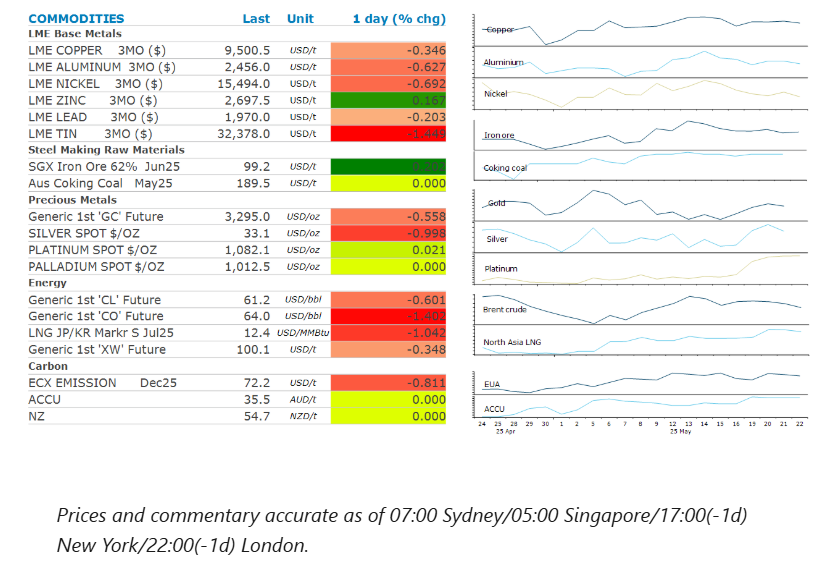
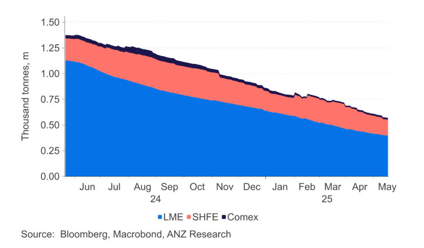

# Oil falls as OPEC considers further supply hikes

**Date:** May 23, 2025  
**Publisher:** Breakwave Advisors | **Category:** Market Insights  
**Original URL:** [https://www.breakwaveadvisors.com/insights/2025/5/23/oil-falls-as-opec-considers-further-supply-hikes](https://www.breakwaveadvisors.com/insights/2025/5/23/oil-falls-as-opec-considers-further-supply-hikes)  

---

A risk-off tone weighed on sentiment across the commodity complex. Fear of rising supply pushed oil lower. Gold weakened amid a stronger USD.

*By*[*Daniel Hynes*](https://www.linkedin.com/in/dahynes/)

> **Figure 1: Στιγμιότυπο Οθόνης 2025 05 23 114355**  
> **Interactive Data & Source:** [Linkedin](https://www.linkedin.com/newsletters/commodities-wrap-6692196755876012032/?fbclid=IwAR3kiXJqZdxmp9ZcRwBNI7FsBySI-XSC0pfPur1qzjt7OZp7PTE59Tsl1QI) | [Local Asset](file:///C:/Users/Dell/Github/Shipping/corpus/03-breakwave/insights/2025/assets/2025-05-23_oil-falls-as-opec-considers-further-supply-hikes_img_cea3cf84ceb9ceb3cebcceb9cf8ccf84cf85_23ad6a74b3bc.png)

### Market Commentary

**Crude oil**slumped amid fears of rising supply. Reports surfaced that the OPEC+ alliance is considering a potential increase in output of 411kb/d in July. This would be the third month in a row that the group has agreed to triple the initially scheduled amount. No final agreement has been reached yet, with this option being one of many being discussed, according to Bloomberg, which suggests OPEC may be testing the market’s reaction. What it does indicate is that leaders, including Saudi Arabia, are serious in their efforts to force members, who are overproducing against their quotas, to rein in supply. It also spells the end of OPEC being a market stabilising force, with a projected oversupply likely to push prices lower in the coming months. This comes amid a challenging geopolitical backdrop. Earlier this week CNN reported that Israel was considering a strike on Iranian nuclear facilities. The prospect of a broader conflict in the Middle East could have implications for supply from other producers in the region. Sentiment wasn’t helped by data showing rising inventories in the US. Commercial stockpiles rose by 1,328kbbl last week, according to the Energy Information Administration.

**Global gas**prices came under pressure amid renewed concerns about demand. The recent rally in gas markets has seen alternative fuels become more economically attractive in certain regions, which could weigh on demand as utilities switch fuels. And the economic backdrop is already challenging. In Europe, the PMI for May fell to 49.5 from 50.4 in April, suggesting Trump’s tariffs are impacting economic activity.**European gas**futures fell, although the losses were contained by recent supply outages. Exports from Norway were disrupted this week after the giant Troll field suffered power issues. That’s in addition to curbs at other global gas facilities including Israel and Malaysia.**North Asian LNG**prices also pushed lower with interest from large buyers such as China remaining subdued.

A stronger USD created headwinds for the**gold**market. The precious metal recorded its first daily loss in three days amid subdued investor demand. Nevertheless, the spectre of a weak global bond market will remain supportive in the medium term. Concerns of a ballooning fiscal deficit in the US rose after Trump’s tax bill was passed by the House of Representatives. The bill could add about USD3.8bn to the federal government’s USD36.2trn debt over the next decade.**Platinum**hovered near a one year high as traders weighed up an impending market deficit against an uncertain demand outlook. The World Platinum Investment Council is forecasting a shortage of almost 1m ounces this year. However, the global rollout of electric vehicles could hinder demand for its auto catalysts, which are used to filter emission from internal combustion engines.

**Metals**were broadly lower amid a risk-off tone across markets. Prices were also weighed down by concerns of weaker demand in China. Inventories of key metals including aluminium and copper have been rising in recent weeks, suggesting demand has waned. However, recent supply side issues may help limit the downside. Mercuria Energy warned this week that deficits in both the copper concentrate and refined market could develop this year. The uncertainty created by Trump’s tariffs are also resulting in major resource companies delaying plans for investment in new projects.

### Chart of the Day

Inventories of aluminium held on global exchanges have been falling steadily over the past 12 months. Despite concerns about the economic backdrop, limited supply growth is keeping the market tight.

> **Figure 2: Στιγμιότυπο Οθόνης 2025 05 23 115350**  
> **Interactive Data & Source:** [Linkedin](https://www.linkedin.com/newsletters/commodities-wrap-6692196755876012032/?fbclid=IwAR3kiXJqZdxmp9ZcRwBNI7FsBySI-XSC0pfPur1qzjt7OZp7PTE59Tsl1QI) | [Local Asset](file:///C:/Users/Dell/Github/Shipping/corpus/03-breakwave/insights/2025/assets/2025-05-23_oil-falls-as-opec-considers-further-supply-hikes_img_cea3cf84ceb9ceb3cebcceb9cf8ccf84cf85_5a30dc9e20c7.png)

Data source:[Commodities Wrap](https://www.linkedin.com/newsletters/commodities-wrap-6692196755876012032/?fbclid=IwAR3kiXJqZdxmp9ZcRwBNI7FsBySI-XSC0pfPur1qzjt7OZp7PTE59Tsl1QI)

---

**Tags:** Commodities, Markets, Shipping  
