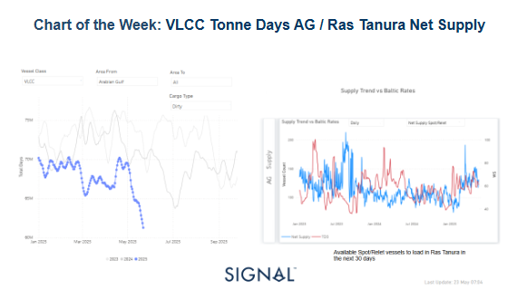
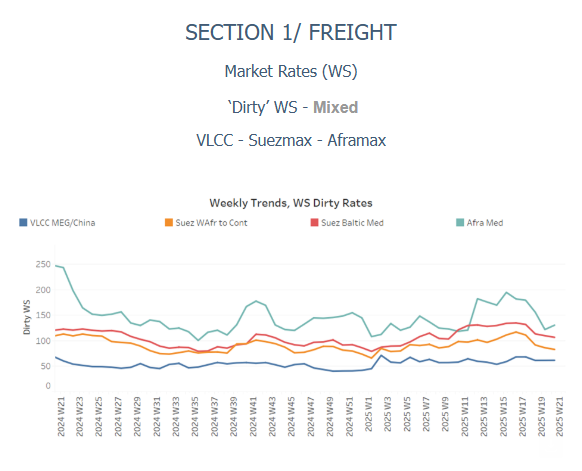
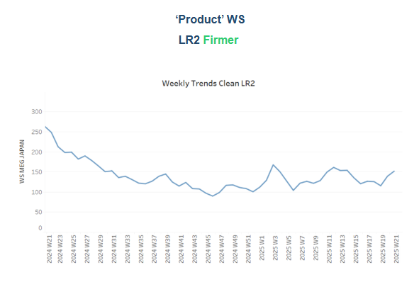
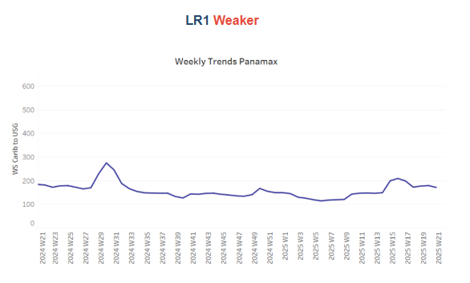
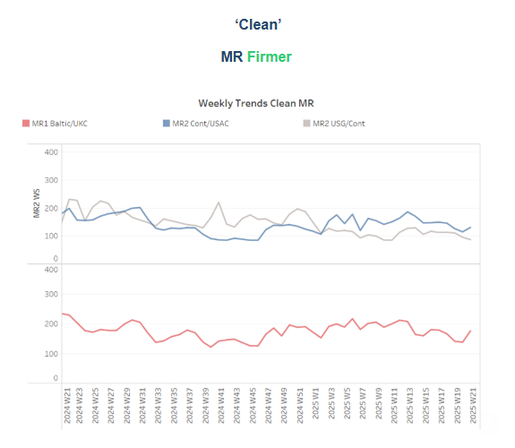
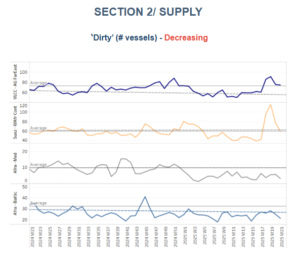
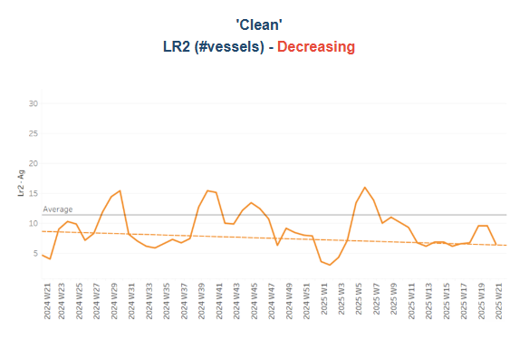
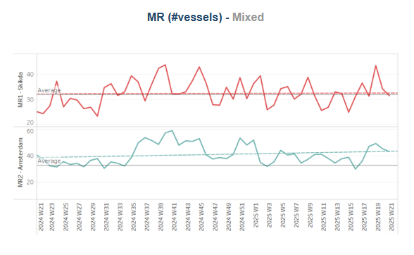
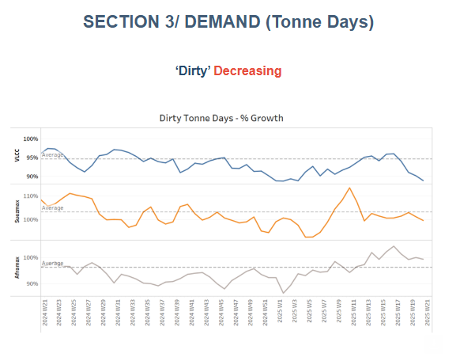
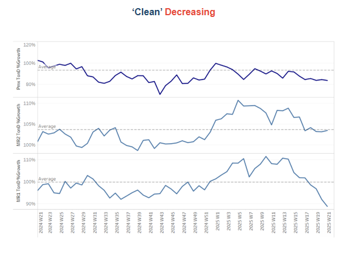

# VLCC Tonne Days

**Date:** May 26, 2025  
**Publisher:** Breakwave Advisors | **Category:** Market Insights  
**Original URL:** [https://www.breakwaveadvisors.com/insights/2025/5/26/vlcc-tonne-days](https://www.breakwaveadvisors.com/insights/2025/5/26/vlcc-tonne-days)  

---

### Tanker - Weekly Market Monitor

Snapshot of Crude and Product Freight Rates, Supply-Demand

Week 21, 23 May, 2025

> **Figure 1: Στιγμιότυπο Οθόνης 2025 05 26 090443**  
> **Interactive Data & Source:** [Signal Ocean Platform](https://www.thesignalgroup.com/signal-ocean-platform) | [Local Asset](file:///C:/Users/Dell/Github/Shipping/corpus/03-breakwave/insights/2025/assets/2025-05-26_vlcc-tonne-days_img_cea3cf84ceb9ceb3cebcceb9cf8ccf84cf85_72e50989c761.png)

**At the end of the third week of May**, we are analysing the AG growth in tonne days within the dirty segment for VLCC tankers and the Ras Tanura supply trend to reveal the potential reasons behind the persistent downward pressure seen in the AG-China freight market sentiment.

Examining seasonal trends of VLCC tonne days using a 7-day moving average indicates a steady decline since late April. Current estimates show figures falling below those recorded in the past two years, with recent data reflecting nearly 61 million tonnes compared to 70 million during the same timeframe in 2023 and 2024. Given the persistent drop in oil prices and OPEC+'s plans to increase supply, there is uncertainty regarding possible recovery during the summer season, particularly amid growing concerns about economic prospects in China and the U.S.

Meanwhile, the latest weekly change in**net vessel supply**(spot-relet vessels available to load Ras Tanura 30 days) held levels around 128. This follows a significant rise of 190 vessels noted in mid-March. However, TD3 rates have not yet shown signs of recovery, while an increase is likely when net supply drops below 100 vessels and even further down, as a similar case was experienced in mid-January with TD3 rates at an excess of WS70.

Despite the ongoing economic and trade headwinds, the IEA adjusted its 2025 oil demand growth forecast to reach 740,000 barrels per day in its May report, an increase from the previous estimate of 730,000 barrels per day reported in April. However, this revision does not ease the challenges posed by heightened trade uncertainties affecting the global economy and oil demand, while the IEA has emphasised that demand growth is expected to decelerate for the remainder of the year.

In parallel, updated EIA forecasts for oil demand growth have been released amid continued declines in industry oil prices. Non-OPEC oil-producing countries expect an increase of over 1 million barrels per day this year due to stronger production from China, Canada, and Brazil. Additionally, recent reports suggest that oil prices may continue to fall as discussions around OPEC+ plans to boost production levels in July gain traction; a final decision is expected during a meeting on June 1.

> **Figure 2: Στιγμιότυπο Οθόνης 2025 05 26 090559**  
> **Interactive Data & Source:** [Signal Ocean Platform](https://www.thesignalgroup.com/signal-ocean-platform) | [Local Asset](file:///C:/Users/Dell/Github/Shipping/corpus/03-breakwave/insights/2025/assets/2025-05-26_vlcc-tonne-days_img_cea3cf84ceb9ceb3cebcceb9cf8ccf84cf85_6cb92b4a0c6c.png)

Crude oil tanker freight rates on the MEG-China route experienced a decline in momentum. Conversely, the Aframax Mediterranean route showed a slight recovery.

- **VLCC**freight rates on the**MEG–China**dropped to WS 60, reflecting a 4% weekly increase. Meanwhile, Suezmax rates from West Africa to continental Europe dropped below WS80, showing a 10% weekly decrease. Meanwhile, rates on the**Baltic–Mediterranean route**dropped below WS110, standing 20% lower than a month ago.
- **Aframax**freight rates in the**Mediterranean**indicated signs of rebound at WS130, showing a 10% weekly increase.

> **Figure 3: Στιγμιότυπο Οθόνης 2025 05 26 090732**  
> **Interactive Data & Source:** [Signal Ocean Platform](https://www.thesignalgroup.com/signal-ocean-platform) | [Local Asset](file:///C:/Users/Dell/Github/Shipping/corpus/03-breakwave/insights/2025/assets/2025-05-26_vlcc-tonne-days_img_cea3cf84ceb9ceb3cebcceb9cf8ccf84cf85_b9a6976a59c3.png)

- **LR2**AG freight rates rose to WS155, reflecting a monthly increase of 20%.

> **Figure 4: Στιγμιότυπο Οθόνης 2025 05 26 090825**  
> **Interactive Data & Source:** [Signal Ocean Platform](https://www.thesignalgroup.com/signal-ocean-platform) | [Local Asset](file:///C:/Users/Dell/Github/Shipping/corpus/03-breakwave/insights/2025/assets/2025-05-26_vlcc-tonne-days_img_cea3cf84ceb9ceb3cebcceb9cf8ccf84cf85_ba6ee77a147a.png)

- **Panamax**Carib-to-USG rates decreased to WS170, indicating a weakening trend from the prior week. This level is 15% lower than the rates seen a month ago.

> **Figure 5: Στιγμιότυπο Οθόνης 2025 05 26 090916**  
> **Interactive Data & Source:** [Signal Ocean Platform](https://www.thesignalgroup.com/signal-ocean-platform) | [Local Asset](file:///C:/Users/Dell/Github/Shipping/corpus/03-breakwave/insights/2025/assets/2025-05-26_vlcc-tonne-days_img_cea3cf84ceb9ceb3cebcceb9cf8ccf84cf85_4c9c904b7ac7.png)

- **MR1**freight rates for Baltic-to-Continent shipments hovered around WS180, representing a 30% weekly increase.

- **MR2**freight rates for shipments from the Continent to the US Atlantic Coast (USAC) reached WS150, reflecting a 30% weekly increase. MR2 rates from the US Gulf to the Continent saw a notable rise to WS100, which marks an 11% increase week-on-week and a 5% decrease compared to rates from a month ago.

> **Figure 6: Στιγμιότυπο Οθόνης 2025 05 26 091012**  
> **Interactive Data & Source:** [Signal Ocean Platform](https://www.thesignalgroup.com/signal-ocean-platform) | [Local Asset](file:///C:/Users/Dell/Github/Shipping/corpus/03-breakwave/insights/2025/assets/2025-05-26_vlcc-tonne-days_img_cea3cf84ceb9ceb3cebcceb9cf8ccf84cf85_b935a26b45ec.png)

​​​​​The upward pressure of vessel count in the VLCC and Suezmax dirty segments recorded in the first two decades of May appears to be slowing down, while ship numbers in the Aframax segment remain below the annual trend.

- **VLCC Ras Tanura**: The current ship count indicates levels of around 75, while it remains to be seen whether the slowing demand growth in tonne days will further accelerate the vessel count for the rest of the month.
- **Suezmax Wafr**: The current ship count, amid a spike of two weeks ago, has started to decelerate and is now approaching again the annual trend, while the levels floating below the annual trend were last at the end of week 15.
- **Aframax Med**: The ongoing decline continues, with the current figure remaining significantly below the annual benchmark of 10.
Aframax Baltic: The current number of ships is approximately 21, a decrease of nearly 10 vessels compared to the annual trend.

> **Figure 7: Στιγμιότυπο Οθόνης 2025 05 26 091108**  
> **Interactive Data & Source:** [Signal Ocean Platform](https://www.thesignalgroup.com/signal-ocean-platform) | [Local Asset](file:///C:/Users/Dell/Github/Shipping/corpus/03-breakwave/insights/2025/assets/2025-05-26_vlcc-tonne-days_img_cea3cf84ceb9ceb3cebcceb9cf8ccf84cf85_fcaab98f4017.png)

> **Figure 8: Στιγμιότυπο Οθόνης 2025 05 26 091116**  
> **Interactive Data & Source:** [Signal Ocean Platform](https://www.thesignalgroup.com/signal-ocean-platform) | [Local Asset](file:///C:/Users/Dell/Github/Shipping/corpus/03-breakwave/insights/2025/assets/2025-05-26_vlcc-tonne-days_img_cea3cf84ceb9ceb3cebcceb9cf8ccf84cf85_dff56a8b8ecf.png)

- **Clean LR2 AG Jubail**: The number of vessels in the third decade of May has significantly decreased, falling 37% below the average trend.

- **Clean MR**: Skikda, Algeria continued the downward trend of the previous week, reaching 31, 5 lower than the prior week. In**Amsterdam**, MR2 vessels are now above the annual average of 32 for a sixth consecutive week, confirming a sustained increase throughout May.

> **Figure 9: Στιγμιότυπο Οθόνης 2025 05 26 091230**  
> **Interactive Data & Source:** [Signal Ocean Platform](https://www.thesignalgroup.com/signal-ocean-platform) | [Local Asset](file:///C:/Users/Dell/Github/Shipping/corpus/03-breakwave/insights/2025/assets/2025-05-26_vlcc-tonne-days_img_cea3cf84ceb9ceb3cebcceb9cf8ccf84cf85_b0545b689657.png)

- **Dirty**tonne days: Growth in VLCC tonne days declined sharply in the third decade of May. In the Suezmax segment, recent tonne-days growth is below the average trend line, with the latest peak recorded at the end of week 11, while Aframax tonne-days growth is above the average trend but still weaker than the peak at the end of week 17.

> **Figure 10: Στιγμιότυπο Οθόνης 2025 05 26 091333**  
> **Interactive Data & Source:** [Signal Ocean Platform](https://www.thesignalgroup.com/signal-ocean-platform) | [Local Asset](file:///C:/Users/Dell/Github/Shipping/corpus/03-breakwave/insights/2025/assets/2025-05-26_vlcc-tonne-days_img_cea3cf84ceb9ceb3cebcceb9cf8ccf84cf85_72661c49971d.png)

- **Panamax**tonne days: The growth rate is still below the average annual trend from the end of week 14, with the last increase recorded last year.

- **MR**tonne-days: The growth rate in the MR tanker segment has been decreasing since the end of Week 14 of 2025, with MR1 vessels continuously experiencing a particularly sharp decline.

Data Source:[Signal Ocean Platform](https://www.thesignalgroup.com/signal-ocean-platform)

---

**Tags:** Tankers, Markets, Shipping  
