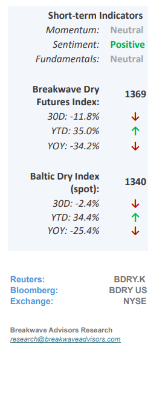
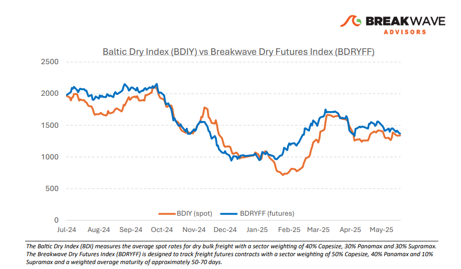
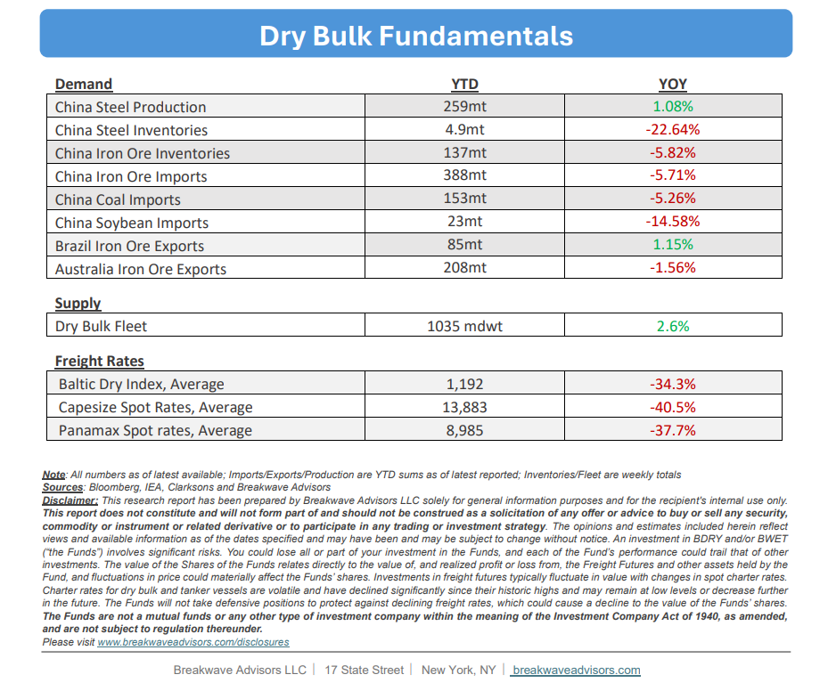

# Breakwave Bi-Weekly Dry Bulk Report - May 27, 2025

**Date:** May 27, 2025  
**Publisher:** Breakwave Advisors | **Category:** Market Insights  
**Original URL:** [https://www.breakwaveadvisors.com/insights/2025527-dry5kji5547](https://www.breakwaveadvisors.com/insights/2025527-dry5kji5547)  

---

•**Stability Persists Albeit Nervousness Amongst Market Participants**– Since early April, the dry bulk market has seen**limited activity,**with spot indices remaining within a broad range and freight futures gradually declining toward spot rates. To date, freight rates have shown**little****inclination to rise significantly.**In terms of overall volume, both coal and iron ore trading remain subdued. Notably,**iron ore prices**have remained**stable**at approximately $100 per ton, while coal prices have fallen to multi-year lows. As we approach the summer months, increased volatility in the Capesize spot market is anticipated, aligning with historical seasonal patterns. The West Africa region is expected to experience a slowdown in bauxite shipments due to seasonal rains commencing in early to mid-July. Conversely, Brazil's iron ore exports are projected to remain strong at relatively high levels throughout the remainder of the year. The dynamic between export volumes from these two regions will be key in shaping the Capesize market in the months ahead. Overall, we**expect activity levels to remain steady**, supporting current price levels. However, any potential tightening caused by positioning could quickly trigger upward spikes, particularly given the prevailing**positive sentiment**in the industry. This optimism is also reflected in the robust pricing levels observed in the secondhand vessel market.

> **Figure 1: Στιγμιότυπο Οθόνης 2025 05 27 112601**  
> [Local Asset](file:///C:/Users/Dell/Github/Shipping/corpus/03-breakwave/insights/2025/assets/2025-05-27_2025527-dry5kji5547_img_cea3cf84ceb9ceb3cebcceb9cf8ccf84cf85_964097326a16.png)

•**Iron Ore Prices Stable as Market Awaits New Supply**– Iron ore prices remain unexpectedly stable despite an outlook characterized by weak supply and demand fundamentals. With the upcoming addition of West African production, most notably from the**Simandou project**, which is expected to commence shipping its first cargo in late November, there appears to be**limited risk of tightness**in the physical market in the near term. On the demand side, we anticipate a**slight decline**in**Chinese steel production**this year, reflecting both domestic and international weakness. Steel**export volumes**from China likely**peaked**last year, and recent trade tensions are expected to further constrain export volumes. While this does not suggest a collapse in demand, it is probable that China's**iron ore imports**will be**lower**for the full year compared to 2024. The**longer distances**associated with the new West African supply are expected to**benefit**the shipping market in 2025. However, the overall volume of cargo in transit remains relatively modest, which continues to be a structural downside for seaborne bulk trade.

•**Our Long-term View**– The last few years have been characterized by increased geopolitical uncertainty. Going forward, we expect such events to continue to affect global trade and have a meaningful impact on effective vessel supply. Combined with the potential for a multi-year cyclical rebound in China’s economic activity following the recent economic turmoil, dry bulk shipping should experience higher volatility on top of a secular tightness driven by stable bulk commodity demand and a slower fleet growth owing to a relatively low orderbook.

> **Figure 2: Στιγμιότυπο Οθόνης 2025 05 27 100729**  
> [Local Asset](file:///C:/Users/Dell/Github/Shipping/corpus/03-breakwave/insights/2025/assets/2025-05-27_2025527-dry5kji5547_img_cea3cf84ceb9ceb3cebcceb9cf8ccf84cf85_bfa275da895d.png)

> **Figure 3: Στιγμιότυπο Οθόνης 2025 05 27 112616**  
> [Local Asset](file:///C:/Users/Dell/Github/Shipping/corpus/03-breakwave/insights/2025/assets/2025-05-27_2025527-dry5kji5547_img_cea3cf84ceb9ceb3cebcceb9cf8ccf84cf85_a4c340f1e303.png)

### Subscribe:
